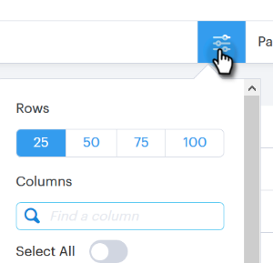
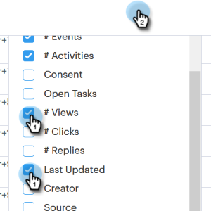

# 人物ページの列 {#people-page-columns}

表示する列を選択して、表示する取引先責任者情報をカスタマイズするオプションがあります。

## 列の選択方法 {#how-to-select-columns}

1. [!UICONTROL 人物]ページで、「リスト設定」アイコンをクリックします。

   

1. スクロールして目的の列を選択します（「**[!UICONTROL すべてを選択]**」を返します）。 完了したら、リスト以外の場所をクリックします。

   

## 列の説明 {#column-descriptions}

<table>
 <colgroup>
  <col>
  <col>
 </colgroup>
 <tbody>
  <tr>
   <th>列</th>
   <th>説明</th>
  </tr>
  <tr>
   <td>[!UICONTROL 名前（名）（デフォルト）]</td>
   <td>名前（名）</td>
  </tr>
  <tr>
   <td>[!UICONTROL 名前（姓）（デフォルト）]</td>
   <td>名前（姓）</td>
  </tr>
  <tr>
   <td colspan="1">[!UICONTROL メール（デフォルト）]</td>
   <td colspan="1">メールアドレス</td>
  </tr>
  <tr>
   <td colspan="1">[!UICONTROL 電話]</td>
   <td colspan="1">電話番号</td>
  </tr>
  <tr>
   <td colspan="1">[!UICONTROL タイトル（デフォルト）]</td>
   <td colspan="1">役職</td>
  </tr>
  <tr>
   <td>[!UICONTROL 会社（デフォルト）]</td>
   <td>会社名</td>
  </tr>
  <tr>
   <td>[!UICONTROL キャンペーン（デフォルト）]</td>
   <td>人物に対して現在実施中のセールスキャンペーン</td>
  </tr>
  <tr>
   <td># [!UICONTROL キャンペーン]</td>
   <td>人物が属しているセールスキャンペーンの合計数</td>
  </tr>
  <tr>
   <td># [!UICONTROL 通話]</td>
   <td>この人物に対して行われた通話の合計数</td>
  </tr>
  <tr>
   <td># [!UICONTROL メール]</td>
   <td>この人物に送信されたメールの合計数</td>
  </tr>
  <tr>
   <td>[!UICONTROL タスク期限]</td>
   <td>タスクの期限</td>
  </tr>
  <tr>
   <td># [!UICONTROL イベント（デフォルト）]</td>
   <td>その人物によるエンゲージメントイベントの合計数（表示、クリック、返信）</td>
  </tr>
  <tr>
   <td># [!UICONTROL アクティビティ（デフォルト）]</td>
   <td>このリードに対してユーザが行ったアクティビティの合計数（メール、通話、タスク）</td>
  </tr>
  <tr>
   <td>[!UICONTROL 同意]</td>
   <td>
正当な利益、契約の履行、法的義務の遵守、重大利益の保護、公益／職務権限等
</td>
  </tr>
  <tr>
   <td>[!UICONTROL オープンタスク]</td>
   <td>この人物のオープンタスクの数</td>
  </tr>
  <tr>
   <td># [!UICONTROL 表示]</td>
   <td>この人物による表示の合計数</td>
  </tr>
  <tr>
   <td># [!UICONTROL クリック]</td>
   <td>この人物によるクリックの合計数</td>
  </tr>
  <tr>
   <td># [!UICONTROL 返信]</td>
   <td>この人物による返信の合計数</td>
  </tr>
  <tr>
   <td>[!UICONTROL 最終更新日]</td>
   <td>人物レコードの最終更新日：</td>
  </tr>
  <tr>
   <td>[!UICONTROL 作成者]</td>
   <td>人物を作成したユーザの名前</td>
  </tr>
  <tr>
   <td>[!UICONTROL ソース]</td>
   <td>人物が作成されたソース元</td>
  </tr>
  <tr>
   <td>[!UICONTROL グループ（デフォルト）]</td>
   <td>その人物が属しているグループ</td>
  </tr>
  <tr>
   <td colspan="1">[!UICONTROL 登録解除済み]</td>
   <td colspan="1">セールスの登録解除ステータス</td>
  </tr>
 </tbody>
</table>
