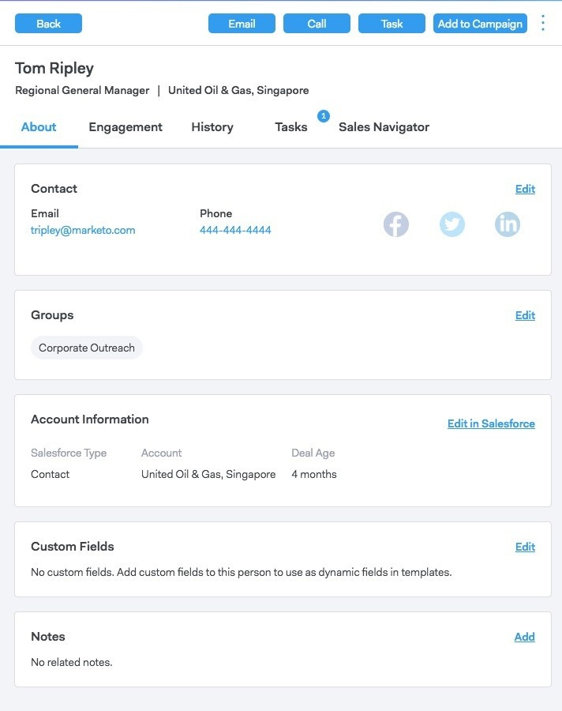

# 個人の詳細表示 {#person-detail-view}

「個人詳細」表示には、MSCアカウント内の各個人の詳細プロファイルが表示されます。

## アクセス方法 {#how-to-access}

1. 個人の詳細表示にアクセスするには、「 **人** 」タブをクリックします。

   

1. 目的のユーザーをクリックします。

   

   >[!TIP]
   >
   >人の名前が表示される場所ならどこでも、その人の名前をクリックして、その人の詳細表示に移動できます。

## タブについて {#about-tab}

ユーザーの連絡先情報をすべて含めます。

**連絡先カード**

* 次のような連絡先情報が含まれます。電子メールアドレス、名前、会社、タイトル、電話番号、ソーシャルメディアのリンク

**グループ**

* このユーザーが属するグループを表示および管理します

**アカウント情報**

* Salesforceにユーザーを追加できます。
* Salesforceからの引き出し勘定情報とリード/連絡先情報

**カスタムフィールド**

* テンプレートやキャンペーンで動的フィールドとして使用できるカスタムフィールドを削除します。

**メモ**

* カスタムメモの作成

## 「アクション」タブ {#engagement-tab}

このユーザーがお客様のアウトリーチにどのように関与しているかを確認します。

**Sales Connectアクティビティ**

* 販売用の電子メールおよびキャンペーンからのエンゲージメントアクティビティの表示

**マーケティングアクティビティ**

* 貴社の担当者がマーケティングキャンペーンにどのように関与しているか確認する

## 「履歴」タブ {#history-tab}

アウトリーチの履歴を表示します。 電子メール、キャンペーン、呼び出しが含まれます。

**販売キャンペーン**

* このユーザーが属するアクティブなキャンペーンまたは完了したユーザーを確認する

**マーケティングキャンペーン**

* このユーザーが属するマーケティングキャンペーンを確認する

**販売の電子メール**

* この人に送信した電子メールおよびエンゲージメント指標を表示する

**販売呼び出し**

* このユーザーに対して行った通話を確認する

## 「タスク」タブ {#tasks-tab}

このユーザーに関連付けられているタスクを管理します。

実行できるアクション：

* タスクの編集または削除
* 期日を参照
* [種類]をクリックすると、[電話の場合]、[電子メールの場合]、[電子メールの場合]、[電子メールの場合]、[カスタムの場合]の場合は[カスタムメモの場合]の各タイプが起動します。
* タスクを完了としてマーク

## 「販売ナビゲータ」タブ {#sales-navigator-tab}

表示LinkedInプロファイルデータとLinkedInの販売ナビゲーター。

>[!NOTE]
>
>Sales NavigatorはLinkedInを通じた有料のアドオンです。この機能を入手するには、担当者にお問い合わせください。

ラポートを構築するには、氷盤を挙げてください。

Sales Navigatorで、連絡先をリードとして保存します。
