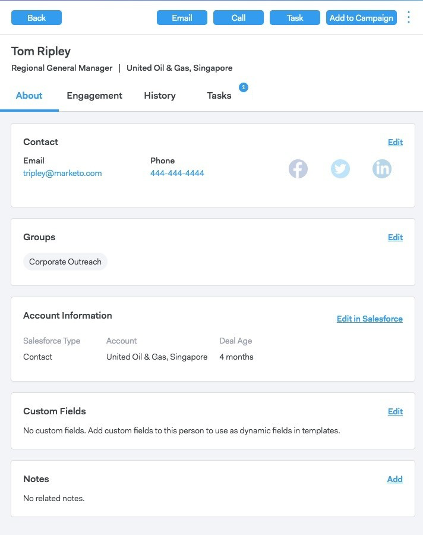

# 人物の詳細表示 {#person-detail-view}

人物の詳細表示には、MSC アカウント内の各人物の詳細なプロファイルが表示されます。

## アクセス方法 {#how-to-access}

1. 人物の詳細表示にアクセスするには、「**人物**」タブをクリックします。

   

1. 目的の人物をクリックします。

   

   >[!TIP]
   >
   >人物の名前が表示される場所付近をクリックすると、その人物の詳細表示に移動できます。

## 「情報」タブ {#about-tab}

人物の取引先責任者情報がすべて含まれます。

**取引先責任者カード**

* 次のような取引先責任者情報が含まれます。メールアドレス、名前、会社名、職位、電話番号、ソーシャルメディアリンク

**グループ**

* この人物が属するグループを表示および管理します

**アカウント情報**

* Salesforce に人物を追加できます
* Salesforce からアカウントおよびリード／取引先責任者情報を取得します

**カスタムフィールド**

* テンプレートやキャンペーンで動的フィールドとして使用できるカスタムフィールドを追加または削除します

**メモ**

* カスタムメモを作成します

## 「エンゲージメント」タブ {#engagement-tab}

この人物がどのようにアウトリーチと関わっているかを確認できます。

**Sales Connect アクティビティ**

* セールスメールとキャンペーンからのエンゲージメントアクティビティが表示されます

**マーケティングアクティビティ**

* この人物がどのようにマーケティングキャンペーンと関わっているかを確認できます。

## 「履歴」タブ {#history-tab}

アウトリーチ履歴を表示します。メール、キャンペーン、通話が含まれます。

**セールスキャンペーン**

* この人物が属するアクティブなキャンペーンまたは完了したキャンペーンを確認できます

**マーケティングキャンペーン**

* この人物が属するマーケティングキャンペーンを確認できます

**セールスメール**

* この人物に送信したメールとエンゲージメント指標を確認できます

**セールス電話**

* この人物に対して行った通話を確認できます

## 「タスク」タブ {#tasks-tab}

この人物に関連付けられたタスクを管理します。

実行できるアクションは次のとおりです。

* タスクの編集または削除
* 期限の参照
* 「タイプ」をクリックすると、通話の場合はセールス通話、メールの場合はメール作成、InMail の場合は LinkedIn、カスタムの場合はカスタムメモが起動します。
* タスクを完了済みとしてマーク
