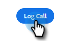

# 通話結果 {#call-outcomes}

セールスチームが電話をかける際に通話結果を選択できるようにし、チームが顧客エンゲージメント活動の影響を把握できるようにします。

>[!NOTE]
>
>**管理者権限が必要。**

## 通話結果を有効にする {#enable-call-outcomes}

1. 歯車アイコンをクリックし、「**[!UICONTROL 設定]**」を選択します。

   

1. [!UICONTROL Admin Settings] で **[!UICONTROL Dialer]** を選択します。

   

1. 「**[!UICONTROL 呼び出し結果を有効にする]**」を選択します。

   

1. 目的の通話結果要件を選択します。

   

## 通話結果の作成 {#create-call-outcomes}

>[!NOTE]
>
>最大 15 件の呼び出し結果を作成できます。

1. 歯車アイコンをクリックし、「**[!UICONTROL 設定]**」を選択します。

   

1. [!UICONTROL Admin Settings] で **[!UICONTROL Dialer]** を選択します。

   

1. **[!UICONTROL 呼び出し結果の管理]** をクリックします。

   

1. テキストフィールドに目的の通話結果名を入力します。

   

1. 「[!UICONTROL &#x200B; 回答済み &#x200B;]」ドロップダウンをクリックし、結果タイプを選択します（この例では、「回答済み」を選択しています）。 「**[!UICONTROL 追加]**」をクリックします。

   

## 通話結果の選択 {#choose-a-call-outcome}

通話結果が有効になったら、ユーザは、通話する際に 1 つ選択できます。

1. 通話ボタンをクリックして、ダイヤラーを起動します。

   

1. ダイヤラーで通話情報を入力し、「**[!UICONTROL 通話]**」をクリックします。

   

1. 通話を最もよく表す通話結果を選択します。

   

1. 通話を終了します。

   

1. 通話をログに記録します。

   

>[!MORELIKETHIS]
>
>* [Salesforce に通話理由と通話結果を記録](/help/marketo/product-docs/marketo-sales-connect/phone/log-call-reasons-and-call-outcomes-to-salesforce.md)
>* [通話理由](/help/marketo/product-docs/marketo-sales-connect/phone/call-reasons.md)
