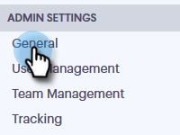

# 通話の記録を有効にする {#enable-call-recording}

管理者は、Sales Connect呼び出しの通話記録を有効にできます。 チームの通話を記録することは、営業担当者に最良の通話方法を教える上で役立ちます。

1. 設定アイコンをクリックし、「 **設定**」を選択します。

   

1. 「管理設定」で、「 **一般**」をクリックします。

   

1. 「Sales Connect Phone Settings」まで下にスクロールし、「 **Enable call recording** 」トグルを選択します。

   

1. 販売者に自分自身の通話記録を有効または無効にする機能を与えたい場合は、[**オプションの通話記録]をクリックして、すべてのチームメンバーの通話記録を有効または無効にします。 **すべての呼び出しを自動的に記録する場合は、** 「すべての呼び出しを記録」をクリックします。**

   

>[!MORELIKETHIS]
>
>[双方の同意の設定](http://docs.marketo.com/x/dgC1Ag)

