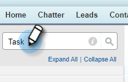

# Salesforce に通話理由と通話結果を記録 {#log-call-reasons-and-call-outcomes-to-salesforce}

レポートや表示の目的で、通話の結果や通話理由を Salesforce に記録したい場合は、それぞれにカスタムアクティビティフィールドを作成できます。 各フィールドは、特定の API 名（Salesforce では「フィールド名」と呼ばれます）を使用する必要があります。

* 通話の結果フィールド名：mktosales_call_outcome
* 通話理由フィールド名：mktosales_call_reason

これらのフィールドを利用するには、まず、カスタムアクティビティフィールドとしてフィールドを作成する必要があります。 ユーザーに表示するには、タスクオブジェクトのページレイアウトに追加する必要があります。

## Salesforce Classic {#salesforce-classic}

### Salesforce Classic でカスタムアクティビティフィールドを作成  {#create-custom-activity-field-in-salesforce-classic}

1. Salesforce で、 **設定**.

   

1. クイック検索ボックスに&quot;Activitys&quot;と入力します。

   

1. クリック **アクティビティカスタムフィールド**.

   

1. 「**新規**」をクリックします。

   

1. データタイプ「テキスト」を選択し、 **次へ**.

   

1. カスタムフィールドに、上で定義した名前を付けます。 フィールドの長さの上限は 255 文字です。 フィールドラベルは、セールスチームが表示できるフィールドで、チームのニーズに合わせてカスタマイズできます。

   

1. 残りの設定はオプションです。 設定が完了したら、「 **次へ**.

   

1. このフィールドの目的のフィールドレベルのセキュリティ設定を選択し、 **次へ** （以下の画像は一例です）。

   

   >[!NOTE]
   >
   >セールスコネクトユーザーが使用するプロファイルと、他に表示したいプロファイルにカスタムフィールドが表示されていることを確認します。

1. フィールドを追加するページレイアウトを選択し、 **保存** ( オプションで、 **保存して新規作成** 「Call Reason」フィールドのプロセスを繰り返します )。

   

### Salesforce Classic のタスクページレイアウトにカスタムアクティビティフィールドを追加 {#add-custom-activity-field-to-task-page-layout-in-salesforce-classic}

1. Salesforce で、 **設定**.

   

1. [ クイック検索 ] ボックスに&quot;タスク&quot;と入力します。

   

1. クリック **タスクページレイアウト**.

   

1. クリック **編集** このフィールドを追加するタスクページレイアウトの横にあります。

   

1. フィールドをタスクページレイアウトにドラッグ&amp;ドロップします。

   PICC

1. 「**保存**」をクリックします。

   PICC

## Salesforce Lightning {#salesforce-lightning}

### Salesforce Lightning でカスタムアクティビティフィールドを作成 {#create-custom-activity-field-in-salesforce-lightning}

1. Salesforce で、右上の歯車アイコンをクリックします。

PICC

1. クリック **設定**.

PICC

1. クリック **オブジェクトマネージャ**.

PICC

1. 「クイック検索」ボックスに「アクティビティ」と入力し、アクティビティラベルをクリックして、オブジェクトの設定を開きます。

PICC

1. 左側で、 **フィールドと関係**.

PICC

1. 「**新規**」をクリックします。

PICC

## Salesforce Lightning のタスクページレイアウトにカスタムアクティビティフィールドを追加 {#add-custom-activity-field-to-task-page-layout-in-salesforce-lightning}

1. Salesforce で、右上の歯車アイコンをクリックします。

PICC

1. クリック **設定**.

PICC

1. セットアップに移動します。?????????

PICC

1. [ クイック検索 ] ボックスに&quot;タスク&quot;と入力します。

PICC

1. [ タスク ] をクリックします。

PICC

1. 「ページレイアウト」をクリックします。

PICC

1. このフィールドを追加するタスクページレイアウトを pn ボタンでクリックします。

PICC

1. フィールドをタスクページレイアウトにドラッグ&amp;ドロップします。

PICC

1. 「保存」をクリックします。

PICC

>[!MORELIKETHIS]
>
>[アクティビティ履歴への Sales Connect イベントフィールドのインストール](/help/marketo/product-docs/marketo-sales-connect/crm/salesforce-customization/install-sales-connect-event-fields-on-activity-history.md)
