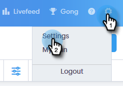

# 双方の同意の設定 {#two-party-consent-settings}

通話の録音時に米国の双方の当事者による同意に関する法律に準拠するため、管理者として、事前に記録されたメッセージを通話の録音時に最初に再生するように設定できます。

>[!NOTE]
>
>**前提条件**
>
>次の手順に従う前に、最初に呼び出しの記録を [有効にする必要があります。](http://docs.marketo.com/x/dAC1Ag)

1. 設定アイコンをクリックし、「 **設定**」を選択します。

   

1. 「管理設定」で、「 **一般**」をクリックします。

   

1. 「Sales Connect Phone Settings」まで下にスクロールし、「 **Manage recording notice**」をクリックします。

   

1. 「記録を **読み込み**」をクリックします。

   

   >[!NOTE]
   >
   >WavファイルとMP3ファイルのみがサポートされています。 30秒を超えるファイルはアップロードできません。

1. ハードドライブから目的のオーディオファイルを選択します。

   

1. アップロードが完了したら、ファイルマネージャーでドット（3つのドット）を選択し、「同意の通知として **選択**」をクリックします。 終了したら **「OK** 」をクリックします。

   

1. 切り替えボタンをクリックして、選択したメッセージを録画された呼び出しの最初に再生できるようにします。

   

