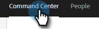

# リマインダータスクの作成と割り当て {#create-and-assign-reminder-tasks}

リマインダータスクは、顧客や見込み客のエンゲージメントに最適な方法です。 タスクを作成するには、次の手順に従います。

1. クリック **コマンドセンター**.

   

1. デフォルトでタスクが開きます。 クリック **タスクを追加**.

   

1. タスクの種類を [ 電子メール ]、[ 呼び出し ]、[ 電子メール ]、または [ カスタムタスク ] から選択します。

   

1. タスクに名前を付けます。

   

1. タスクの割り当て先を自分自身に保つか、タスクの割り当て先となる別のユーザーを選択するかを選択します。

   

1. このリマインダータスクを使用して、フォローアップ先の人を追加します。

   

1. タスクの期限を選択します。

   

1. タスクの優先度を選択します。

   

1. 通話メモ、InMail メッセージテンプレート、人物に関するメモなど、タスクの完了時に利用できるタスクの詳細を追加します。 クリック **作成** 完了したら、

   
