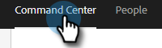
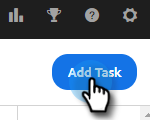
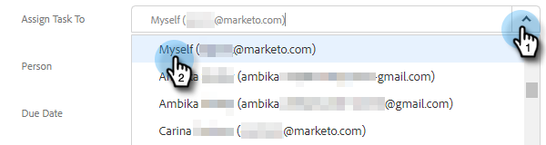
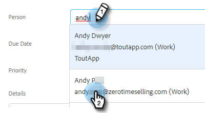
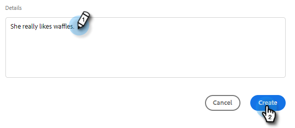

# リマインダータスクの作成と割り当て {#create-and-assign-reminder-tasks}

リマインダータスクは、顧客や見込み客のエンゲージメントに最適な方法です。 タスクを作成するには、次の手順に従います。

1. **[!UICONTROL コマンドセンター]**&#x200B;をクリックします。

   

1. デフォルトでタスクが開きます。 「**[!UICONTROL タスクを追加]**」をクリックします。

   

1. タスクタイプを、[!UICONTROL メール]、[!UICONTROL 電話]、[!UICONTROL InMail]、[!UICONTROL カスタム]タスクから選択します。

   

1. タスクに名前を付けます。

   

1. タスクの割り当て先を自分自身のままにするか、タスクの割り当て先となる別のユーザを選択するかを選択します。

   

1. このリマインダータスクを使用して、フォローアップしているユーザーを追加します。

   

1. タスクの期限を選択します。

   

1. タスクの優先度を選択します。

   

1. 通話メモ、InMail メッセージテンプレート、ユーザに関するメモなど、タスクの完了時に利用できるタスクの詳細を追加します。 終了したら、「**[!UICONTROL 作成]**」をクリックします。

   
