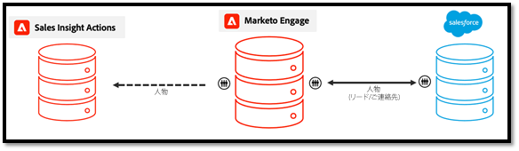
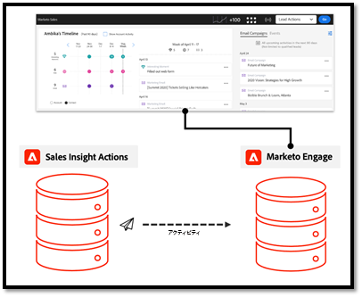
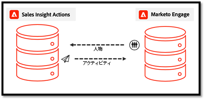

# アクションデータ同期の FAQ {#actions-data-sync-faq}

Sales Insight Actions のデータ統合フィールド同期を使用すると、Marketo Engage・データベースから Sales Insight Actions データベースに個人情報を取り込むことができます。

これにより、Sales Insight Actions Web アプリで最新の人物データを提供し、Marketoの対応する人物レコードと Salesforce のリード/連絡先/アカウント/商談レコードの一意の ID を収集して、レコードをログデータに正しく参照できます。

この同期は、Marketo Engageの「管理」セクションの「Sales Insight アクション設定」タブで有効にできます。 詳しくは、 [データ同期の開始](/help/marketo/product-docs/marketo-sales-insight/actions/getting-started/msi-actions-admin-guide.md#initiate-data-sync).

上の図は、ユーザーのアクティビティとタスクのデータがシステム間でどのように同期されるかを示しています。 注意事項を以下に示します。

* 人物レコードは、Marketo Engageから Sales Insight アクションに同期され、Sales Insight アクションの人物データの真実の源となるMarketo Engage
* Marketo Engageと Sales Insight の両方のアクション [機構を持つ](/help/marketo/product-docs/marketo-sales-insight/actions/email/unsubscribes/syncing-unsubscribes-with-salesforce.md) Salesforce への配信停止ステータスの収集と同期
* 配信停止ステータスはセールスアクションからMarketo Engageに同期されませんが、販売者にメールの送信を許可する前に、Sales Insight アクションを設定して、担当者のMarketo配信停止ステータスを確認できます。 [Marketo配信停止の確認](/help/marketo/product-docs/marketo-sales-insight/actions/email/unsubscribes/marketo-unsubscribe-check.md).

データ統合同期の仕組みに関するよくある質問を以下に示します。

## Sales Insight アクションに同期されるリード/連絡先は何ですか？ {#what-lead-contacts-are-synced}

セールス所有者が割り当てられているリードと連絡先は、セールスアクションに同期されます。

リード/連絡先に Salesforce 内のセールス所有者が存在するかどうかを確認するには、存在する標準所有者フィールドを確認します。

販売所有者は、Marketo同期ユーザー、または特定の Salesforce または販売ユーザーである必要はありません。 必要なのは、Salesforce のリード所有者と連絡先所有者フィールドにユーザーがリストされているだけです。これにより、リードとして識別して Sales Insight アクションに同期できます。 同期するフィールドの更新は、Sales Insight のアクションでも検出され、更新されます。

## Sales Insight スマートグリッドに表示されるアクティビティデータは、どこから入手しますか？ {#where-does-the-activity-data-get-sourced-from}

E メール、電話、注目のアクション、Web などのアクティビティデータは、すべてMarketo Engageのデータベースから取得されます。 Sales Insight スマートグリッドは、セールスMarketo Engageが Sales Insight パネルを読み込むたびに、この値を取得するリクエストをユーザーインスタンスに対して行います。

すべてのアクティビティデータをMarketo Engageから取得できるように、Sales Insight Actions は、すべてのアクティビティデータをMarketo Engageに同期します。

## 担当者レコードに関連するフィールドは、Marketo Engageから Sales Insight アクションに同期しますか？ {#what-fields-sync}

Marketo Engageから Sales Insight アクションに同期する 11 のフィールドがあります。

* 名
* 姓
* Salesforce 連絡先 ID
* Salesforce リード ID
* Marketo ID
* 企業
* 職位
* メール
* 電話番号
* Linkedin URL
* ソース

## Marketo Engageと Sales Insight アクションの間で同期するフィールドは設定可能ですか？ {#are-the-fields-that-sync-configurable}

Sales Insight アクションに同期するMarketo Engageフィールドの設定は使用できず、フィールドをマッピングする機能も使用できません。 Marketoからの同期では、標準のMarketoフィールドが、セールスアクションインスタンスの標準フィールドに自動的にマッピングされます。

## Sales Insight Actions に独自のデータベースがあるのはなぜですか？ {#why-does-actions-have-its-own-database}

Sales Insight Actions には、専用の個人およびアクティビティ・データベースを備えた独自の Web アプリケーションがあり、セールス・チーム向けに構築および設計された最適化されたワークスペースを提供します。 これにより、販売管理者と販売者は、マーケティングオペレーションスペシャリスト向けに最適化されたプライマリMarketo Engageワークスペースにアクセスや権限を付与することなく、エンゲージメント戦略を構築し、管理するスペースを確保できます。

## 重複の処理方法 {#how-are-duplicates-handled}

セールスアクションデータベースは、Marketo Engageデータベースに存在する認定済みの担当者（セールス所有者のリード/連絡先）のコピーになります。 つまり、Marketoで同じメールアドレスを持つ 2 つのレコードが作成された場合、セールスアクションで作成された重複レコードが存在します。

## 初期同期が完了するまでにどのくらい時間がかかりますか？ {#how-long-initial-sync}

すべてのセールスリードデータを新しい Sales Insight Actions インスタンスに同期する最初のプロセスでは、通常、1 ～ 2 分ごとに約 1,000 人の担当者が処理されます。 これは単なる推定であり、状況によって異なる場合があります。

初期同期が実行され、すべてのセールスリードが Sales Insight Actions Web アプリインスタンスに入力されると、同期されるサポート対象フィールドの 1 つが更新されるたびに増分同期が実行されます。

## Sales Insight Actions ユーザーは Actions Web アプリから人物データを編集できますか？ {#can-actions-users-edit-people-data}

いいえ。アクションで人物レコードを作成および編集する機能は、アクション Web アプリのユーザーと管理者の両方で使用できません。 担当者の作成と編集は、Salesforce またはMarketo Engageで行う必要があります。 Sales Insight Actions は、新しいデータを継続的に同期することで、Marketoを人物データの情報源として使用します。Marketoのワークフローから、または Salesforce から同期した人物がMarketoで更新または作成されると、その更新が Sales Insight Actions Web アプリデータベースに渡されます。

## 販売活動はMarketoに記録されますか。 {#do-sales-activities-log-to-marketo}

はい、セールスエンゲージメントアクティビティは、ネイティブアクティビティとしてMarketoに記録されます。 また、これらのアクティビティには、セールスアクティビティ属性に基づいてリードをターゲット設定するための制約と共に使用できるネイティブフィルターも含まれます。

以下に、Marketoに記録されるアクティビティのリストを示します。

* セールスメール送信
* セールスメール開封
* セールスメールクリック
* セールスメールに返信済み
* セールスメールバウンス
* セールス電話を受信しました
* セールスキャンペーンに追加
* セールスキャンペーンから削除済み

## セールス活動は Salesforce に記録されますか？ {#do-sales-activities-log-to-salesforce}

はい、セールスエンゲージメントアクティビティは、ネイティブタスクとして Salesforce に記録されます。 これらのタスクを Salesforce レポートで使用して、セールス活動を追跡するチームダッシュボードを強化できます。

Sales Insight アクションを使用すると、管理者は、Salesforce にログに記録するセールスアクティビティを設定できます。 これらのアクティビティには、電子メール、呼び出し、および開封済みリマインダータスクが含まれます。

上の図は、Salesforce にログに記録される情報を示しています。 メールや通話などのアクティビティは、 [一方向同期](/help/marketo/product-docs/marketo-sales-insight/actions/crm/salesforce-integration/salesforce-sync-settings.md). [配信停止](/help/marketo/product-docs/marketo-sales-insight/actions/email/unsubscribes/syncing-unsubscribes-with-salesforce.md) および [リマインダータスク](/help/marketo/product-docs/marketo-sales-insight/actions/tasks/reminder-task-sync-with-salesforce.md) は双方向同期で最新の状態に保たれています。 これらの各データ同期は、Sales Insight Actions Web アプリインターフェイスから設定できます。

>[!MORELIKETHIS]
>
>* [Salesforce との配信停止の同期](/help/marketo/product-docs/marketo-sales-insight/actions/email/unsubscribes/syncing-unsubscribes-with-salesforce.md)
>* [Marketo 配信停止チェック](/help/marketo/product-docs/marketo-sales-insight/actions/email/unsubscribes/marketo-unsubscribe-check.md)
>* [Salesforce 同期設定](/help/marketo/product-docs/marketo-sales-insight/actions/crm/salesforce-integration/salesforce-sync-settings.md)
>* [Salesforce とのリマインダータスク同期](/help/marketo/product-docs/marketo-sales-insight/actions/tasks/reminder-task-sync-with-salesforce.md)
>* [データ同期の開始](/help/marketo/product-docs/marketo-sales-insight/actions/getting-started/msi-actions-admin-guide.md#initiate-data-sync)

