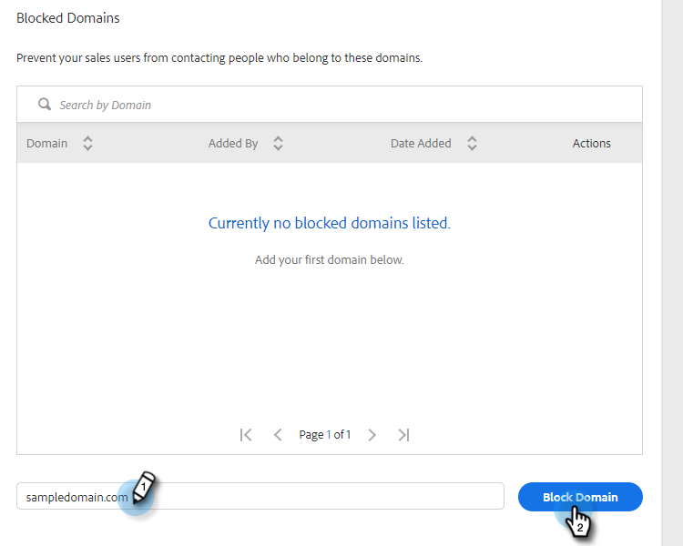

# ブロック済みドメイン {#blocked-domains}

セールスチームが誤って競合相手にメールを送信したり、既知のスパムトラップや、連絡を希望しないその他のドメインに送信したりするのを防ぎ、成功を収める支援をします。

>[!NOTE]
>
>**管理者権限が必要**

1. Web アプリケーションで、歯車アイコンをクリックし、「**[!UICONTROL 設定]**」を選択します。

   

1. 「[!UICONTROL 管理者設定]」で、「**[!UICONTROL 一般]**」をクリックします。

   

1. ブロックするドメインを入力し、「**[!UICONTROL ドメインをブロック]**」をクリックします。

   

   >[!NOTE]
   >
   >グループメール送信に含まれるメールは、ブロック済みメールドメインに送信されたことで送信失敗になりますが、送信失敗メールフォルダーには表示されず、警告もされません。
