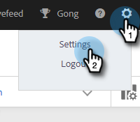

# コンテンツのロックダウン {#content-lockdown}

コンテンツのロックダウンを有効にすることで、管理者以外のユーザーによるテンプレートやキャンペーンの編集を制限します。 次の操作は実行できません。コンテンツの共有、複製、編集、削除を行います。 また、テンプレートをアーカイブするオプションもありません。

>[!NOTE]
>
>ユーザーは、送信時、またはキャンペーンの開始時に、E メールのコンテンツを編集できます。

1. 内 [web アプリケーション](https://toutapp.com/login)、歯車アイコンをクリックし、「 **設定**.

   

1. 「管理設定」で、「**一般**」をクリックします。

   

1. 下にスクロールしてコンテンツのロックダウンを行います。 いずれかのスライダーをオンにすると、チームメンバーがテンプレートやキャンペーンを作成/編集できなくなります。

   
