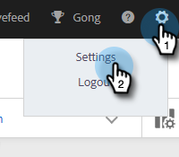
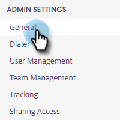
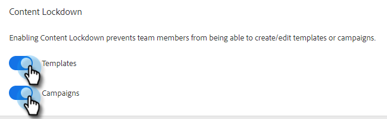

# コンテンツのロックダウン {#content-lockdown}

コンテンツのロックダウンを有効にすることで、管理者以外のユーザによるテンプレートやキャンペーンの編集を制限します。 ユーザは、コンテンツの共有、複製、編集、削除を行うことはできません。 また、テンプレートをアーカイブするオプションもありません。

>[!NOTE]
>
>ユーザは引き続き、送信時またはキャンペーンの開始時に、メールの内容を編集できます。

1. 歯車アイコンをクリックし、「**[!UICONTROL 設定]**」を選択します。

   

1. 「[!UICONTROL 管理者設定]」で、「**[!UICONTROL 一般]**」をクリックします。

   

1. 「[!UICONTROL コンテンツのロックダウン]」まで下にスクロールします。 いずれかのスライダーをオンにすると、チームメンバーによるテンプレートやキャンペーンの作成および編集が無効になります。

   
