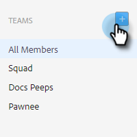

# チームの作成 {#creating-a-team}

チームを作成すると、コンテンツを共有したり、レポートをフィルタリングしたりできるユーザーのグループを作成できます。

## チームの作成 {#create-a-team}

1. 内 [web アプリケーション](https://toutapp.com/login)、歯車アイコンをクリックし、「 **設定**.

   

1. 管理設定で、「**チーム管理**」を選択します。

   

1. 「チーム」の横の **+** アイコン

   

1. チーム名を入力し、 **作成**.

   

>[!NOTE]
>
>これで、テンプレート、キャンペーンおよびグループを
そのチームと共有できるようになりました。

## チームに担当者を追加 {#add-people-to-a-team}

1. 引き続きチーム管理で、「 」を選択します。 **すべてのメンバー**.

   

1. チームに追加するユーザーを見つけて、そのユーザーのチェックボックスをオンにします。

   

1. クリック **チームに追加**.

   

1. ドロップダウンをクリックし、目的のチームを選択します。

   

1. クリック **追加** 完了したら、

   
