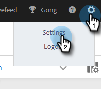
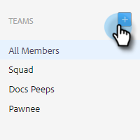
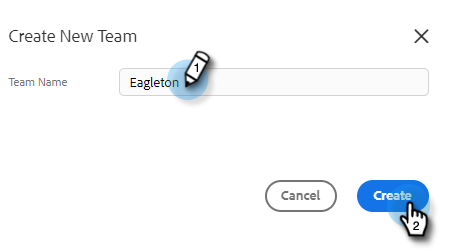
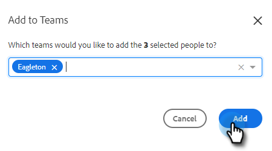

# チームの作成 {#creating-a-team}

チームを作成すると、コンテンツを共有したり、レポートをフィルターしたりできるユーザのグループを作成できます。

## チームの作成 {#create-a-team}

1. [Web アプリケーションで](https://toutapp.com/login)、歯車アイコンをクリックし、「**[!UICONTROL 設定]**」を選択します。

   

1. 「[!UICONTROL 管理者設定]」で、「**[!UICONTROL チーム管理]**」を選択します。

   

1. [!UICONTROL チーム]の横の「**+**」アイコンをクリックします。

   

1. チーム名を入力し、「**[!UICONTROL 作成]**」をクリックします。

   

>[!NOTE]
>
>これで、テンプレート、キャンペーンおよびグループをそのチームと共有できるようになりました。

## チームにメンバーを追加 {#add-people-to-a-team}

1. 引き続き[!UICONTROL チーム管理]で、「**[!UICONTROL すべてのメンバー]**」を選択します。

   

1. チームに追加するユーザを見つけ、そのチェックボックスを選択します。

   

1. 「**[!UICONTROL チームに追加]**」をクリックします。

   

1. ドロップダウンをクリックし、目的のチームを選択します。

   

1. 終了したら「**[!UICONTROL 追加]**」をクリックします。

   
