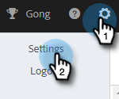
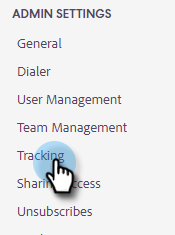
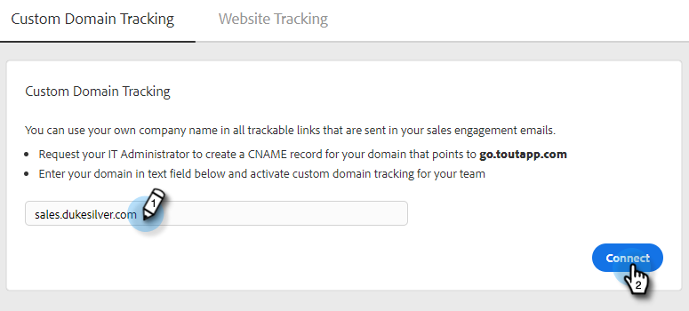

# カスタムドメイントラッキングの設定方法 {#how-to-set-up-custom-domain-tracking}

カスタムドメイントラッキングを使用すると、チームでセールスメールに追加されたすべてのトラッキング可能なリンクに自社の会社名を使用できます。 この設定が完了すると、メールに含まれているリンクが許可リストに加えられ、「go.yourcompany.com」と表示されるようになります。そのため、リンクにマウスポインターを置いたときに、go.toutapp.com ではなく go.yourcompany.com と表示されます。

go.toutapp.com を指すドメインの CNAME レコードを設定するには、IT チームのサポートが必要です。 この CNAME は、すべてのトラッキングリンク（例：go.yourcompany.com）に表示されます。

CNAME が正しく設定されていることを IT チームに確認したら、「アクション」の[!UICONTROL カスタムドメイントラッキング]ページに追加できます。

>[!NOTE]
>
>CNAME が適切に設定されておらず、アクションでカスタムドメインとしてアクティブ化すると、トラッキングリンクとピクセルが壊れる場合があります。

## カスタムドメイントラッキングの有効化 {#enable-custom-domain-tracking}

>[!NOTE]
>
>**管理者権限が必要。**

1. 歯車アイコンをクリックし、「**[!UICONTROL 設定]**」を選択します。

   

1. 「[!UICONTROL 管理者設定]」で、「**[!UICONTROL トラッキング]**」を選択します。

   

1. 「[!UICONTROL カスタムドメイントラッキング]」タブで、CNAME を入力し、「**[!UICONTROL 接続]**」をクリックします。

   
