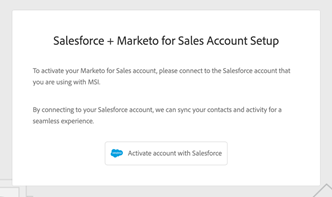

# ログイン管理の設定 {#login-management-settings}

ログイン管理の設定を使用すると、管理者は、Sales Insight Actions のユーザに対して、グローバルレベルで認証設定を設定できます。

>[!NOTE]
>
>デフォルトでは、Sales Insight Actions インスタンスに対して「Salesforce のみ」オプションが選択されます。Salesforce から[自動ログイン](/help/marketo/product-docs/marketo-sales-insight/actions/admin/auto-login-from-salesforce.md)できるので、この設定をお勧めします。

## ログイン管理設定の更新 {#update-login-management-settings}

>[!NOTE]
>
>**管理者権限が必要**

ログイン管理の環境設定を更新するには、次の手順に従います。

1. 歯車アイコンをクリックし、「**設定**」を選択します。

   

1. 「管理設定」で、「**一般**」をクリックします。

   

1. 下の「ログイン管理」カードまでスクロールし、目的の設定を選択します（この例では「Salesforce のみ」を選択します）。終了したら「**保存**」をクリックします。

   

## 「Salesforce のみ」についての FAQ {#salesforce-only-faq}

「Salesforce のみ」とは、Salesforce で Sales Insight Actions を使用する場合にのみ認証できることを意味します。これは Sales Insight Actions インスタンスのデフォルトの選択で、ユーザ名やパスワードを管理しなくてもユーザがシームレスに認証できるので、お勧めです。

### 「Salesforce のみ」が選択されている場合、インスタンスの新しいユーザは自分のアカウントをどのようにアクティブ化しますか？ {#activate-when-salesforce-only-is-selected}

招待メールの「**開始する**」ボタンをクリックすると、新しいユーザがアカウントアクティブ化画面に送信され、Salesforce インスタンスに接続して Sales Insight Actions アカウントをアクティブ化する必要が生じます。

### 「Salesforce のみ」が選択されている場合、ユーザはどの認証方法で認証できますか？ {#what-authentication-methods}

ログイン画面に移動する際、ユーザはまずメールアドレスを入力します。その後、「Salesforce ワンクリックログイン」ボタンをクリックし、ログイン先の Salesforce アカウントを使用して認証を行います。

>[!NOTE]
>
>これは、ログイン画面に直接移動するユーザにのみ関係します。Salesforce から Actions にアクセスするユーザは、[自動ログイン](/help/marketo/product-docs/marketo-sales-insight/actions/admin/auto-login-from-salesforce.md)を使用してログインします。

### ユーザが Salesforce から Actions の機能にアクセスし、「Salesforce のみ」が選択されている場合、ユーザ認証は Actions でどのように処理されますか？ {#how-is-user-authentication-handled}

ユーザがいずれかのアクション（通話、メール、キャンペーン、タスク、キャンペーンリストなど）をクリックすると、SFDC 認証を使用して Sales Insight Actions アカウントに自動的にログインします。この認証を、[自動ログイン](/help/marketo/product-docs/marketo-sales-insight/actions/admin/auto-login-from-salesforce.md)と呼んでいます。

## 「すべてのログイン方法」に関する FAQ {#all-login-methods-faq}

### 「すべてのログイン方法」が選択されている場合、自分のインスタンスの新しいユーザは自分のアカウントをどのようにアクティブ化しますか？ {#activate-when-all-login-methods-is-selected}

新しいユーザがインスタンスに招待されると、アカウントのアクティベーションに関するメールが届きます。「開始する」というボタンをクリックすると、パスワードの作成と確認を求めるページが表示されます。作成されたアカウントはアクティブ化され、オンボーディングワークフローで使用されます。

### 「すべてのログイン方法」が選択されている場合、インスタンスのユーザはどのようにログインできますか？ {#what-are-users-allowed-to-log-in-with-all-login}

当社のログインページを使用する場合、ユーザはまず自分のメールアドレスを入力します。次に、すべてのログインオプション（ユーザ名／パスワード、SFDC、Gmail、SSO）を提供するページに送信されます。
