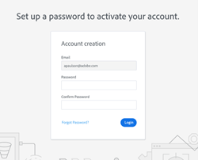

# ログイン管理設定 {#login-management-settings}

ログイン管理設定を使用すると、管理者は、Sales Insight アクションのユーザーに対して、グローバルレベルで認証設定を設定できます。

>[!NOTE]
>
>デフォルトでは、Sales Insight アクションインスタンスに対して「Salesforce のみ」オプションが選択されます。 この設定をお勧めします。 [自動ログイン](/help/marketo/product-docs/marketo-sales-insight/actions/admin/auto-login-from-salesforce.md) Salesforce から。

## ログイン管理設定の更新 {#update-login-management-settings}

>[!NOTE]
>
>**管理者権限が必要です**

ログイン管理環境設定を更新するには、次の手順に従います。

1. 歯車アイコンをクリックし、「**設定**」を選択します。

   

1. 「管理設定」で、「**一般**」をクリックします。

   

1. 下の「ログイン管理」カードまでスクロールし、目的の設定を選択します（この例では「Salesforce のみ」を選択します）。 終了したら「**保存**」をクリックします。

   

## Salesforce のみの FAQ {#salesforce-only-faq}

Salesforce のみとは、Salesforce で Sales Insight アクションを使用する場合にのみ認証できることを意味します。 これは Sales Insight Actions インスタンスのデフォルトの選択で、ユーザー名やパスワードを管理しなくてもユーザーがシームレスに認証できるので、お勧めします。

### 「Salesforce のみ」が選択されている場合、インスタンスの新しいユーザーは自分のアカウントをどのようにアクティブ化しますか。 {#activate-when-salesforce-only-is-selected}

クリック時に **はじめに** ボタンをクリックすると、新しいユーザーがアカウント有効化画面に送信され、Salesforce インスタンスに接続して Sales Insight Actions アカウントを有効化する必要が生じます。

### 「Salesforce のみ」が選択されている場合、ユーザーはどの認証方法で認証できますか？ {#what-authentication-methods}

ログイン画面に移動する際、ユーザーはまず電子メールアドレスを入力します。 その後、「Salesforce One Click Login」ボタンをクリックし、ログイン先の Salesforce アカウントを使用して認証を行います。

>[!NOTE]
>
>これは、ログイン画面に直接移動するユーザーにのみ関係します。 Salesforce からアクションにアクセスするユーザーは、次を使用してログインします： [自動ログイン](/help/marketo/product-docs/marketo-sales-insight/actions/admin/auto-login-from-salesforce.md).

### ユーザーが Salesforce からアクション機能にアクセスし、「Salesforce のみ」が選択されている場合、ユーザー認証はアクションでどのように処理されますか？ {#how-is-user-authentication-handled}

ユーザーがいずれかのアクション（通話、メール、キャンペーン、タスク、キャンペーンリストなど）をクリックすると、SFDC 認証を使用して Sales Insight Actions アカウントに自動的にログインします。 この認証は、 [自動ログイン](/help/marketo/product-docs/marketo-sales-insight/actions/admin/auto-login-from-salesforce.md).

## すべてのログイン方法に関する FAQ {#all-login-methods-faq}

### 「すべてのログイン方法」が選択されている場合、自分のインスタンスの新しいユーザーは自分のアカウントをどのようにアクティブ化しますか。 {#activate-when-all-login-methods-is-selected}

新しいユーザーがインスタンスに招待されると、アカウントのアクティベーションに関する電子メールが届きます。 「はじめに」というボタンをクリックすると、パスワードの作成と確認を求めるページが表示されます。 作成されたアカウントはアクティブ化され、オンボーディングワークフローで使用されます。

### 「すべてのログイン方法」が選択されている場合、インスタンスのユーザーはどのようにを使用してログインできますか。 {#what-are-users-allowed-to-log-in-with-all-login}

当社のログインページを使用する場合、ユーザーはまず自分のメールアドレスを入力します。 次に、すべてのログインオプション（ユーザー名/パスワード、SFDC、Gmail、SSO）を提供するページに送信されます。
