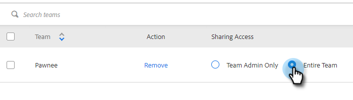

# 設定の共有 {#sharing-settings}

ユーザーが共有可能な項目やカテゴリを制限して、テンプレートを適切に管理しましょう。

セールスコネクトアカウントを初めて作成すると、共有設定が有効になります。 これにより、チームのカテゴリ内のコンテンツを共有できる機能をユーザーに追加しなくても、アカウント管理者がテンプレートカテゴリを作成し、構成できるようになります。

設定の共有が有効になっている場合、チームまたは全員に共有権限が提供されない限り、管理者のみがカテゴリを共有できます。 設定の共有を無効にした場合、制限はなく、すべてのユーザーが任意のテンプレートカテゴリで共有できます。

## 設定の共有 {#configure-your-sharing-settings}

1. 内 [web アプリケーション](https://toutapp.com/login)、歯車アイコンをクリックし、「 **設定**.

   

1. 管理設定で、「**アクセス権の共有**」を選択します。

   

1. 確認 **設定の共有** が有効になっている。 つまり、デフォルトでは、管理者のみがテンプレートカテゴリのテンプレートを共有できます。

   

1. 設定するテンプレートカテゴリを選択します。

   

1. 「**アクセスするチームを追加**」をクリックします。

   

1. 追加するチームを選択します。

   

   >[!NOTE]
   >
   >チームが表示されない場合は、チーム管理に移動して、ユーザーのチームを作成する必要があります。

1. 「**アクセスするチームを追加**」をクリックすると保存されます。

   

1. チームが追加されたので、チーム管理者のみがチームの共有を許可するか、そのチームのすべてのユーザーを共有するかを選択できます。この例では、SDR チームのすべてのユーザーに対して、アクセス権を共有するように指定しています。

   
