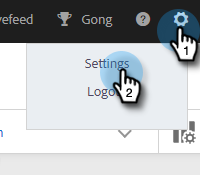
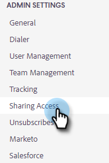
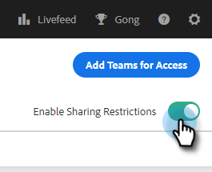
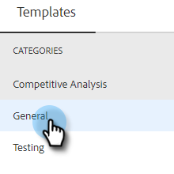
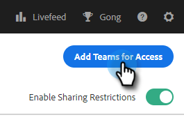
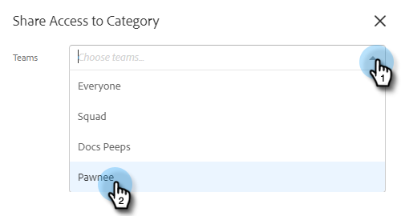
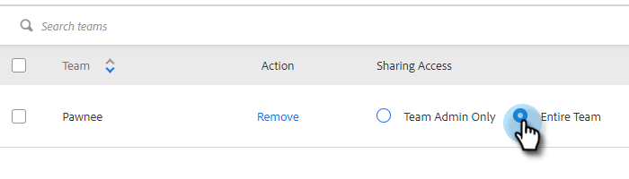

# 設定の共有 {#sharing-settings}

ユーザが共有可能な項目やカテゴリを制限して、テンプレートを適切に管理しましょう。

セールスインサイトアクションアカウントを最初に作成すると、設定の共有が有効になります。 これにより、アカウント管理者は、ユーザがチームのカテゴリ内でコンテンツを共有できるようにする前に、テンプレートカテゴリを作成して整理する機会が得られます。

設定の共有が有効な場合、チームまたは全員に共有権限が付与されていない限り、カテゴリに共有できるのは管理者のみです。 設定の共有を無効にした場合、制限はなく、すべてのユーザが任意のテンプレートカテゴリに共有できます。

## 共有設定の構成 {#configure-your-sharing-settings}

1. [Web アプリケーションで](https://toutapp.com/login)、歯車アイコンをクリックし、「**[!UICONTROL 設定]**」を選択します。

   

1. 「[!UICONTROL 管理者設定]」で、「**[!UICONTROL アクセス権の共有]**」を選択します。

   

1. 「**[!UICONTROL 設定の共有]**」が有効になっていることを確認します。 つまり、デフォルトでは、管理者のみがテンプレートカテゴリのテンプレートを共有できます。

   

1. 設定するテンプレートカテゴリを選択します。

   

1. 「**[!UICONTROL アクセスするチームを追加]**」をクリックします。

   

1. 追加するチームを選択します。

   

   >[!NOTE]
   >
   >チームが表示されない場合は、チーム管理に移動して、ユーザのチームを作成する必要があります。

1. 「**[!UICONTROL アクセスするチームを追加]**」をクリックすると保存されます。

   

1. チームが追加されたので、チーム管理者のみに共有を許可するか、そのチームのすべてのユーザに共有を許可するかを選択できます。 この例では、SDR チームのすべてのユーザに共有アクセス権を付与します。

   
