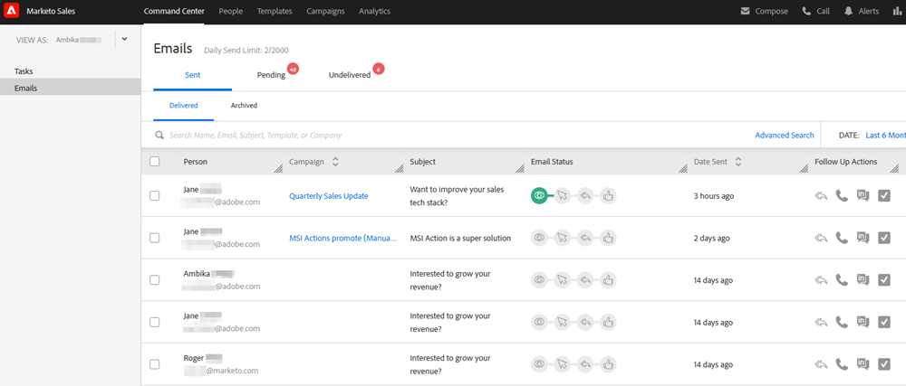

# ユーザアクセスの詳細 {#user-access-details}

管理者と管理者以外のユーザは何にアクセスできますか？

## 管理者ユーザの権限 {#admin-user-permissions}

管理者は[すべてのテンプレートを表示](/help/marketo/product-docs/marketo-sales-connect/templates/view-template-list-as-another-user.md)できます。

管理者は[すべてのキャンペーンを表示](/help/marketo/product-docs/marketo-sales-connect/campaigns/view-campaigns-list-as-another-user.md)できます。

管理者は、すべてのメールアクティビティを表示できます。

管理者は、実行中のキャンペーンが適用されているすべての人を表示できます。

管理者は、「表示形態 [!UICONTROL  ドロップダウンを使用して、ユーザーキャンペーンおよびキャンペーンカテゴリを表示 ] きます。

管理者は、ユーザの代わりにキャンペーンを停止できます。

## 管理者以外のユーザ権限 {#non-admin-user-permissions}

* 分析：

   * ユーザはチームの分析を表示できます
   * ユーザは所属するチームのみの詳細を表示できます
   * ユーザは独自の分析を表示できます

* [!UICONTROL People] ページ：

   * ユーザは全員とグループを共有できます
   * ユーザは、所属するチームとのみグループを共有できます
   * ユーザは、アクションデータベース内のすべてのユーザを表示できます
   * ユーザが削除されると、そのユーザの共有取引先責任者は、そのユーザを削除したマスター管理者に所有権を転送します

* [!UICONTROL  チーム ] 管理ページ：

   * 表示できません

* [!UICONTROL  テンプレート ] ページ：

   * ユーザは全員とテンプレートを共有できます
   * ユーザは、管理者が許可するカテゴリにテンプレートを共有できます
   * ユーザがチームから削除されると、そのユーザのテンプレートはそのチームと共有されなくなります
   * ユーザがチームから削除されると、テンプレートは、ユーザを削除したマスター管理者に所有権を転送します
