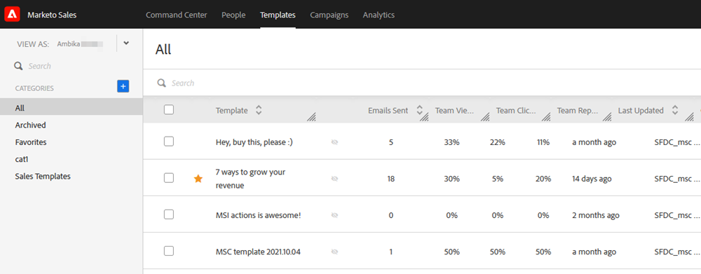
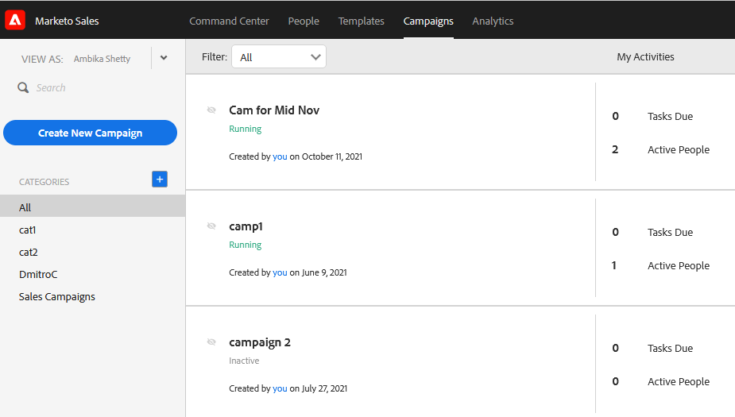
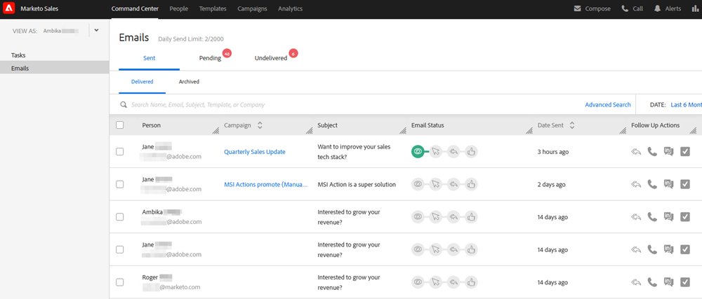
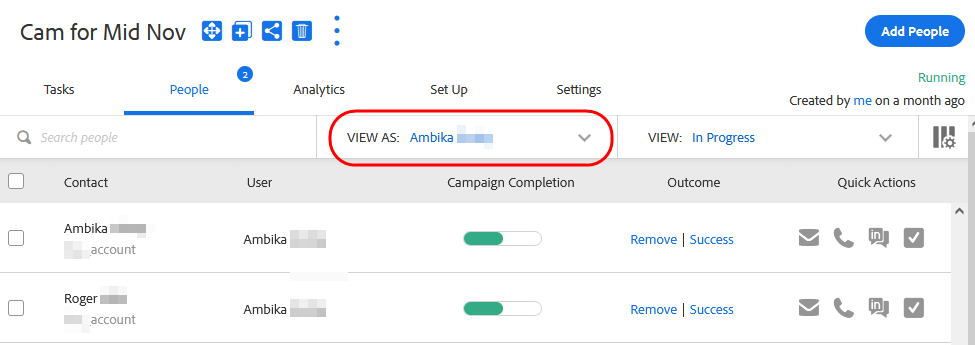
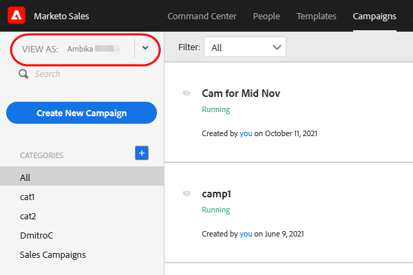

# ユーザアクセスの詳細 {#user-access-details}

管理者と管理者以外のユーザは何にアクセスできますか？

## 管理者ユーザーの権限 {#admin-user-permissions}

管理者は[すべてのテンプレートを表示](/help/marketo/product-docs/marketo-sales-connect/templates/view-template-list-as-another-user.md)できます。

管理者は[すべてのキャンペーンを表示](/help/marketo/product-docs/marketo-sales-connect/campaigns/view-campaigns-list-as-another-user.md)できます。

管理者は、すべてのメールアクティビティを表示できます。

管理者は、実行中のキャンペーンが適用されているすべての人を表示できます。

管理者は、「[!UICONTROL 次のユーザとして表示]」ドロップダウンで、ユーザのキャンペーンおよびキャンペーンカテゴリを表示できます。

管理者は、ユーザの代わりにキャンペーンを停止できます。

## 管理者以外のユーザー権限 {#non-admin-user-permissions}

* 分析：

  * ユーザはチームの分析を表示できます。
  * ユーザは所属するチームのみの詳細を表示できます
  * ユーザは自分の分析を表示できます

* [!UICONTROL 人物]ページ：

  * ユーザは全員とグループを共有できます
  * ユーザは、所属するチームとのみグループを共有できます
  * ユーザは、アクションデータベース内のすべての人物を表示できます
  * ユーザーが削除されると、そのユーザーの共有取引先責任者の所有権は、そのユーザーを削除したマスター管理者に移転されます

* [!UICONTROL チーム]管理ページ：

  * 表示できません

* [!UICONTROL テンプレート]ページ：

  * ユーザは全員とテンプレートを共有できます
  * ユーザは、管理者が許可するカテゴリにテンプレートを共有できます。
  * ユーザーがチームから削除されると、そのユーザーのテンプレートはそのチームと共有されなくなります。
  * ユーザーがチームから削除されると、そのユーザーのテンプレートの所有権が、そのユーザーを削除したマスター管理者に移転されます。
