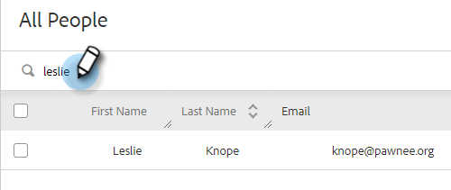
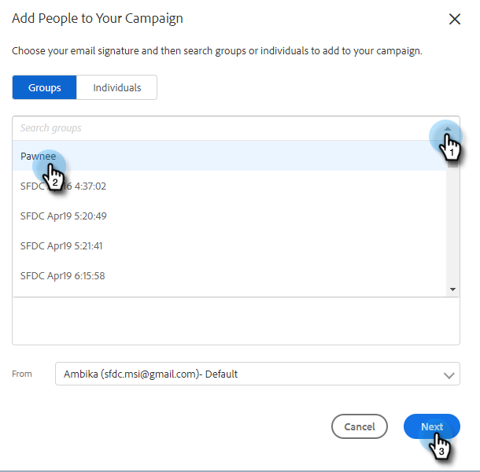
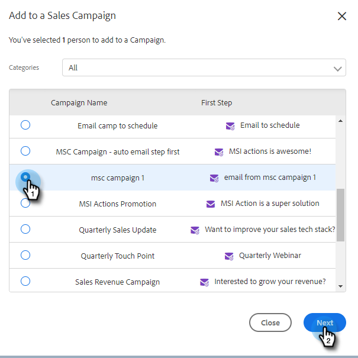

# マーケティングキャンペーンへの追加 {#add-to-marketing-campaign}

>[!PREREQUISITES]
>
>[Sales ユーザにキャンペーンを表示](/help/marketo/product-docs/marketo-sales-insight/actions/marketo/make-a-marketing-campaign-visible-in-sales-insight-actions.md)

## キャンペーンに個人を追加する {#add-individuals-to-a-campaign}

>[!NOTE]
>
>[!DNL Sales Connect] から Marketo キャンペーンに人物を追加するには、[!DNL Sales Connect] に人物の Marketo リード ID が必要です。

1. 「**[!UICONTROL リード]**」タブをクリックします。

   

1. 追加する取引先責任者を見つけます。

   

1. チェックボックスをクリックして取引先責任者を選択し、「**[!UICONTROL 選択項目をキャンペーンに追加]**」をクリックします。

   

1. ここに手順を追加

   

1. マーケティングキャンペーンに追加する場合は、「送信元」アドレスの選択をスキップします。 ただし、取引先責任者をさらに追加することもできます。 選択する場合は、「[!UICONTROL 個人]」をクリックして入力します。 終了したら「**[!UICONTROL 次へ]**」をクリックします。

   

1. 「**[!UICONTROL マーケティングキャンペーン]**」をクリックします。

PICC

1. ワークスペースドロップダウンをクリックし、グループを追加するキャンペーンが含まれているワークスペースを選択します。

PICC

>[!NOTE]
>
>必要なワークスペースが表示されない場合は、管理者が Marketo [!UICONTROL チームアクセス]ページでワークスペースをプロビジョニングしていることを確認してください。

1. 目的のキャンペーンを選択し、「**[!UICONTROL 次へ]**」をクリックします。

PICC

1. 選定した連絡先が表示されます。 「**[!UICONTROL 開始]**」をクリックして追加します。

PICC

## キャンペーンにグループを追加する {#add-a-group-to-a-campaign}

1. 「**[!UICONTROL リード]**」タブをクリックします。

PICC

1. 「[!UICONTROL マイグループ]」で、キャンペーンに追加するグループを選択します。

PICC

1. 「**[!UICONTROL グループをキャンペーンに追加]**」をクリックします。

PICC

1. マーケティングキャンペーンに追加する場合は、「送信元」アドレスの選択をスキップします。 ただし、取引先責任者をさらに追加することもできます。 選択する場合は、「[!UICONTROL 個人]」をクリックして入力します。 終了したら「**[!UICONTROL 次へ]**」をクリックします。

PICC

1. 「**[!UICONTROL マーケティングキャンペーン]**」を選択します。

PICC

>[!NOTE]
>
>[!DNL Sales Connect] から Marketo キャンペーンに人物を追加するには、[!DNL Sales Connect] に人物の Marketo リード ID が必要です。

1. ワークスペースドロップダウンをクリックし、グループを追加するキャンペーンが含まれているワークスペースを選択します。

PICC

>[!NOTE]
>
>必要なワークスペースが表示されない場合は、管理者が Marketo チームアクセスページでワークスペースをプロビジョニングしていることを確認してください。

1. 目的のキャンペーンを選択し、「**[!UICONTROL 次へ]**」をクリックします。

PICC

1. 選定した連絡先が表示されます。 「**[!UICONTROL 開始]**」をクリックして追加します。

PICC
