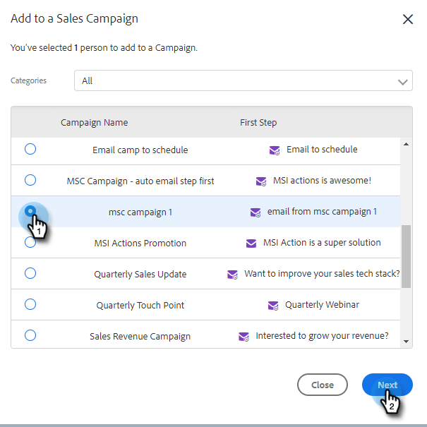

# マーケティングキャンペーンへの追加 {#add-to-marketing-campaign}

>[!PREREQUISITES]
>
>[Sales ユーザーにキャンペーンを表示](/help/marketo/product-docs/marketo-sales-insight/actions/marketo/make-a-campaign-visible-to-sales-connect-users.md)

## キャンペーンへの個人の追加 {#add-individuals-to-a-campaign}

>[!NOTE]
>
>セールスコネクトからMarketoキャンペーンに人を追加するには、セールスコネクトにその人のMarketoリード ID が必要です。

1. 次をクリック： **人** タブ。

   

1. 追加する連絡先を見つけます。

   

1. チェックボックスをクリックして連絡先を選択し、「 」をクリックします。 **選択項目をキャンペーンに追加**.

   

1. ここに手順を追加

   

1. マーケティングキャンペーンに追加するので、「送信元」アドレスの選択をスキップしてください。 ただし、連絡先をさらに追加することもできます。 選択する場合は、「個人」をクリックして入力します。 終了したら「**次へ**」をクリックします。

   

1. クリック **マーケティングキャンペーン**.

PICC

1. 「ワークスペース」ドロップダウンをクリックし、グループを追加するキャンペーンが含まれているワークスペースを選択します。

PICC

>[!NOTE]
>
>必要なワークスペースが表示されない場合は、管理者がMarketoチームアクセスページでワークスペースをプロビジョニングしていることを確認してください。

1. 目的のキャンペーンを選択し、 **次へ**.

PICC

1. クオリファイ対象の連絡先が表示されました。 クリック **開始** をクリックして追加します。

PICC

## キャンペーンへのグループの追加 {#add-a-group-to-a-campaign}

1. 次をクリック： **人** タブ。

PICC

1. 「マイグループ」で、キャンペーンに追加するグループを選択します。

PICC

1. クリック **グループをキャンペーンに追加**.

PICC

1. マーケティングキャンペーンに追加するので、「送信元」アドレスの選択をスキップしてください。 ただし、連絡先をさらに追加することもできます。 選択する場合は、「個人」をクリックして入力します。 終了したら「**次へ**」をクリックします。

PICC

1. 選択 **マーケティングキャンペーン**.

PICC

>[!NOTE]
>
>セールスコネクトからMarketoキャンペーンに人を追加するには、セールスコネクトにその人のMarketoリード ID が必要です。

1. 「ワークスペース」ドロップダウンをクリックし、グループを追加するキャンペーンが含まれているワークスペースを選択します。

PICC

>[!NOTE]
>
>必要なワークスペースが表示されない場合は、管理者がMarketoチームアクセスページでワークスペースをプロビジョニングしていることを確認してください。

1. 目的のキャンペーンを選択し、 **次へ**.

PICC

1. クオリファイ対象の連絡先が表示されました。 クリック **開始** をクリックして追加します。

PICC
