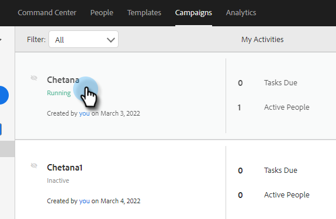

# セールスキャンペーンの設定 {#sales-campaign-settings}

「セールスキャンペーンの設定」セクションでは、特定のセールスキャンペーンを設定し、そのセールスキャンペーンに対するチームのユースケースに最適に機能するようにできます。

## 週末のスキップ {#skip-weekends}

週末のスキップを有効にして、週末（土曜日または日曜日）にあたるステップを月曜日に移動します。

>[!NOTE]
>
>「週末をスキップ」を有効にすると、5 日間の週に基づいてメールがスケジュールされます。つまり、ステップがスケジュールされると、週末は日として無視されます。

1. 「**キャンペーン**」をクリックします。

   

1. 目的のセールスキャンペーンを選択します。

   

1. 「**設定**」タブをクリックします。

   

1. 「**週末をスキップ**」チェックボックスを選択します。

   

## バウンス時に削除 {#remove-on-bounce}

メール接続を使用している場合、ユーザのインボックスに送信されたバウンスメッセージに基づいてバウンスが検出されます。さらに、バウンスが検出された場合にセールスキャンペーンから人物を削除できます。

1. 「**キャンペーン**」をクリックします。

   

1. 目的のセールスキャンペーンを選択します。

   

1. 「**設定**」タブをクリックします。

   

1. 「**バウンス時に削除**」チェックボックスを選択します。

   

## 返信があった場合 {#if-a-reply-occurs}

Gmail または Exchange の返信追跡を有効にした場合、受信者がメールに返信すると自動的にセールスキャンペーンを終了します。

1. 「**キャンペーン**」をクリックします。

   

1. 目的のセールスキャンペーンを選択します。

   

1. 「**設定**」タブをクリックします。

   

1. 「**返信が発生した場合**」で、必要な選択を行います。

   

>[!MORELIKETHIS]
>
>* [セールスキャンペーンの作成](/help/marketo/product-docs/marketo-sales-insight/actions/campaigns/create-a-sales-campaign.md){target=&quot;_blank&quot;}
>* [メールステップのセールスキャンペーン送信オプションについて](/help/marketo/product-docs/marketo-sales-insight/actions/campaigns/understanding-sales-campaign-send-options-for-email-steps.md){target=&quot;_blank&quot;}
>* [セールスキャンペーンのステップのタイプとリマインダータスク](/help/marketo/product-docs/marketo-sales-insight/actions/campaigns/sales-campaign-step-types-and-reminder-tasks.md){target=&quot;_blank&quot;}

