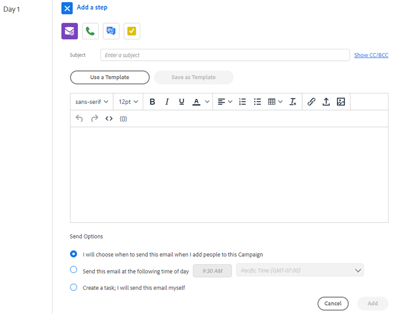

# セールスキャンペーンのステップのタイプとリマインダータスク {#sales-campaign-step-types-and-reminder-tasks}

## セールスキャンペーンのステップタイプ {#sales-campaign-step-types}

セールスキャンペーンにステップを追加する場合、4 つのオプションがあります。

### 電子メール {#email}

新しいメールを作成するか、既存のテンプレートを使用します。

| **テンプレートを使用** | 既存のテンプレートの 1 つを選択します |
|---|---|
| **テンプレートとして保存** | 作成したメールを新しいテンプレートとして保存します |
| **コンテンツの追加** | ファイルをアドビのサーバーにアップロードし、メールでトラックできる URL（コンテンツを指す）を受け取ります |
| **ファイルを添付** | コンピューターからメールにファイルを添付します（サイズ制限は 23 MB） |

>[!TIP]
>
>詳細は [送信オプション](/help/marketo/product-docs/marketo-sales-insight/actions/campaigns/sales-campaign-send-options-for-email-steps.md){target=&quot;_blank&quot;}。

### 電話 {#call}

電話で連絡先をフォローアップするリマインダーを設定します。また、通話中にトークトラックとして使用するメモを保存することもできます。

### InMail {#inmail}

複数のチャネルをフォローアップすることは、リードとのつながりを強化する優れた方法です。InMail タスクを使用して、LinkedIn を介して連絡を取るリマインダーを設定できます。

### カスタムタスク {#custom-task}

上記のオプションを適用できない場合は、カスタムタスクを使用します。例えば、同僚を招待して、メールでリードをフォローアップすることができます。

## セールスキャンペーンでのリマインダータスクの使用 {#using-reminder-tasks-in-sales-campaigns}

タスクは、特にセールスプロセスがマルチチャネル/タッチの場合に、セールスキャンペーンを連絡先に送信する際に強力なツールです。

連絡先にメールとタスクを送信するタスクは、セールスキャンペーンのタスクで最も一般的に使用されます。

また、ワークフローに「Task to Inmail」という連絡先を LinkedIn 上に作成することもできます。また、カスタムタスクを作成して、ハッピーアワーに招待したり、チャリティイベントについて質問したり、ゲーム 5 の後にチェックインしたりするよう促すこともできます。

>[!NOTE]
>
>セールスキャンペーンのタスクで最も重要なことは、次のステップをトリガーするためにタスクを完了する必要があります。

>[!MORELIKETHIS]
>
>[セールスキャンペーンの作成](/help/marketo/product-docs/marketo-sales-insight/actions/campaigns/create-a-sales-campaign.md){target=&quot;_blank&quot;}
