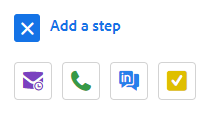

# セールスキャンペーンのステップのタイプとリマインダータスク {#sales-campaign-step-types-and-reminder-tasks}

## セールスキャンペーンのステップタイプ {#sales-campaign-step-types}

セールスキャンペーンにステップを追加する場合、4 つの選択肢があります。

### 電子メール {#email}

新しいメールを作成するか、既存のテンプレートを使用します。

| **[!UICONTROL テンプレートを使用]** | 既存のテンプレートの 1 つを選択します |
|---|---|
| **[!UICONTROL テンプレートとして保存]** | 作成したメールを新しいテンプレートとして保存します |
| **コンテンツの追加** | ファイルをアドビのサーバーにアップロードし、メールでトラックできる URL（コンテンツを指す）を受け取ります |
| **ファイルを添付** | コンピューターからメールにファイルを添付します（サイズ制限は 23 MB） |

>[!TIP]
>
>[送信オプション](/help/marketo/product-docs/marketo-sales-insight/actions/campaigns/understanding-sales-campaign-send-options-for-email-steps.md){target="_blank"}の詳細をご覧ください。

### 電話 {#call}

電話で取引先責任者をフォローアップするリマインダーを設定します。また、通話中にトークトラックとして使用するメモを保存することもできます。

### InMail {#inmail}

複数のチャネルをフォローアップすることは、リードとのつながりを強化する優れた方法です。InMail タスクを使用して、LinkedIn を介して連絡を取るリマインダーを設定できます。

### カスタムタスク {#custom-task}

上記のオプションを適用できない場合は、カスタムタスクを使用します。例えば、同僚を招待して、メールでリードをフォローアップすることができます。

## セールスキャンペーンでのリマインダータスクの使用 {#using-reminder-tasks-in-sales-campaigns}

タスクは、特に営業プロセスがマルチチャネル／タッチの場合に、セールスキャンペーンを取引先責任者に送信する際に強力なツールです。

取引先責任者にメールを送信するタスクと電話をかけるタスクは、セールスキャンペーンのタスクで最も一般的に使用されます。

また、LinkedIn で取引先責任者に「Inmail するタスク」がワークフローの一環である場合、そのように作成することもできます。また、カスタムタスクを作成して、ハッピーアワーに招待したり、チャリティイベントについて質問したり、ゲーム 5 の後にチェックインしたりするよう促すこともできます。

>[!NOTE]
>
>セールスキャンペーンのタスクで最も重要な点は、次の手順をトリガーするためにタスクを順番に完了する必要があることです。

>[!MORELIKETHIS]
>
>[セールスキャンペーンの作成](/help/marketo/product-docs/marketo-sales-insight/actions/campaigns/create-a-sales-campaign.md){target="_blank"}
