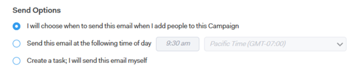

# メールステップのセールスキャンペーン送信オプションについて {#understanding-sales-campaign-send-options-for-email-steps}

セールスキャンペーンを作成する場合、[!DNL Sales Insight Actions] でのメール手順の作成方法に関して、いくつかのオプションがあります。 また、セールスキャンペーン内でのメールの場所によって、オプションも異なります。

## 送信オプションの最初のステップ {#first-step-send-options}

セールスキャンペーンの最初のステップと初日の場合は、次のオプションがあります。

### このメールを送信するタイミングを選択する {#first-step-i-will-choose}

* このオプションを使用すると、リードを追加してセールスキャンペーンを開始する際に、セールスキャンペーンの最初のメールの「送信時」を選択できます。

### 以下の時刻にこのメールを送信 {#first-step-following-time}

* リードを追加してセールスキャンペーンを開始する際に、今回のメールのスケジュールが設定されます。
* セールスキャンペーンを開始する際に、常に新しい「送信時刻」を選択するオプションがあります。

### タスクを作成（このメールは手動で送信） {#first-step-create-a-task}

* このオプションでは、都合のよいときに送信できるメールタスク（および [!DNL Salesforce] と同期）が作成されます。
* これを選択すると、セールスキャンペーンを開始する際に、コマンドセンターとライブフィードでこれらのタスクがキューに入れられます。 その後、送信前に、各メールをパーソナライズして送信（またはスケジュール設定）できます。

   * このタスクを web アプリケーションで開くと、作成ウィンドウが開き、取引先責任者のメールアドレス、メールの件名、選択したテンプレートが表示されます。
   * このタスクを Gmail または [!DNL Outlook] で開くと、ネイティブの作成ウィンドウが開き、取引先責任者のメールアドレス、メールの件名、選択したテンプレートが動的に入力されます。

## 送信オプションの後続のステップ {#subsequent-step-send-options}

セールスキャンペーンの後続の日／ステップでは、以下のオプションを使用できます。

### このセールスキャンペーンの前のメールと同じ時刻にこのメールを送信 {#subsequent-send-at-same-time}

* このオプションを選択すると、直近のメールと同じ時刻にメールが送信されます。
* 関連付けられた日にも送信されます。

>[!IMPORTANT]
>
>同じ日に送信したメールの場合、前のメールと同じ時刻にメールを送信することはサポートされていません。 代わりに、前日にメールを送信した時刻にメールが送信されます。 キャンペーンの初日にメールに対してこのオプションを選択した場合（非推奨）、そのメールはキャンペーンの開始時に即座に送信されます。

### 以下の時刻にこのメールを送信 {#subsequent-send-at-following-time}

* リードを追加してセールスキャンペーンを開始する際に、今回のメールのスケジュールが設定されます。
* セールスキャンペーンを開始する際に、常に新しい「送信時刻」を選択するオプションがあります。

### タスクを作成（このメールは手動で送信） {#subsequent-create-a-task}

* このオプションでは、都合のよいときに送信できるメールタスク（および [!DNL Salesforce] と同期）が作成されます。
* この選択を行った後、セールスキャンペーンを開始すると、[!DNL Sales Insight Actions] はこれらのタスクをコマンドセンターとライブフィードでキューに入れます。 その後、送信前に、各メールをパーソナライズして送信（またはスケジュール設定）できます。

   * このタスクを web アプリケーションで開くと、作成ウィンドウが開き、取引先責任者のメールアドレス、メールの件名、選択したテンプレートが表示されます。
   * このタスクを Gmail または [!DNL Outlook] で開くと、ネイティブの作成ウィンドウが開き、取引先責任者のメールアドレス、メールの件名、選択したテンプレートが動的に入力されます。

### このキャンペーンの前のメールのフォローアップとしてこのメールを作成 {#subsequent-create-this-email}

* セールスキャンペーンの前のメールを、セールスキャンペーンで送信される次のメールに追加したい場合は、このチェックボックスを有効にします。
* 追加されたメールのコピーの場合、セールスキャンペーンのメールテンプレートが常に送信されます。 送信される前にユーザーが行った編集は、送信には含まれません。

>[!NOTE]
>
>メールをフォローアップとして作成するこのオプションは、前のステップもメールの場合、メールステップでのみ使用できます。 前のステップが、電話、InMail またはカスタムの場合、フォローアップを作成するオプションは表示されません。

>[!MORELIKETHIS]
>
>[ セールスキャンペーンの作成](/help/marketo/product-docs/marketo-sales-insight/actions/campaigns/create-a-sales-campaign.md){target="_blank"}
>[セールスキャンペーンのステップのタイプとリマインダータスク](/help/marketo/product-docs/marketo-sales-insight/actions/campaigns/sales-campaign-step-types-and-reminder-tasks.md){target="_blank"}
>[セールスキャンペーンの設定](/help/marketo/product-docs/marketo-sales-insight/actions/campaigns/sales-campaign-settings.md){target="_blank"}
