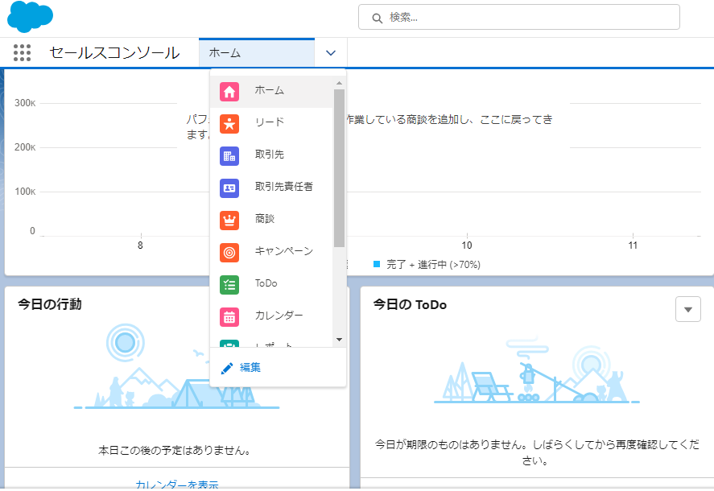
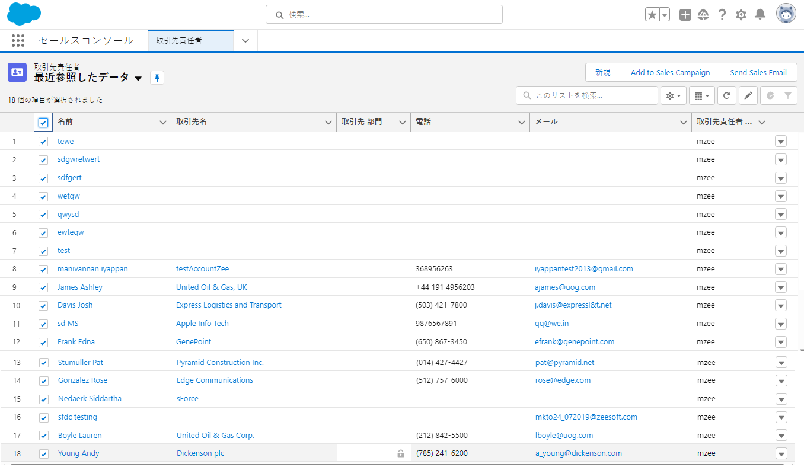
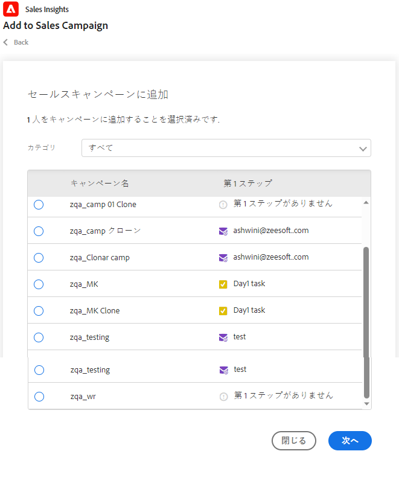
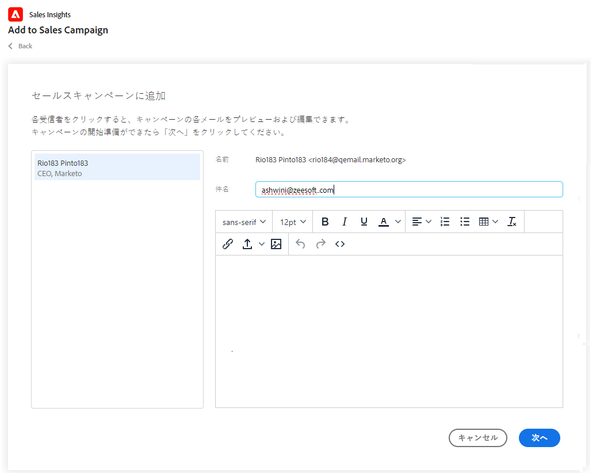
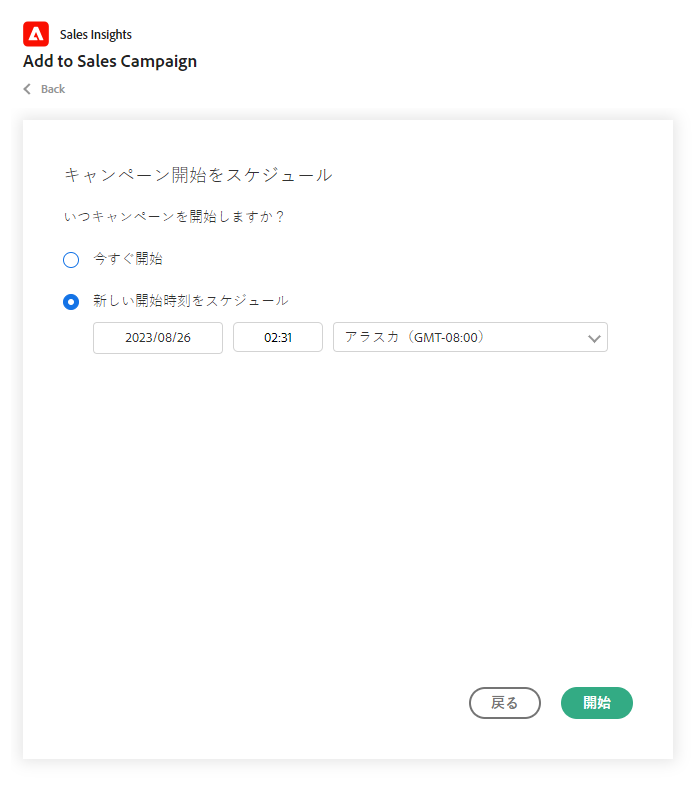
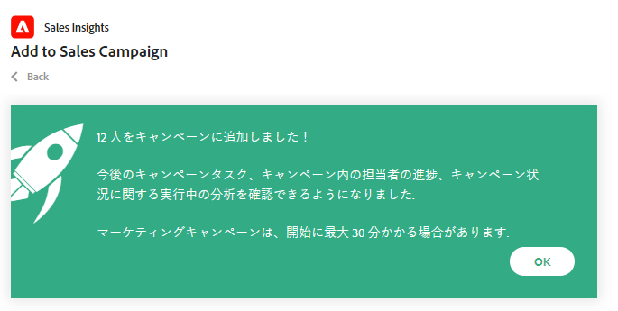
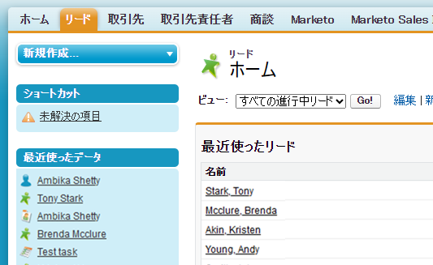
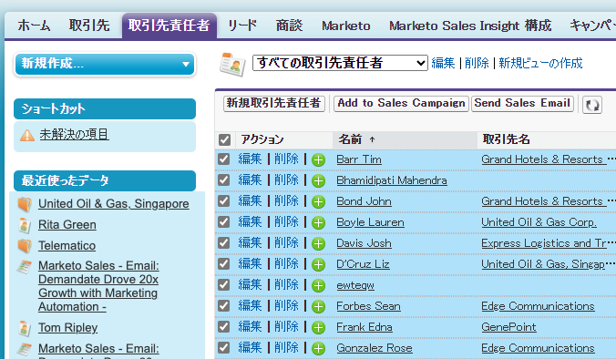
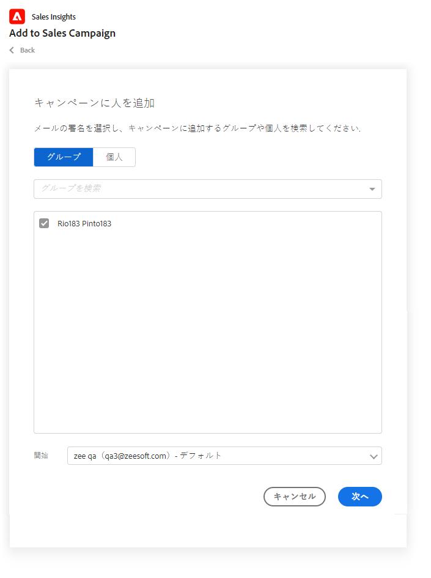

# Salesforce でセールスキャンペーンへの一括追加を使用 {#using-bulk-add-to-sales-campaign-in-salesforce}

セールスアクションを使用してアウトバウンド通信を拡張するために、Salesforce でセールスキャンペーンに一括追加する方法を説明します。

>[!NOTE]
>
>Salesforce では、一度に 200 件のレコードを選択できる制限が適用されています。

>[!PREREQUISITES]
>
>をインストール済みであることを確認します。 [最新の Sales Insight パッケージ](/help/marketo/product-docs/marketo-sales-insight/msi-for-salesforce/upgrading/upgrading-your-msi-package.md){target="_blank"} to your Salesforce instance and have configured the [Action buttons](/help/marketo/product-docs/marketo-sales-insight/actions/crm/salesforce-package-configuration/add-action-buttons-to-salesforce-list-view.md){target="_blank"} を Salesforce の連絡先およびリードリスト表示に追加しました。

## Salesforce Lightning でセールスキャンペーンに一括追加 {#bulk-add-to-sales-campaign-in-salesforce-lightning}

1. Salesforce で、 **リード/連絡先** タブをクリックします。

   

1. 内 **表示** ドロップダウンから、電子メールを送信するリード/連絡先の目的のビューを選択します。

   >[!TIP]
   >
   >新しいビューを作成するには、右側のコグアイコンをクリックし、「 **新規**. ビューに新しい名前を付けて保存したら、右側のフィルターアイコンをクリックして、電子メールで送信するリード/連絡先を絞り込むことができます。

1. 目的のリードまたは連絡先のリストを選択し、 **セールスキャンペーンに追加** 」ボタンをクリックします。

   

1. 選択した受信者が追加された状態で、アクションセールスキャンペーンモーダルに移動します。

1. ユーザーまたはグループを削除するために必要な編集を行い、「 **次へ**.

   

1. カテゴリドロップダウンから、使用するセールスキャンペーンカテゴリを選択します。

1. 選択した担当者を追加するセールスキャンペーンを選択し、 **次へ**.

   

1. キャンペーンの最初の手順に応じて、異なるオプションが表示される場合があります。 最初の手順が E メールの場合は、次に示すように、各受信者の E メールを編集するオプションがあります。 完了したら、「 **次へ**.

   

1. また、最初の手順が電子メールで、キャンペーンの起動時に選択できるように設定した場合は、次のオプションを使用できます。 **利用する** または **新しい開始時間のスケジュール設定**. これが完了したら、 **開始**.

   

「開始」をクリックすると、追加されたユーザーの数を知らせる確認画面が表示されます。

## Salesforce Classic のセールスキャンペーンへの一括追加 {#bulk-add-to-sales-campaign-in-salesforce-classic}

1. Salesforce で、 **リード/連絡先** タブをクリックします。

1. 「表示」ドロップダウンで、電子メールを送信するリード/連絡先の目的のビューを選択し、「 」をクリックします **移動**.

   

   >[!TIP]
   >
   >新しいビューを作成するには、「新しいビューを作成」をクリックし、電子メールで送信する受信者のリストを絞り込むための使用可能なフィルターを設定します。

1. 目的のリードまたは連絡先のリストを選択し、 **セールスキャンペーンに追加** 」ボタンをクリックします。

   

1. 選択した人物が含まれる「アクションセールスキャンペーン」モーダルに移動します。

1. ユーザーまたはグループを削除するために必要な編集を行い、「 **次へ**.

   

1. 使用するセールスキャンペーンカテゴリを **カテゴリ** 」ドロップダウンリストから選択できます。

1. 選択した担当者を追加するセールスキャンペーンを選択し、 **次へ**.

   

1. キャンペーンの最初の手順に応じて、異なるオプションが表示される場合があります。 最初の手順が E メールの場合は、次に示すように、各受信者の E メールを編集するオプションがあります。 完了したら、「 **次へ**.

   

1. また、最初の手順が電子メールで、キャンペーンの起動時に選択できるように設定した場合は、次のオプションを使用できます。 **利用する** または **新しい開始時間のスケジュール設定**. これが完了したら、 **開始**.

   

「開始」をクリックすると、追加されたユーザーの数を知らせる確認画面が表示されます。

