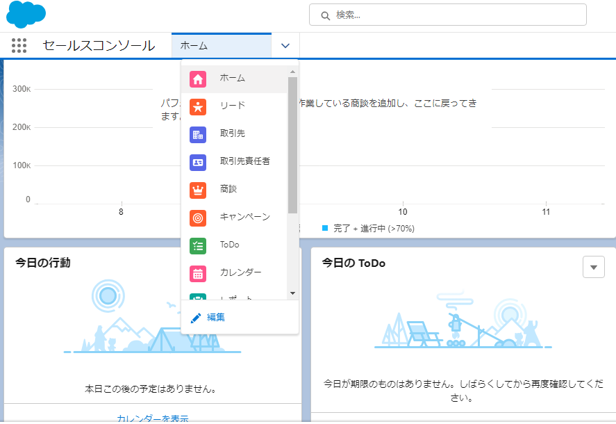
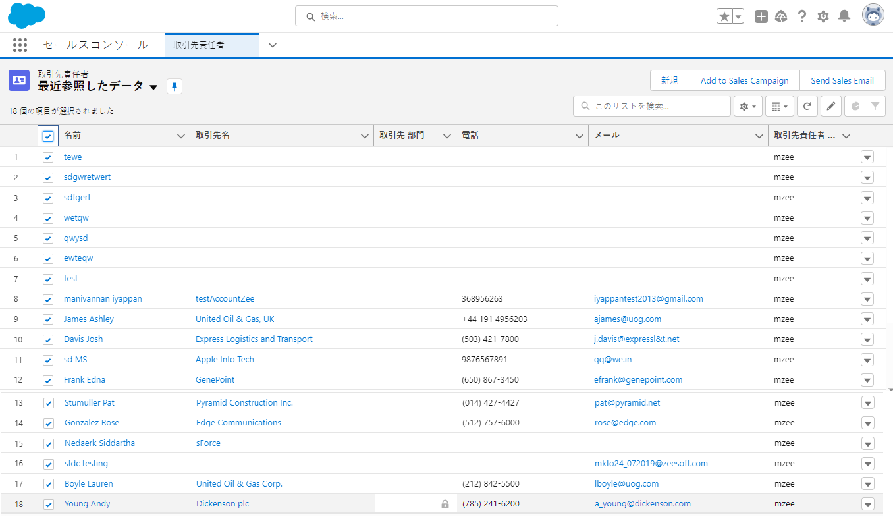
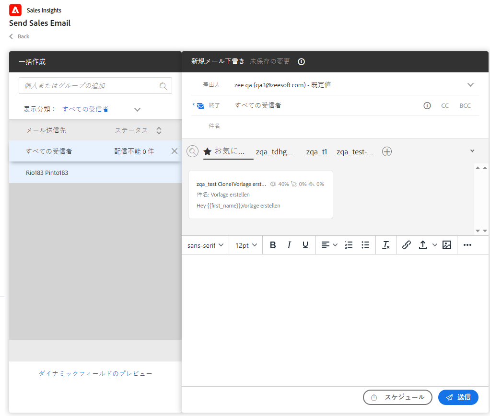
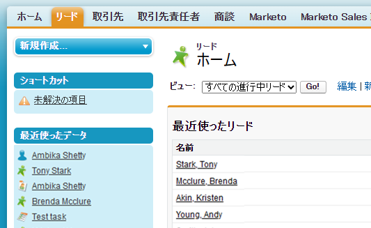
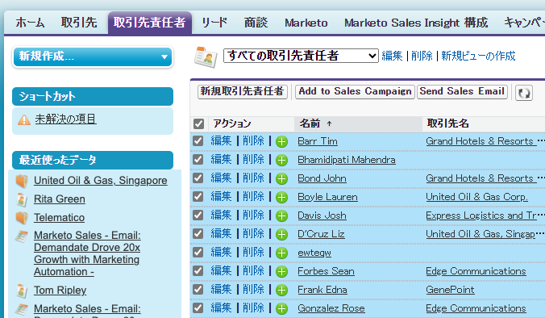
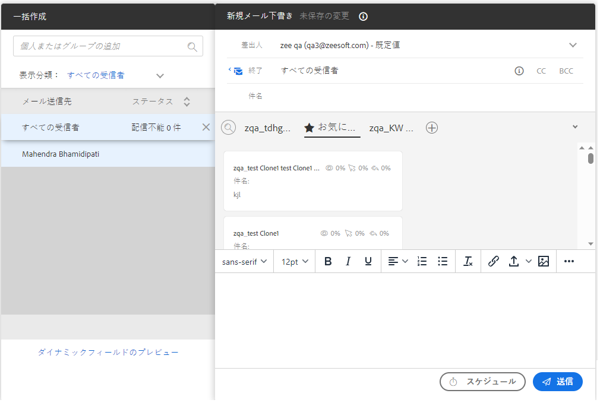

# Salesforce でのセールスメールの一括送信の使用 {#using-bulk-send-sales-email-in-salesforce}

Sales Actions を使用したアウトバウンド通信の拡大に役立つ、Salesforce での一括メールの送信方法を説明します。

>[!NOTE]
>
>Salesforce では、一度に選択できるレコード数が 200 に制限されます。

>[!PREREQUISITES]
>
>[ 最新の Sales Insight パッケージ ](/help/marketo/product-docs/marketo-sales-insight/msi-for-salesforce/upgrading/upgrading-your-msi-package.md){target="_blank"} が Salesforce インスタンスにインストールされ、Salesforce の連絡先ビューとリードリストビューで [ アクションボタン ](/help/marketo/product-docs/marketo-sales-insight/actions/crm/salesforce-package-configuration/add-action-buttons-to-salesforce-list-view.md){target="_blank"} が設定されていることを確認します。

## Salesforce Lightning での一括メールの送信 {#sending-bulk-email-in-salesforce-lightning}

1. Salesforce で、「**リード／連絡先**」タブをクリックして、リード／連絡先ホームページに移動します。

   

1. 表示ドロップダウンで、メールを送信するリード／連絡先の目的の表示を選択します。

   >[!TIP]
   >
   >右側の歯車アイコンをクリックして、「**新規**」を選択することで、新しい表示を作成できます。表示に新しい名前を付けて保存したら、右側のフィルターアイコンをクリックして、メールを送信するリード／連絡先の目的のセットに絞り込むことができます。

1. 目的のリードまたは連絡先のリストを選択して、「**セールスメールを送信**」ボタンをクリックします。

   

1. 選択した人物が追加された、Actions 作成ウィンドウが表示されます。

1. Actions 作成ウィンドウエディターに挿入するテンプレートを選択するか、カスタムメールを記述します。

   >[!TIP]
   >
   >お気に入りのメールテンプレートにアクセスしやすくするには、[ピン留めしたカテゴリ](/help/marketo/product-docs/marketo-sales-insight/actions/email/using-the-compose-window/using-a-template-in-the-compose-window.md#pinning-template-categories-in-the-compose-window){target="_blank"}を使用します。

   **オプションの手順**：**ダイナミックフィールドをプレビュー**&#x200B;ボタンをクリックして、ダイナミックフィールドパーソナライゼーションをプレビューします。

   >[!TIP]
   >
   >すべての受信者用のテンプレートをカスタマイズするには、一括作成サイドバーの「すべての受信者」オプションをクリックすることで、すべての受信者メールに対して同時に編集できます。特定のメールに対して変更を加えるには、一括作成サイドバーの受信者の名前またはメールをクリックします。個々のメールに変更を加えてから、「すべての受信者」を選択して変更を加えると、すべての受信者に対して行った変更が個々のメールに対して行った変更を上書きすることに注意してください。

1. 「**送信**」を選択して、即座にメールを送信するか、**スケジュールを設定**&#x200B;して、メールが送信される日時を設定します。

   

## Salesforce Classic での一括メールの送信 {#sending-bulk-email-in-salesforce-classic}

1. Salesforce で、「**リード／連絡先**」タブをクリックします。

1. 表示ドロップダウンで、メールを送信するリード／連絡先の目的の表示を選択して、「**移動**」をクリックします。

   

   >[!TIP]
   >
   >「ビューの新規作成」をクリックして、セールスキャンペーンに追加する人物のリストを絞り込むための使用可能なフィルターを設定することで、新しい表示を作成できます。

1. 目的のリードまたは連絡先のリストを選択して、「**セールスメールを送信**」ボタンをクリックします。

   

1. 選択した受信者が追加された、Actions 作成ウィンドウが表示されます。

1. Actions 作成ウィンドウエディターに挿入するテンプレートを選択するか、カスタムメールを記述します。

   

   >[!TIP]
   >
   >お気に入りのメールテンプレートにアクセスしやすくするには、[ピン留めしたカテゴリ](/help/marketo/product-docs/marketo-sales-insight/actions/email/using-the-compose-window/using-a-template-in-the-compose-window.md#pinning-template-categories-in-the-compose-window){target="_blank"}を使用します。

   **オプションの手順**：**ダイナミックフィールドをプレビュー**&#x200B;ボタンをクリックして、ダイナミックフィールドパーソナライゼーションをプレビューします。

   >[!TIP]
   >
   >すべての受信者用のテンプレートをカスタマイズするには、一括作成サイドバーの「すべての受信者」オプションをクリックすることで、すべての受信者メールに対して同時に編集できます。特定のメールに対して変更を加えるには、一括作成サイドバーの受信者の名前またはメールをクリックします。個々のメールに変更を加えてから、「すべての受信者」を選択して変更を加えると、すべての受信者に対して行った変更が個々のメールに対して行った変更を上書きすることに注意してください。

1. 「**送信**」を選択して、即座にメールを送信するか、**スケジュールを設定**&#x200B;して、メールが送信される日時を設定します。
