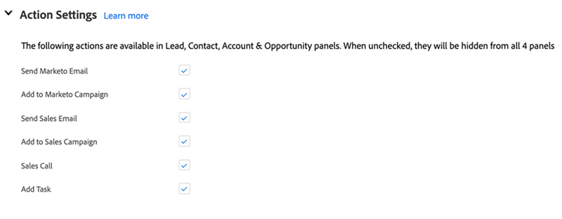

# Salesforce での Sales Insight アクション構成 {#sales-insight-actions-configuration-in-salesforce}

>[!PREREQUISITES]
>
>* [インストール](/help/marketo/product-docs/marketo-sales-insight/msi-for-salesforce/installation/install-marketo-sales-insight-package-in-salesforce-appexchange.md) または [アップグレード](/help/marketo/product-docs/marketo-sales-insight/msi-for-salesforce/upgrading/upgrading-your-msi-package.md) Salesforce インスタンス内の Sales Insight パッケージ
>* [Salesforce Enterprise／Unlimited での Marketo Sales Insight の設定](/help/marketo/product-docs/marketo-sales-insight/msi-for-salesforce/configuration/configure-marketo-sales-insight-in-salesforce-enterprise-unlimited.md)

## Salesforce に新しいリモートサイトを追加 {#add-new-remote-site-in-salesforce}

1. Salesforce で、「**設定**」をクリックします。

   

1. 「リモートサイト」を検索し、を選択します。 **リモートサイト設定**.
   

1. 「**新規リモートサイト**」をクリックします。

   

1. リモートサイト名を入力します（「MarketoSalesInsight1」など）。 リモートサイトの URL を入力 `https://ims-na1.adobelogin.com` をクリックし、 **保存**.

   

1. もう一度「**新規リモートサイト**」をクリックします。

   

1. リモートサイト名を入力します（「MarketoSalesInsight2」など）。 リモートサイトの URL を入力 `https://mkto-sales-connect.adobe.io` をクリックし、 **保存**.

## CRM 全体での Sales Insight アクションの有効化 {#enabling-sales-insight-actions-across-the-crm}

1. Salesforce で、「**Marketo Sales Insight 設定**」タブをクリックします。

   

   >[!NOTE]
   >
   >上部のバーに「Marketo Sales Insight 設定」が表示されない場合は、「**+**」をクリックし、「すべてのタブ」から見つけます。

1. 「**MSI アクションを有効にする**」チェックボックスをオンにします。

   

1. API 秘密鍵を入力します。

   

   >[!NOTE]
   >
   >API 秘密鍵をお持ちでない場合は、[この記事](/help/marketo/product-docs/marketo-sales-insight/msi-for-salesforce/configuration/configure-marketo-sales-insight-in-salesforce-enterprise-unlimited.md)の手順を参照してください。

1. 終了したら「**保存**」をクリックします。

これにより、機能の概要記事で概要を説明しているすべての MSI アクション機能が自動的に有効になります。

>[!NOTE]
>
>[MSI アクションを有効にする ] チェックボックスをオフにするだけで、すべての MSI アクション機能を無効にすることができます。

## MSI アクションのガバナンス {#msi-actions-governance}

1. 今後提供されるセクションで、セールスキャンペーンや「タスク」タブを無効にすることができます。これは、リード、連絡先、アカウント、商談の各パネルに適用されます。

   

1. MSI アクションを無効にするには、「アクション」設定で対応する機能をオフにします。

   

>[!NOTE]
>
>ガバナンス設定は、すべての MSI ユーザーに適用できます。
