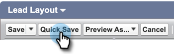
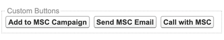
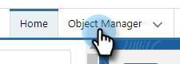
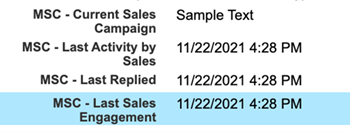

# Salesforce Lightning カスタマイズパッケージのアンインストール {#uninstall-salesforce-lightning-customization-package}

MSI アクションパッケージの使用を開始したら、Salesforce アカウントから Marketo Sales Connect パッケージをアンインストールします。

## ページレイアウトから Sales Connect フィールドを削除 {#remove-sales-connect-fields-from-page-layout}

1. Salesforce Lightning で、歯車アイコンをクリックし、「**設定**」を選択します。

   

1. 「**オブジェクトマネージャー**」をクリックします。

   

1. 下にスクロールして、「**リード**」をクリックします。

   

1. 「**ページレイアウト**」をクリックします。

   

1. 「**リードレイアウト**」をクリックします。

   

   >[!NOTE]
   >
   >Salesforce Lightning のページレイアウトの編集ビューは、まだ更新されていません。

1. コンソールで、「**フィールド**」を選択します。クイック検索で「MSC」を検索します。グレー表示のフィールドはすべて、ページレイアウトに追加されています。削除する必要があります。

   

   >[!NOTE]
   >
   >グレー表示になっているフィールドがない場合は、まだページレイアウトに追加されていないことを意味します。このセクションはスキップできます。

1. Sales Connect のカスタムフィールドが設定されたセクションにスクロールします。

   

1. このセクションに追加できる MSC フィールドは 10 種類あります。追加したすべてのフィールドを削除するか、単にセクション全体を削除します。

1. 終了したら「**保存**」をクリックします。

   

## ページレイアウトから Sales Connect のボタンを削除 {#remove-sales-connect-buttons-from-page-layouts}

1. コンソールで（上記の手順 4）、「**ボタン**」を選択します。「MSC」を検索します。グレー表示のボタンがすべて、「カスタムボタン」セクションに追加されました。削除する必要があります。

   

   >[!NOTE]
   >
   >グレー表示になっているボタンがない場合は、まだ追加されていないことを意味します。このセクションはスキップできます。

1. 「カスタムボタン」セクションからコンソールに MSC ボタンをドラッグ＆ドロップします。

   

1. 終了したら「**保存**」をクリックします。

   

## 「アクティビティ履歴」セクションからセールスコネクトフィールドを削除 {#remove-sales-connect-fields-from-activity-history-section}

1. ページの下部までスクロールして、「アクティビティ履歴」関連リストセクションに移動し、レンチアイコンをクリックします。

   

1. 「選択したフィールド」領域で「Sales Connect フィールド」を選択し、「削除」矢印をクリックします。終了したら「**OK**」をクリックします。

   

   >[!NOTE]
   >
   >_MSE_ は Sales Connect の略称です。これは「Marketo Sales Engage」という名前です

1. 「リード」ページの操作が完了したら、「**保存**」をクリックします。

## リードリスト表示から Sales Connect の一括アクションボタンを削除 {#remove-sales-connect-bulk-action-buttons-from-lead-list-view}

1. Salesforce Lightning で、歯車アイコンをクリックし、「**設定**」を選択します。

   

1. 「**オブジェクトマネージャー**」をクリックします。

   

1. 下にスクロールして、「**リード**」をクリックします。

   

1. 「**検索レイアウト**」をクリックします。

   

1. リスト表示の横の矢印をクリックし、「**編集**」を選択します。

   

1. 「**MSC キャンペーンに追加**」、「**MSC でメール送信**」、「**MSC にプッシュ**&#x200B;を選択し、「削除」矢印をクリックします。「**保存**」をクリックします。

   

リードリスト表示にボタンが表示されなくなりました。

## 連絡先の MSC 設定を削除 {#remove-msc-configuration-for-contacts}

1. Salesforce Lightning で、歯車アイコンをクリックし、「**設定**」を選択します。

1. 「**オブジェクトマネージャー**」をクリックします。

1. 下にスクロールして、「**連絡先**」をクリックします。

1. 「**ページレイアウト**」をクリックします。

1. 「**連絡先レイアウト**」をクリックします。

1. 3 つのセクションすべてから手順を繰り返します。

## 商談の MSC 設定を削除 {#remove-msc-configuration-for-opportunity}

1. Salesforce Lightning で、歯車アイコンをクリックし、「**設定**」を選択します。

1. 「**オブジェクトマネージャー**」をクリックします。

1. 下にスクロールして、「**商談**」をクリックします。

1. 「**ページレイアウト**」をクリックします。

1. 「**商談のレイアウト**」をクリックします。

商談表示には、「MSE メールを送信」ボタンが 1 つと次のフィールドがあります。

## アカウントの MSC 設定を削除 {#remove-msc-configuration-for-account}

1. Salesforce Lightning で、歯車アイコンをクリックし、「**設定**」を選択します。

1. 「**オブジェクトマネージャー**」をクリックします。

1. 下にスクロールして、「**アカウント**」をクリックします。

1. 「**ページレイアウト**」をクリックします。

1. 「**アカウントのレイアウト**」をクリックします。

アカウント表示には、「MSE メールを送信」ボタンが 1 つと次のフィールドがあります。

## Marketo Sales 送信トレイを削除 {#remove-marketo-sales-outbox}

1. Salesforce で、画面上部の「**+**」タブをクリックします。

1. 「**タブをカスタマイズ**」をクリックします。

1. 右側の「Marketo Sales 送信トレイ」オプションを選択します。削除矢印をクリックし、「**保存**」をクリックします。

## Sales Connect パッケージを削除 {#delete-sales-connect-package}

Salesforce アカウントからすべてのオブジェクトを削除したら、次の手順に従います。

1. Salesforce Lightning で、歯車アイコンをクリックし、「**設定**」を選択します。

1. 「クイック検索」ボックスに、「Apex Classes」と入力します。

1. リストのすべての「MarketoSalesConnectionCustomization」または「MarketoSalesEngageCustomization」エントリの横の「**削除**」をクリックします。

準備完了です。

以下に、Salesforce インスタンスから削除する必要のあるすべてのオブジェクトのリストを示します。

## Sales Connect のカスタマイズ詳細 {#sales-connect-customization-details}

<table>
 <tr>
  <th>カスタムアクティビティフィールド</th>
  <th>説明</th>
  <th>タイプ</th>
  <th>データタイプ</th>
 </tr>
 <tr>
  <td>MSC 電話ローカルプレゼンス ID</td>
  <td>ユーザーは、MSC 電話から電話をかける際に、「ローカルプレゼンス」をオプションとして選択できます。着信電話は、受信者のローカル番号を表示します</td>
  <td>アクティビティ</td>
  <td>テキスト</td>
 </tr>
 <tr>
  <td>MSC 電話録音 URL</td>
  <td>通話は録音され、録音のリンクはここに記録されます </td>
  <td>アクティビティ</td>
  <td>テキスト</td>
 </tr>
 <tr>
  <td>MSC キャンペーン</td>
  <td>連絡先／リードに適用されている MSC キャンペーンの名前を記録します</td>
  <td>アクティビティ</td>
  <td>テキスト</td>
 </tr>
 <tr>
  <td>MSC キャンペーン URL</td>
  <td>MSC で作成されたキャンペーンの URL を記録します。これをクリックすると、MSC web アプリでキャンペーンが開きます</td>
  <td>アクティビティ</td>
  <td>テキスト</td>
 </tr>
 <tr>
  <td>MSC キャンペーンの現在のステップ</td>
  <td>連絡先／リードに適用されているキャンペーンがある場合、このフィールドには、リード／連絡先が現在適用されているステップの名前が記録されます</td>
  <td>アクティビティ</td>
  <td>チェックボックス</td>
 </tr>
 <tr>
  <td>MSC メール添付ファイルの閲覧</td>
  <td>ファイルが添付されたメールが送信され、受信者が閲覧した場合に、データを記録します</td>
  <td>アクティビティ</td>
  <td>チェックボックス</td>
 </tr>
 <tr>
  <td>MSC メールのクリック</td>
  <td>受信者がメール内のリンクをクリックしたときにチェックマークを記録します</td>
  <td>アクティビティ</td>
  <td>チェックボックス</td>
 </tr>
 <tr>
  <td>MSC メールの返信</td>
  <td>受信者がメールに返信したときにチェックマークを記録します</td>
  <td>アクティビティ</td>
  <td>テキスト</td>
 </tr>
 <tr>
  <td>MSC メールのステータス</td>
  <td>メールが送信済み／処理中／バウンスされたかどうかを表示します（バウンスメールのトラッキングは、使用する配信チャネルに依存します）</td>
  <td>アクティビティ</td>
  <td>テキスト</td>
 </tr>
 <tr>
  <td>MSC メールテンプレート</td>
  <td>リード／連絡先に送信されたメールで使用された MSC テンプレートの名前を記録します</td>
  <td>アクティビティ</td>
  <td>テキスト</td>
 </tr>
 <tr>
  <td>MSC メールテンプレート URL</td>
  <td>MSC で作成されたテンプレートの URL を記録します。これをクリックすると、MSC web アプリでテンプレートが開きます</td>
  <td>アクティビティ</td>
  <td>テキスト</td>
 </tr>
 <tr>
  <td>MSC メール URL</td>
  <td>この URL をクリックすると、MSC でコマンドセンターが開き、「リード詳細表示の履歴」タブが前面表示され、送信されたメールを確認できます</td>
  <td>アクティビティ</td>
  <td>テキスト</td>
 </tr>
 <tr>
  <td>MSC メールの表示</td>
  <td>受信者がメールを表示したときにチェックマークを記録します</td>
  <td>アクティビティ</td>
  <td>チェックボックス</td>
 </tr>
</table>

<table>
 <tr>
  <th>MSC ロールアップログフィールド</th>
  <th>説明</th>
  <th>タイプ</th>
  <th>データタイプ</th>
 </tr>
 <tr>
  <td>MSC - 最終マーケティングエンゲージメント</td>
  <td>マーケティングから最後に入ってきたエンゲージメント</td>
  <td>
  
アカウント
  
連絡先
  
リード
  
商談</td>
  <td>日時</td>
 </tr>
 <tr>
  <td>MSC - 最終マーケティングエンゲージメント日</td>
  <td>マーケティングからのエンゲージメントのタイムスタンプ</td>
  <td>
  
アカウント 
  
連絡先 
  
リード 
  
商談</td>
  <td>日時</td>
 </tr>
 <tr>
  <td>MSC - 最終マーケティングエンゲージメントの説明</td>
  <td>エンゲージメントの説明</td>
  <td>
  
アカウント 
  
連絡先 
  
リード 
  
商談</td>
  <td>テキスト</td>
 </tr>
 <tr>
  <td>MSC - 最終マーケティングエンゲージメントソース</td>
  <td>マーケティングエンゲージメントのソース</td>
  <td>
  
アカウント 
  
連絡先 
  
リード 
  
商談</td>
  <td>テキスト</td>
 </tr>
 <tr>
  <td>MSC - 最終マーケティングエンゲージメントのタイプ</td>
  <td>エンゲージメントのタイプ（例：web アクティビティ）</td>
  <td>
  
アカウント 
  
連絡先 
  
リード 
  
商談</td>
  <td>テキスト</td>
 </tr>
 <tr>
  <td>MSC - セールスによる最終アクティビティ</td>
  <td>セールスチームが最後に実行した外部アクティビティ</td>
  <td>
  
アカウント 
  
連絡先 
  
リード 
  
商談</td>
  <td>日時</td>
 </tr>
 <tr>
  <td>MSC - 最終返信</td>
  <td>セールスメールに最後に返信したメール</td>
  <td>
  
アカウント 
  
連絡先 
  
リード 
  
商談</td>
  <td>日時</td>
 </tr>
 <tr>
  <td>MSC - 現在のセールスキャンペーン</td>
  <td>連絡先／リードに適用されている MSC キャンペーンの名前を記録します</td>
  <td>
  
アカウント 
  
連絡先 
  
リード 
  
商談</td>
  <td>テキスト</td>
 </tr>
 <tr>
  <td>MSC - 最終セールスエンゲージメント</td>
  <td>セールスから最後に入ってきたエンゲージメント</td>
  <td>
  
アカウント
  
連絡先
  
リード
  
商談</td>
  <td>日時</td>
 </tr>
 <tr>
  <td>MSC - オプトアウト</td>
  <td>オプトアウトフィールド</td>
  <td>
  
アカウント 
  
連絡先 
  
リード 
  
商談</td>
  <td>チェックボックス</td>
 </tr>
</table>

<table>
 <tr>
  <th>MSC ボタン</th>
  <th>説明</th>
  <th>タイプ</th>
 </tr>
 <tr>
  <td>MSC メールを送信</td>
  <td>Salesforce からセールスメールを送信します</td>
  <td>
  
アカウント 
  
連絡先 
  
リード 
  
商談</td>
 </tr>
 <tr>
  <td>MSC キャンペーンに追加する</td>
  <td>Salesforce から MSC キャンペーンに追加します</td>
  <td>
  
連絡先
  
リード</td>
 </tr>
 <tr>
  <td>MSC にプッシュ</td>
  <td>Salesforce から MSC に連絡先をプッシュします</td>
  <td>
  
連絡先
  
リード</td>
 </tr>
 <tr>
  <td>MSC で電話</td>
  <td>Salesforce からセールス電話をかけます</td>
  <td>
  
連絡先
  
リード</td>
 </tr>
</table>

<table>
 <tr>
  <th>MSC 一括アクションボタン</th>
  <th>説明</th>
  <th>タイプ</th>
 </tr>
 <tr>
  <td>MSC キャンペーンに追加する</td>
  <td>Salesforce から MSC キャンペーンに追加します</td>
  <td>
  
連絡先
  
リード</td>
 </tr>
 <tr>
  <td>MSC にプッシュ</td>
  <td>Salesforce から MSC に連絡先をプッシュします</td>
  <td>
  
連絡先
  
リード</td>
 </tr>
 <tr>
  <td>MSC でメールを送信</td>
  <td>Salesforce から MSC でメールを送信します</td>
  <td>
  
連絡先
  
リード</td>
 </tr>
</table>
