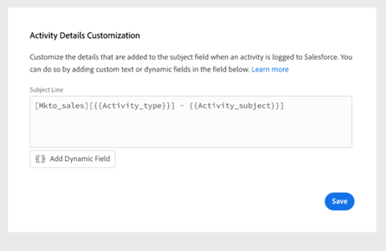
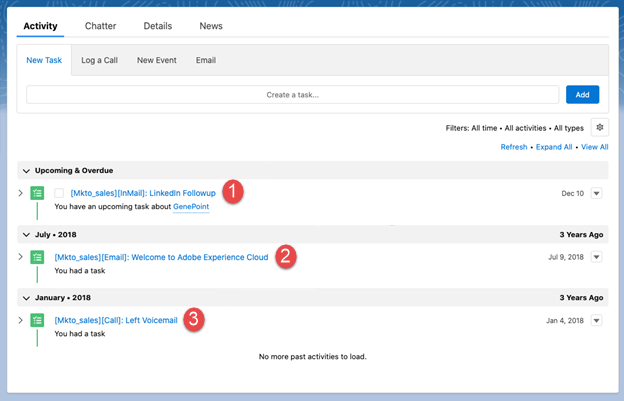
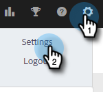
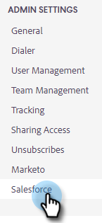
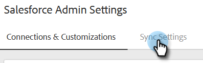
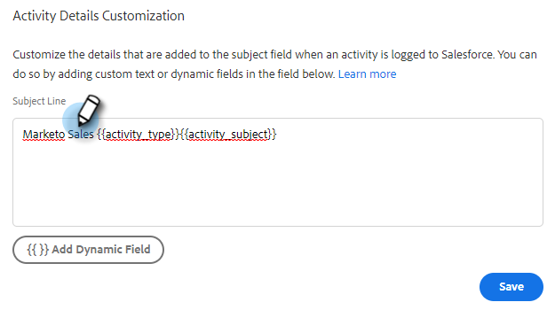
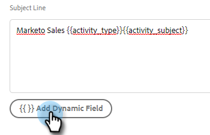
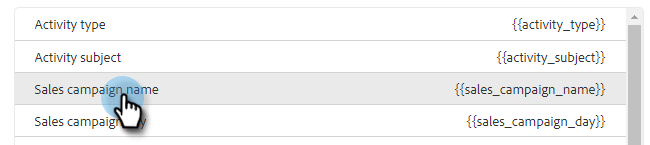
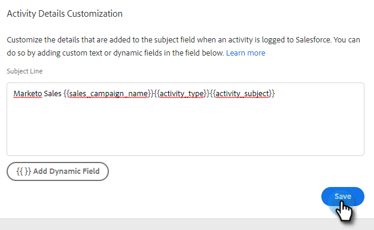

# [!DNL Salesforce] アクティビティ詳細のカスタマイズ設定 {#configure-salesforce-activity-detail-customization}

>[!PREREQUISITES]
>
>* Salesforce とセールスインサイトアクションは、[接続されている必要があります](/help/marketo/product-docs/marketo-sales-insight/actions/crm/salesforce-integration/connect-your-sales-insight-actions-account-to-salesforce.md)
>* API を使用したメールアクティビティのログが[有効になっている](/help/marketo/product-docs/marketo-sales-insight/actions/crm/salesforce-integration/sync-sales-activities-to-salesforce.md)

アクティビティの詳細のカスタマイズを使用すると、管理者は、[!DNL Sales Insight Actions] のアクティビティ／リマインダータスクが [!DNL Salesforce] に同期されたときに、[!DNL Salesforce] タスクの件名フィールドに記録する情報を設定できます。

>[!NOTE]
>
>* アクティビティの詳細カスタマイズで`{{activity_subject}}`動的フィールドを使用している場合、リマインダータスクの[!DNL Sales Insight Actions]で件名フィールドに加えられた更新は、対応する[!DNL Salesforce] タスクの件名フィールドに反映されます。
>* 情報を [!DNL Salesforce] 件名フィールドに記録する場合、改行はサポートされません。 セールスタスクの件名が更新されると、アクティビティ詳細のカスタマイズエディターで改行が削除されます。

<table>
 <tr>
  <td><strong>1</td>
  <td>InMail リマインダータスク</td>
 </tr>
 <tr>
  <td><strong>2</td>
  <td>メールアクティビティ</td>
 </tr>
 <tr>
  <td><strong>3</td>
  <td>通話アクティビティ</td>
 </tr>
</table>

この機能を使用して、以下のメリットをアンロックできます。

* 件名フィールドに表示される情報をカスタマイズすることで、Salesforce での販売に関するアクティビティの詳細を簡単にスキャンできます。
* 管理者は、件名フィールドに「Mkto_sales」などの一意の ID をタグ付けできるので、セールスインサイトアクションのアクティビティを簡単に識別し、他のメールアクティビティ、通話アクティビティおよびタスクと区別できます。
* カスタムアクティビティフィールドの必要性を減らします。 Salesforce では、カスタムアクティビティフィールドの数に制限が適用されるので、レポートで使用できるデータを制限できます。 アクティビティの動的フィールドを使用して主要データを件名行に追加することで、Salesforce インスタンスで作成する必要のあるカスタムアクティビティフィールドの数を減らすことができます。
* アクティビティとタスクの件名フィールドは、セールスインサイトアクションが定義した一貫したパターンに従います。

>[!NOTE]
>
>メールの返信を[!DNL Salesforce]へのアクティビティとしてログに記録する場合、[!DNL Salesforce] アクティビティの詳細カスタマイズ設定は使用されません。 代わりに、「返信：メールの件名」として記録されます。

## サポートされるアクティビティの動的フィールド {#activity-dynamic-fields-supported}

アクティビティの動的フィールドでは、セールスアクティビティに関する情報を参照してデータが入力されます。 現在、これは [!DNL Salesforce] アクティビティ詳細のカスタマイズと共に使用できます。

>[!NOTE]
>
>特定のアクティビティ／タスクの動的フィールドに入力する値がない場合、Salesforce タスクの件名フィールドが更新されても、その動的フィールドのデータは入力されません。

<table>
 <tr>
  <th>フィールド</th>
  <th>説明</th>
 </tr>
 <tr>
  <td><code>{{activity_type}}</code></td>
  <td>メール、呼び出し、InMail、カスタムのいずれかのタスクタイプが入力されます。</td>
 </tr>
 <tr>
  <td><code>{{activity_subject}}</code></td>
  <td>
タスクの件名を入力します。

      
メールの場合は、メールの件名行が入力されます。

      
呼び出し、InMail、カスタムの場合、タスク名／件名フィールドに値を含むリマインダータスクが作成された場合に値が入力されます。
</td>
 </tr>
 <tr>
  <td><code>{{sales_campaign_name}}</code></td>
  <td>アクティビティがセールスキャンペーンから開始された場合は、セールスキャンペーンの名前が入力されます。</td>
 </tr>
 <tr>
  <td><code>{{sales_campaign_day}}</code></td>
  <td>アクティビティがセールスキャンペーンから開始された場合は、このアクティビティが発生したセールスキャンペーンの日番号が入力されます。</td>
 </tr>
 <tr>
  <td><code>{{sales_campaign_step}}</code></td>
  <td>アクティビティがセールスキャンペーンから開始された場合は、このアクティビティが発生したセールスキャンペーン日内の手順番号が入力されます。</td>
 </tr>
 <tr>
  <td><code>{{call_outcome}}</code></td>
  <td>アクティビティが呼び出しで、呼び出しの結果が選択されている場合は、呼び出しの結果値が入力されます。</td>
 </tr>
 <tr>
  <td><code>{{call_reason}}</code></td>
  <td>アクティビティが呼び出しで、呼び出しの理由が選択されている場合は、呼び出しの理由の値が入力されます。</td>
 </tr>
</table>

## [!DNL Salesforce] アクティビティ詳細のカスタマイズの設定 {#configuring-salesforce-activity-detail-customization}

>[!NOTE]
>
>**管理者権限が必要。**

アクティビティ詳細を設定する際は、[!DNL Salesforce] でタスク履歴を確認する際に、どのデータがセールスに最も関連するかを検討します。

1. 歯車アイコンをクリックし、「**[!UICONTROL 設定]**」を選択します。

   

1. 「**[!UICONTROL Salesforce]**」をクリックします。

   

1. 「**[!UICONTROL 同期設定]**」をクリックします。

   

1. アクティビティの詳細のカスタマイズエディターで、任意のフリーテキストを追加します。 追加したテキストは動的ではなく、[!DNL Salesforce] に同期されたすべてのタスクの件名フィールドで変更されないままになります。

   

   >[!TIP]
   >
   >必須ではありませんが、追加されたテキストを角括弧で囲むと、[!DNL Salesforce]の件名フィールドに入力されたときにデータを識別しやすくなります。 例：`[Sales Insight Actions] - {{Activity_type}}`

1. 必要に応じて、「**[!UICONTROL 動的フィールドを追加]**」ボタンをクリックして、動的フィールドを追加します。

   

1. 目的の動的フィールドを選択します。

   

1. 「**[!UICONTROL 保存]**」をクリックします。

   

>[!NOTE]
>
>[!DNL Salesforce] では 255 文字の制限が適用されます。 アクティビティの詳細がこれを超えると、情報を [!DNL Salesforce] 件名フィールドに保存できるように切り捨てられます。

>[!MORELIKETHIS]
>
>* [セールスアクティビティの Salesforce への同期](/help/marketo/product-docs/marketo-sales-insight/actions/crm/salesforce-integration/sync-sales-activities-to-salesforce.md)
>* [Salesforce とのリマインダータスク同期](/help/marketo/product-docs/marketo-sales-insight/actions/tasks/reminder-task-sync-with-salesforce.md)
