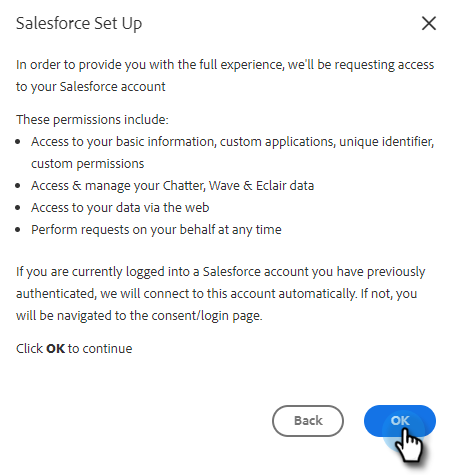

# [!DNL Sales Insight Actions] アカウントを [!DNL Salesforce] に接続 {#connect-your-sales-insight-actions-account-to-salesforce}

次の簡単な手順に従って、[!DNL Sales Insight Actions] アカウントを [!DNL Salesforce] に接続します。

## 管理者として接続する方法 {#how-to-connect-as-an-admin}

1. 歯車アイコンをクリックし、「**[!UICONTROL 設定]**」を選択します。

   

1. 「[!UICONTROL 管理者設定]」で、「**[!UICONTROL Salesforce]**」をクリックします。

   

1. 「[!UICONTROL 接続とカスタマイズ]」タブで、「**[!UICONTROL Salesforce]**」、「**[!UICONTROL 接続]**」の順にクリックします。

   

1. 「**[!UICONTROL OK]**」をクリックします。

   

1. 既に Salesforce にログインしている場合は、Salesforce に接続されます。まだログインしていない場合は、ログインするように求められます。

## 管理者以外のユーザとして接続する方法 {#how-to-connect-as-a-non-admin}

1. 歯車アイコンをクリックし、「**[!UICONTROL 設定]**」を選択します。

   

1. 「[!UICONTROL マイアカウント]」で、「**[!UICONTROL Salesforce]**」を選択します。

1. 「[!UICONTROL 接続とカスタマイズ]」タブで、「**[!UICONTROL Salesforce]**」、「**[!UICONTROL 接続]**」の順にクリックします。

   

1. 「**[!UICONTROL OK]**」をクリックします。

   

1. 既に Salesforce にログインしている場合は、Salesforce に接続されます。まだログインしていない場合は、ログインするように求められます。
