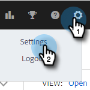

# Salesforce を Sales Insight Actions から切断 {#disconnect-salesforce-from-sales-insight-actions}

Salesforce アカウントを Sales Insight Actions アカウントから切断する必要が生じる場合があります。手順は以下のとおりです。

## Salesforce から管理者として切断する方法 {#how-to-disconnect-from-salesforce-as-an-admin}

1. Sales Insight Actions で、右上の歯車アイコンをクリックし、「**設定**」を選択します。

   

1. 管理設定で、**Salesforce** をクリックします。

   

1. 「接続とカスタマイズ」タブで、「**切断**」をクリックします。

   

## 管理者以外のユーザとして Salesforce との接続を切断する方法 {#how-to-disconnect-from-salesforce-as-a-non-admin}

1. Sales Insight Actions で、右上の歯車アイコンをクリックし、「**設定**」を選択します。

   

1. マイアカウントで、「**Salesforce**」を選択します。

PICC

1. 「接続とカスタマイズ」タブで、「**切断**」をクリックします。

PICC
