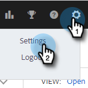

# [!DNL Salesforce] を [!DNL Sales Insight Actions] から切断 {#disconnect-salesforce-from-sales-insight-actions}

[!DNL Salesforce] アカウントを [!DNL Sales Insight Actions] アカウントから切断する必要が生じる場合があります。 手順は次のとおりです。

## [!UICONTROL Salesforce] から管理者として切断する方法 {#how-to-disconnect-from-salesforce-as-an-admin}

1. [!DNL Sales Insight Actions] で、右上の歯車アイコンをクリックし、「**[!UICONTROL 設定]**」を選択します。

   

1. 「[!UICONTROL 管理者設定]」で「**[!UICONTROL Salesforce]**」をクリックします。

   

1. 「[!UICONTROL 接続とカスタマイズ]」タブで、「**[!UICONTROL 切断]**」をクリックします。

   

## 管理者以外のユーザとして [!DNL Salesforce] との接続を切断する方法 {#how-to-disconnect-from-salesforce-as-a-non-admin}

1. [!DNL Sales Insight Actions] で、右上の歯車アイコンをクリックし、「**[!UICONTROL 設定]**」を選択します。

   

1. 「[!UICONTROL マイアカウント]」で、「**[!UICONTROL Salesforce]**」を選択します。

PICC

1. 「[!UICONTROL 接続とカスタマイズ]」タブで、「**[!UICONTROL 接続]**」をクリックします。

PICC
