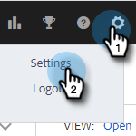
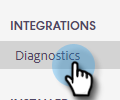

# [!DNL Salesforce] 診断 {#salesforce-diagnostics}

[!DNL Salesforce] 統合の一部には、web アプリケーション内に [!DNL Salesforce] の診断ページが含まれています。 このページでは、失敗したデータログから [!DNL Salesforce] にエラーを取り込みます。 エラーは役に立ちますが、常に読みやすいわけでは限りません。 そのため、エラーメッセージを説明するのに役立つカンニングペーパーを作成しました。

## アクセス診断 {#access-diagnostics}

1. 歯車アイコンをクリックし、「**[!UICONTROL 設定]**」を選択します。

   

1. 「[!UICONTROL 統合]」で、「**[!UICONTROL 診断]**」をクリックします。

   

## エラーカンニングペーパー {#error-cheat-sheet}

**エラー：** API_CURRENTLY_DISABLED
**カテゴリー：** アクセス/検証
**メッセージ：** APIは、このユーザーに対して無効になっています
**何が起こっているのか：** ユーザーにAPI アクセス権がありません
**トラブルシューティング手順：** [!DNL Salesforce]管理者がユーザーにAPI アクセス権を付与する必要があります。

**エラー：** AUTHENTICATION_FAILURE
**カテゴリ：**認証
**メッセージ：** invalid_grant：認証エラー
**何が起こっているのか：**認証に失敗しました
**トラブルシューティング手順：** [!DNL Salesforce]から切断してから再接続してください。

**エラー：** CANNOT_INSERT_UPDATE_ACTIVATE_ENTITY
**カテゴリー：** アクセス/検証
**メッセージ：** {&quot;errorCode&quot;:&quot;INVALID_SESSION_ID&quot;,&quot;message&quot;:&quot;Session expired or invalid&quot;}
**何が起こっています：**

1 - トリガーコードが原因でアップデートが失敗する。
2 - ユーザは、指定されたオブジェクトに対するオブジェクトレベルの書き込み権限を持っていません。

**トラブルシューティングの手順：**

1 – 失敗しているトリガーを確認します。
2 - オブジェクトに対する書き込みアクセス権をユーザに付与するか、オブジェクトに書き込もうとする機能を無効にします。

**エラー：** CANNOT_UPDATE_CONVERTED_LEAD
**カテゴリー：**その他
**メッセージ：**は変換済みリードを参照できません
**何が起こっているのか：**連絡先とリードの最新のアクティビティのログ中に、コンバージョン済みリードにログを記録しようとしています。 また、いくつかのトークも見ました。
**トラブルシューティング手順：**&#x200B;インスタンスがある場合、アドビの[サポートチーム](https://nation.marketo.com/t5/Support/ct-p/Support)に報告してください。

**エラー：** ENTITY_IS_LOCKED
**カテゴリー：** アクセス/検証
**メッセージ：** エンティティは編集用にロックされています
**何が起こっているのか：** レコードは承認プロセス中で、承認を所有するユーザーによって承認または拒否されるまで、追加の編集からロックされます。
**トラブルシューティングの手順：**&#x200B;上記を参照してください。

**エラー：** EXPIRED_ACCESS
**カテゴリ：**認証
**メッセージ：**無効な付与：期限切れのアクセス/更新トークン
**何が起こっているのか：** アクセス トークンまたは更新トークンの有効期限が切れました。 トークンは [ [!DNL Salesforce] のセッション設定](https://salesforce.stackexchange.com/questions/10759/invalid-grant-expired-access-refresh-token-error-when-authenticating-access-via)に基づいて期限切れになります。
**トラブルシューティング手順：**&#x200B;再認証が必要になります。 [!DNL Salesforce] 接続を切断し、再接続します。

**エラー：** FAILED_WRITE
**カテゴリ：**間欠的
**メッセージ：**のファイルが終わりました
**お客様側のトリガーが最適化されていないため、[!DNL Salesforce]のパフォーマンスの問題**が発生しています。
**トラブルシューティング手順：**&#x200B;再試行ロジックで処理する必要があります。 それでも機能しない場合は、管理者と協力して問題のあるトリガーのトラブルシューティングを行います。[!DNL Salesforce]

**エラー：** FIELD_CUSTOM_VALIDATION_EXCEPTION
**カテゴリー：** アクセス/検証
**メッセージ：**はお客様によって異なります。
**状況：**オブジェクトのカスタム検証ルールが失敗します。
**トラブルシューティング手順：** このエラーを引き起こしているカスタム検証ルールを確認します。 これは慣習的な規則なので、エラーは 1 回限りで対処する必要があります。

**エラー：** FIELD_FILTER_VALIDATION_EXCEPTION
**カテゴリー：** アクセス/検証
**メッセージ：**値が存在しないか、フィルター条件と一致しません
**何が起こっているのか：** [!DNL Salesforce]の既存の不正なデータは、更新時に適用されます。
**トラブルシューティングの手順：**&#x200B;上記を参照してください。

**エラー：** FIELD_INTEGRITY_EXCEPTION
**カテゴリー：** アクセス/検証
**メッセージ：**既存の国/地域は、フィールドの状態の値を認識しません：州/県コード
**何が起こっているのか：** [!DNL Salesforce]の既存の不正なデータは、更新時に適用されます。
**トラブルシューティングの手順：**&#x200B;上記を参照してください。

**エラー：** INACTIVE_ORGANIZATION
**カテゴリ：**認証
**メッセージ：**無効な付与：非アクティブな組織
**何が起こっています：** [!DNL Salesforce]組織はアクティブではなくなりました。
**トラブルシューティング手順：**[!DNL Salesforce] から切断し、再接続します。

**エラー：** INACTIVE_USER
**カテゴリ：**認証
**メッセージ：** invalid_grant: inactive user
**何が起こっているのか：** [!DNL Salesforce] ユーザーはアクティブではなくなりました
**トラブルシューティング手順：**[!DNL Salesforce] から切断し、再接続します。

**エラー：** INSERT_UPDATE_DELETE_NOT_ALLOWED_DURING_MAINTENANCE
**カテゴリ：**間欠的
**メッセージ：** （追加メッセージはありません）
**何が起こっているのか：** [!DNL Salesforce] インスタンスはメンテナンスモードです。
**トラブルシューティング手順：**&#x200B;システムメンテナンスが完了するまで待ってから、ログを再試行します。

**エラー：**INSUFFICIENT_ACCESS_ON_CROSS_REFERENCE_ENTITY
**カテゴリー：** アクセス/検証
**メッセージ：** オブジェクト IDに対するアクセス権限が不足しています
**何が起こっているのか：** タスクの親レコードへのアクセス権がありません。
**トラブルシューティングの手順：**&#x200B;上記を参照してください。

**エラー：**INSUFFICIENT_ACCESS_OR_READONLY
**カテゴリー：** アクセス/検証
**メッセージ：** オブジェクト IDに対するアクセス権限が不足しています
**何が起こっているのか：**最新のアクティビティ ログでは、ユーザーが書き込みアクセス権を持っていないため、特定のレコードを編集できません。
**トラブルシューティング手順：**[!DNL Salesforce] でユーザにアクセス権を付与するか、そのユーザのオブジェクトに対する最新のアクティビティログを無効にします。

**エラー：**無効なフィールド
**カテゴリ：**間欠的
**メッセージ：** Net::ReadTimeout
**何が起こっているのか：**要求がタイムアウトしています。 おそらく、あまりにも多くの遅い取引の結果です。
**トラブルシューティング手順：**&#x200B;遅延の問題に関する潜在的な原因について既存のカスタマイズを確認し、1 つまたはすべてのオブジェクトの最新のアクティビティログを無効にして負荷を軽減します。

**エラー：**INVALID_FIELD_FOR_INSERT_UPDATE
**カテゴリー：** アクセス/検証
**メッセージ：** フィールドを作成または更新できません：MSE_Replied__c。 このフィールドのセキュリティ設定を確認してください。
**状況：**最新のアクティビティログトランザクションの実行に必要なセールスインサイトアクションカスタムフィールドへの書き込みアクセス権がユーザに与えられていません。 チームはパッケージをインストールしたが、ユーザーの正しいフィールドを有効にしていない可能性があります。
**トラブルシューティング手順：**[!DNL Salesforce] 管理者は、カスタムフィールドへのアクセス権を付与するか、最新のアクティビティログを無効にする必要があります。

**エラー：** INVALID_GRANT
**カテゴリ：**認証
**メッセージ：**無効な付与：ip制限
**何が起こっているのか：**&#x200B;お客様の[!DNL Salesforce]にアクセスしようとしていますが、IP制限が設定されているため、アクセスできません。
**トラブルシューティング手順：**[!DNL Salesforce] 管理者がアドビの IP を許可リストに登録する必要があります。 IP アドレスを取得するには、サポートに問い合わせる必要があります。

**エラー：**無効なタイプ
**カテゴリー：** アクセス/検証
**Message:** CreatedDate, （タスクからIDを選択） FROM リード WHERE Email=&#39;emailid&#39;^ERROR at `Row:1:Column:53sObject` type &#39;Lead&#39;はサポートされていません。 カスタムオブジェクトを使用する場合、必ずエンティティ名の後に &#39;__c&#39; を添付してください。 適切な名前を指定するには、WSDLまたはdescribe呼び出しを参照してください
**何が起こっているのか：** ユーザーがアクセス権を持たないオブジェクトの種類をSalesforceからクエリしようとしています。 これは、ユーザーがリードオブジェクトに適切なアクセス権を持っていないことが原因である可能性が高いです。
**トラブルシューティング手順：** Salesforce のリードオブジェクトに対して読み取りおよび更新アクセス権を付与するか、リードレコードへのメールログと最新のアクティビティのログをオフにします。

**エラー：** QUERY_TIMEOUT
**カテゴリ：**間欠的
**メッセージ：**あなたのクエリ要求は長すぎました
**何が起こっているのか：**上記を参照してください。
**トラブルシューティング手順：**&#x200B;再試行ロジックで処理する必要があります。 それでも機能しない場合は、管理者と協力して問題のあるトリガーのトラブルシューティングを行います。[!DNL Salesforce]

**エラー：** REQUEST_LIMIT_EXCEEDED
**カテゴリ：**間欠的
**メッセージ：**
1 - ConcurrentPerOrgLongTxn制限を超えました
2 - TotalRequests Limit exceeded
3 - ConcurrentRequest
**何が起こっています：**
1 – 同時リクエストの制限を超えました。おそらくトリガーコードが非効率的であることが原因です。
2 – 統合が多すぎると、組織が24時間のローリングウィンドウを通過してしまいます。
**トラブルシューティング手順：**
1 – 影響を受けるオブジェクトの既存のトリガーを確認します。 1 つ以上のオブジェクトのロールアップログを無効にする可能性があります。
2 - [!DNL Salesforce] からさらに API 呼び出しを購入します。 1 つ以上のオブジェクトのロールアップログを無効にする可能性があります。

**エラー：** REQUIRED_FIELD_MISSING
**カテゴリー：** アクセス/検証
**メッセージ：**&#x200B;必須フィールドがありません： `[Amount_Committed_Private_Capital__c]`
**何が起こっているのか：**これは通常、最新のアクティビティのログに対して発生します。 カスタムフィールドは必須として設定されていますが、値が空です。 これは、レコードがカスタムフィールドの空の値で作成され、その後必須に設定された場合に発生する可能性があります。 レコードを更新しようとすると、カスタムフィールドにタッチしていなくても、要求が適用されます。
**トラブルシューティングの手順：**&#x200B;見つからないフィールドの値を手動で更新します。 その後、セールスインサイトアクションからのメッセージを再試行できます。

**エラー：** SERVER_UNAVAILABLE
**カテゴリ：**間欠的
**メッセージ：** サーバーがビジーです
**お客様によるトリガーの最適化が原因である可能性が高い、[!DNL Salesforce]のパフォーマンスの問題**が発生しています
**トラブルシューティング手順：**&#x200B;再試行ロジックで処理する必要があります。 それでも機能しない場合は、[!DNL Salesforce]管理者と協力して、問題のあるトリガーをトラブルシューティングしてください。

**エラー：** TXN_SECURITY_NO_ACCESS
**カテゴリー：** アクセス/検証
**メッセージ：**組織のセキュリティ ポリシーにより、要求された操作は許可されていません。 システム管理者にお問い合わせください。
**何が起こっているのか：**&#x200B;何らかのセキュリティ制限が設定されています – <https://developer.salesforce.com/forums/?id="record> IDを参照してください」
**トラブルシューティング手順：** [!DNL Salesforce]管理者に問い合わせて、具体的な制限について確認します。

**エラー：** UNABLE_TO_LOCK_ROW
**カテゴリ：**間欠的
**メッセージ：**は、このレコードへの排他的アクセスを取得できないか、1つのレコード：「レコード ID」
**何が起こっているのか：**同じレコードに複数の試行が行われる原因となるトリガーが発生している可能性があります（グループ メールの場合など）。
**トラブルシューティング手順：**&#x200B;再試行ロジックで処理する必要があります。 それでも機能しない場合は、管理者と協力して問題のあるトリガーのトラブルシューティングを行います。[!DNL Salesforce]

**エラー：**UNKNOWN_EXCEPTION
**カテゴリー：**その他
**メッセージ：**不明な例外が発生しました
**何が起こっているのか：** [!DNL Salesforce]で処理されていない例外が発生しました。
**トラブルシューティング手順：**[!DNL Salesforce] でケースを作成し、エラーメッセージに数値をコピーします。 これは、[!DNL Salesforce] コードがエラーを適切に処理しないためです。
