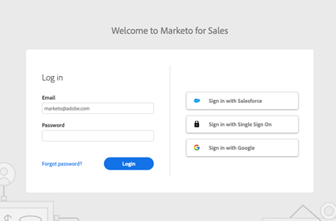

# Sales Insight Actions サンドボックスの設定 {#set-up-a-sales-insight-actions-sandbox}

>[!NOTE]
>
>Marketo Sales Insight Actions は、[Marketo Sales Insight パッケージ](/help/marketo/product-docs/marketo-sales-insight/msi-for-salesforce/installation/install-marketo-sales-insight-package-in-salesforce-appexchange.md){target="_blank"}を使用して Salesforce ユーザーインターフェイスと統合された、web ベースのアプリケーションです。「Marketo Sales」や、シンプルに「Actions」と呼ばれることもあります。

Marketo サンドボックスがある場合、Actions インスタンスを、テスト目的でサンドボックスと共に使用できるようにすることができます。

Actions インスタンスを設定する場合、Salesforce サンドボックスと連携するように設定するか、Salesforce 実稼動と連携するように設定するかを決定する必要があります。 これは、Salesforce ではそれぞれのエンドポイントに異なるエンドポイントを使用し、Actions ではユーザーのアクティブ化と認証に Salesforce への接続を使用するからです。

Salesforce サンドボックスインスタンスと連携するように Actions インスタンスを設定するには、以下の手順に従います。

>[!NOTE]
>
>ユーザーが [ アクションシートをアクティブ化 ](/help/marketo/product-docs/marketo-sales-insight/actions/getting-started/sales-insight-actions-user-onboarding-checklist.md){target="_blank"} する方法の詳細を説明します。 また、ユーザーがどのように [Salesforce を使用して認証 ](/help/marketo/product-docs/marketo-sales-insight/actions/admin/auto-login-from-salesforce.md){target="_blank"} するかについても説明します。 さらに、ユーザーにメールとパスワードによる認証を行わせたい場合は、[ ログイン管理の設定 ](/help/marketo/product-docs/marketo-sales-insight/actions/admin/login-management-settings.md){target="_blank"} の記事で、詳しく説明しています。

## Marketo Sandbox {#request=an-actions-instance} にプロビジョニングする Actions インスタンスをリクエストします。

Marketo Sandbox インスタンスでは、要求がない限り、Sales Insight Actions が有効になりません。 リクエストを送信するには、Adobeアカウントチーム（アカウントマネージャー）にお問い合わせください。

## Marketo Sandbox 用の Actions アカウントのプロビジョニング {#provision-your-actions-account}

Marketo サンドボックスでアクションが有効になったら、次の手順に従って新しいインスタンスをアクティブ化する必要があります。

1. Marketo Sandbox インスタンスにログインします。

1. **Admin** に移動します。

1. **Sales Insight** を選択します。

1. **アクション設定** を選択します。

   >[!IMPORTANT]
   >
   >メールアドレスは、サンドボックスインスタンスと実稼動インスタンスの両方で、1 つの Actions インスタンスにのみ使用できます。 管理者が実稼動環境とサンドボックス全体の複数のインスタンスにアクセスする必要がある場合は、それぞれに異なるメールアドレスを使用する必要があります。

1. プロビジョニング・カードで、Sales Insight Actions インスタンスに招待するユーザーを選択します。

## アクションインスタンスのアクティベート {#activate-your-actions-instance}

Actions インスタンスは、Salesforce 実稼動アカウントでアクティベートする必要があります。 アクティブ化したら、Salesforce サンドボックスアカウントに切り替えることができます。

1. 送信された招待を見つけます。

1. **はじめに** リンクをクリックします。

1. Salesforce 実稼動インスタンスでアクティベートします。

1. 画面の指示に従ってアカウントを設定します。 詳細な概要については、「ユーザーのオンボーディングに関する記事 [ をご覧ください ](/help/marketo/product-docs/marketo-sales-insight/actions/getting-started/sales-insight-actions-user-onboarding-guide.md){target="_blank"}。

## Salesforce サンドボックスインスタンスと互換性を持たせるために、アクションインスタンスを準備します。 {#prepare-your-actions-instance}

アクションを使用するには、最初に Salesforce 実稼動ユーザーで新しいインスタンスをアクティブ化する必要があります。 アクティブ化したら、次の手順を使用して、Salesforce サンドボックスと互換性を持つようにインスタンスを準備できます。

1. ログイン設定を「すべてのログイン方法」に更新し、必要に応じてユーザー名とパスワードを使用してログインできるようにします。 必要に応じて、すべてが設定されたら、「Salesforce のみ」に戻すことができます。 [ その方法については、こちらを参照してください ](/help/marketo/product-docs/marketo-sales-insight/actions/admin/login-management-settings.md){target="_blank"}。

1. Salesforce 実稼動環境から切断し、Salesforce サンドボックスに接続します。 [ 接続方法についてはこちらをご覧ください ](/help/marketo/product-docs/marketo-sales-insight/actions/crm/salesforce-integration/connect-your-sales-insight-actions-account-to-salesforce.md){target="_blank"}。 手順 3 では、「Salesforce」ではなく「Sandbox」を選択します。 既に接続している場合は、[Salesforce 接続とカスタマイズ ] タブに切断するオプションが表示されます。

>[!NOTE]
>
>Salesforce インスタンスのカスタムドメインがある場合、Salesforce に接続する前に Salesforce インスタンスにログインするか、アクションにログインすることをお勧めします。

## Salesforce サンドボックスと互換性を持たせるため、アクションインスタンスの変換をリクエストします。 {#request-your-actions-instance-be-converted}

1. [Marketo Engageサポート ](https://nation.marketo.com/t5/support/ct-p/Support){target="_blank"} に連絡して、Salesforce サンドボックスと互換性を持つように新しい Sales Insight Actions インスタンスを設定するようにリクエストしてください。

1. toutapp.com/login ページの「Salesforce でログイン」ボタンを使用してログインを試みることで、すべてが正しく設定されていることをテストします。

   

   >[!TIP]
   >
   >この時点で問題が発生した場合は、パスワードのリセットをリクエストし、パスワードを使用してアカウントへのアクセスを取り戻すことができます。

これで、インスタンスを Salesforce サンドボックスインスタンスで使用する準備が整いました。 Salesforce から [Salesforce 自動ログイン ](/help/marketo/product-docs/marketo-sales-insight/actions/admin/auto-login-from-salesforce.md){target="_blank"} を使用する場合は、「ログイン管理設定 [ で「Salesforce のみ」に戻すことができ ](/help/marketo/product-docs/marketo-sales-insight/actions/admin/login-management-settings.md){target="_blank"} す。

>[!NOTE]
>
>* [Sales Insight アクションアカウントの Salesforce への接続 ](/help/marketo/product-docs/marketo-sales-insight/actions/crm/salesforce-integration/connect-your-sales-insight-actions-account-to-salesforce.md){target="_blank"}
>* [Sales Insight Actions ユーザーオンボーディングガイド ](/help/marketo/product-docs/marketo-sales-insight/actions/getting-started/sales-insight-actions-user-onboarding-guide.md){target="_blank"}
>* [Salesforce からの自動ログイン ](/help/marketo/product-docs/marketo-sales-insight/actions/admin/auto-login-from-salesforce.md){target="_blank"}
>* [ ログイン管理設定 ](/help/marketo/product-docs/marketo-sales-insight/actions/admin/login-management-settings.md){target="_blank"}
