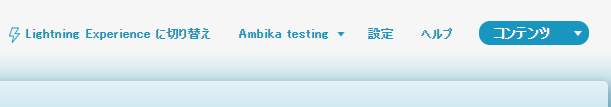
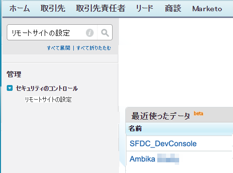
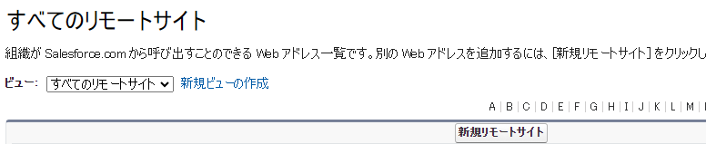
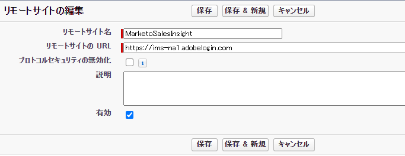
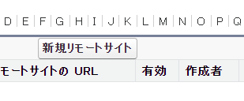
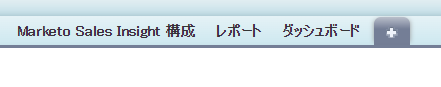
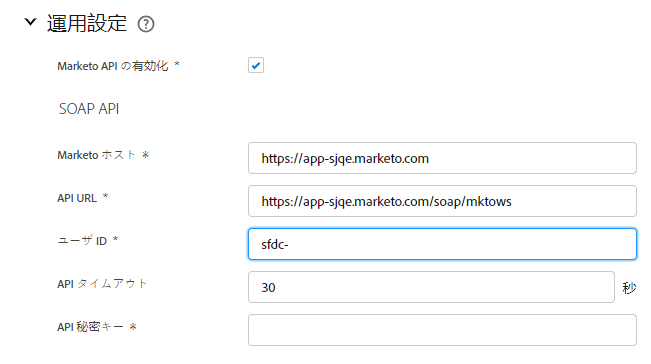
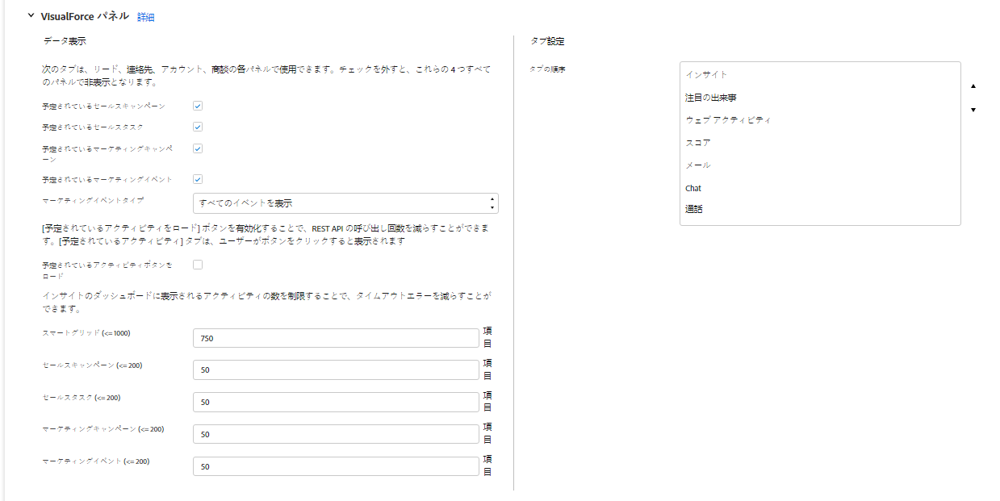
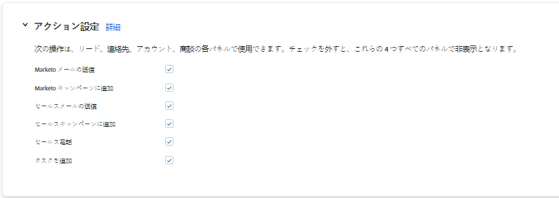

# [!DNL Sales Insight Actions] での [!DNL Salesforce] 設定 {#sales-insight-actions-configuration-in-salesforce}

>[!PREREQUISITES]
>
>* [ インスタンスに Sales Insight パッケージを ](/help/marketo/product-docs/marketo-sales-insight/msi-for-salesforce/installation/install-marketo-sales-insight-package-in-salesforce-appexchange.md) インストール [ または ](/help/marketo/product-docs/marketo-sales-insight/msi-for-salesforce/upgrading/upgrading-your-msi-package.md) アップグレード [!DNL Salesforce] します
>* [Marketo Sales Insightの設定  [!DNL Salesforce] Enterprise/Unlimited](/help/marketo/product-docs/marketo-sales-insight/msi-for-salesforce/configuration/configure-marketo-sales-insight-in-salesforce-enterprise-unlimited.md)

## [!DNL Salesforce] に新しいリモートサイトを追加 {#add-new-remote-site-in-salesforce}

1. [!DNL Salesforce] で、**[!UICONTROL 設定]** をクリックします。

   

1. 「[!UICONTROL &#x200B; リモートサイト &#x200B;]」を検索し、「**[!UICONTROL リモートサイト設定]**」を選択します。
   

1. 「**[!UICONTROL 新規リモートサイト]**」をクリックします。

   

1. リモートサイト名を入力します（「MarketoSalesInsight1」など）。リモートサイトの URL `https://ims-na1.adobelogin.com` を入力し、「**[!UICONTROL 保存」をクリックします。]**

   

1. もう一度「**[!UICONTROL 新規リモートサイト]**」をクリックします。

   

1. リモートサイト名を入力します（「MarketoSalesInsight2」など）。リモートサイトの URL `https://mkto-sales-connect.adobe.io` を入力し、「**[!UICONTROL 保存]**」をクリックします。

## CRM 全体での [!DNL Sales Insight Actions] の有効化 {#enabling-sales-insight-actions-across-the-crm}

1. [!DNL Salesforce] で、「**[!UICONTROL Marketo営業Insight設定]**」タブをクリックします。

   

   >[!NOTE]
   >
   >上部バーに「[!UICONTROL Marketo営業Insight設定 &#x200B;]」が表示されない場合は、「**+**」記号をクリックして「すべてのタブ」の下に表示されます。

1. 「**[!UICONTROL MSI アクションを有効にする]**」チェックボックスをオンにします。

   

1. [!UICONTROL API 秘密鍵 &#x200B;] を入力します。

   

   >[!NOTE]
   >
   >[!UICONTROL API 秘密鍵 &#x200B;] が手元にない場合は、[ この記事 ](/help/marketo/product-docs/marketo-sales-insight/msi-for-salesforce/configuration/configure-marketo-sales-insight-in-salesforce-enterprise-unlimited.md) の手順に従って見つけることができます。

1. 終了したら「**[!UICONTROL 保存]**」をクリックします。

これにより、機能の概要記事で概要を説明しているすべての MSI アクション機能が自動的に有効になります。

>[!NOTE]
>
>「MSI アクションを有効にする」チェックボックスをオフにするだけで、すべての MSI アクション機能を無効にすることができます。

## MSI アクションのガバナンス {#msi-actions-governance}

1. 今後提供されるセクションで、セールスキャンペーンや「タスク」タブを無効にすることができます。これは、リード、取引先責任者、アカウント、商談の各パネルに適用されます。

   

1. MSI 操作を無効にするには、[!UICONTROL &#x200B; 操作設定 &#x200B;] の下で対応する機能のチェックをオフにします。

   

>[!NOTE]
>
>ガバナンス設定は、すべての MSI ユーザに適用できます。
