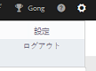
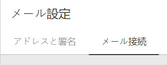
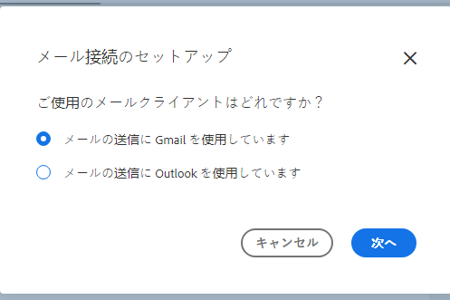
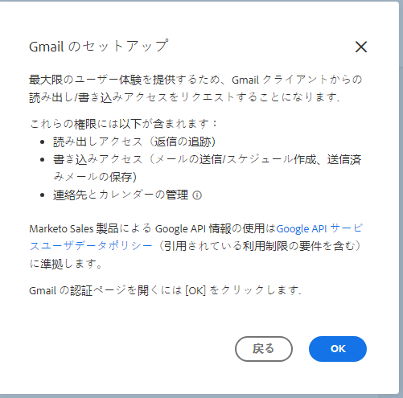
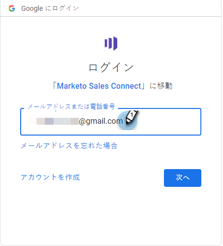
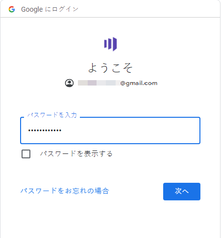
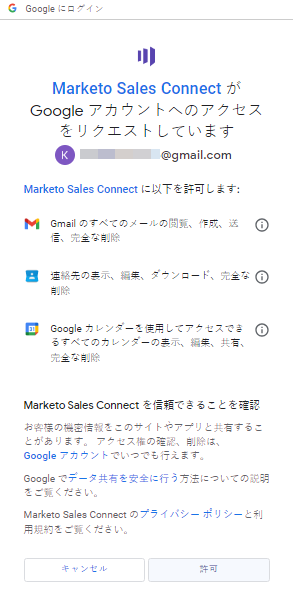

# Gmail に接続 {#connect-to-gmail}

Gmail に接続すると、返信トラッキング、Gmail 配信チャネルへのアクセス、Gmail でのメールのスケジュール設定、コンプライアンスの送信が可能になります。

>[!CAUTION]
>
>次の場合、 [フィルターの使用](https://support.google.com/mail/answer/6579?hl=en#zippy=%2Ccreate-a-filter%2Cedit-or-delete-filters){target="_blank"} メールが既読として自動的にマークされるように Gmail アカウントのルールを設定すると、返信追跡で問題が発生する可能性があります。 Gmail で返信トラッキングを使用する場合に、メールを自動的に既読としてマークするルールを無効にすることをお勧めします。

1. Marketo Sales で、歯車アイコンをクリックし、「**設定**」を選択します。

   

1. マイアカウントで、「**メール設定**」を選択します。

   

1. 「**メール接続**」タブをクリックします。

   

1. 「**開始する**」をクリックします。

   

1. 「**Gmail を使用してメールを送信する**」をクリックし、「**次へ**」をクリックします。

   

1. 「**OK**」をクリックします。

   

1. 既に Gmail にログインしている場合は、接続先のアカウントを選択してください。 そうでない場合は、Gmail アドレスを入力し、「**次へ**」をクリックします。この例では、まだログインしていません。

   

1. パスワードを入力し、「**次へ**」をクリックします。

   

1. 「**許可**」をクリックします。

   

   この接続を使用してメールをトラッキングし、配信チャネルとしてもトラッキングできます。

>[!NOTE]
>
>Gmail では、独自の送信制限が適用されます。[詳細はこちら](/help/marketo/product-docs/marketo-sales-connect/email/email-delivery/email-connection-throttling.md#email-provider-limits)を参照してください。
