# Outlook への接続 {#connect-to-outlook}

Sales Insight Actions アカウントを Outlook に接続する方法を説明します。

>[!NOTE]
>
>各ユーザーは、Marketo Sales アカウントから Outlook に接続する必要があります。

## Outlook オンラインへの接続 {#connecting-to-outlook-online}

Outlook に接続すると、返信トラッキング、Outlook 配信チャネルへのアクセス、Outlook でのメールのスケジュール設定、コンプライアンスの送信が可能になります。

1. Marketo Sales で、歯車アイコンをクリックし、「**設定**」を選択します。

   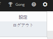

1. マイアカウントで、「**メール設定**」を選択します。

   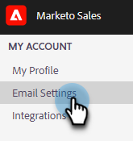

1. 「**メール接続**」タブをクリックします。

   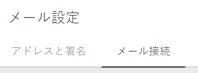

1. 「**開始する**」をクリックします。

   

1. 「**Outlook を使用してメールを送信する**」を選択し、「**次へ**」をクリックします。

   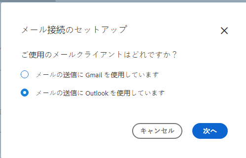

1. 使用している Outlook のバージョンを選択し、「**次へ**」をクリックします。この例では、Outlook オンラインを選択しています。

   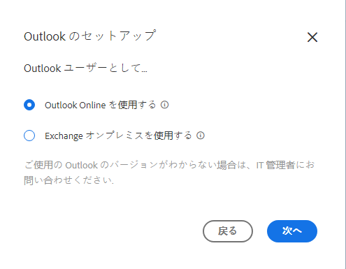

   <table>
    <tbody>
     <tr>
      <td><strong>Outlook オンライン</strong></td>
      <td>Exchange オンラインとも呼ばれます</td>
     </tr>
     <tr>
      <td><strong>Exchange オンプレミス</strong></td>
      <td>Exchange 2013 および 2016 を含む</td>
     </tr>
    </tbody>
   </table>

   >[!NOTE]
   >
   >現在、Marketo は Exchange Hybrid アカウントをサポートしていません。

1. 「**OK**」をクリックします。

   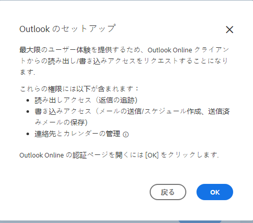

1. Outlook にログインしていない場合は、ログイン情報を入力し、「**次へ**」をクリックします。接続したいアカウントを選択し、「**次へ**」をクリックします。この例では、既にログインしています。

   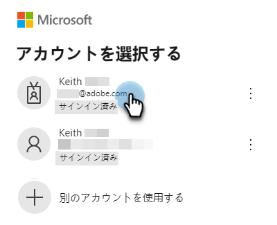

1. 「**確定**」をクリックします。

   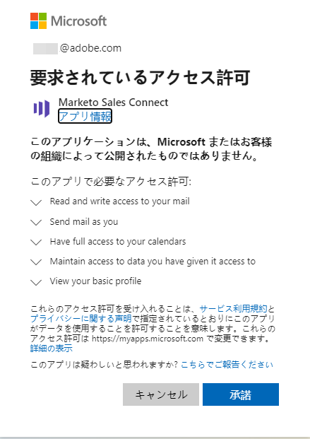

   この接続を使用してメールをトラッキングし、配信チャネルとしてもトラッキングできます。

   >[!NOTE]
   >
   >Outlook オンライン（Office365）では、独自の送信制限が適用されます。詳しくは、[こちらを参照](/help/marketo/product-docs/marketo-sales-connect/email/email-delivery/email-connection-throttling.md#email-provider-limits)してください。

## Exchange オンプレミスへの接続 {#connecting-to-exchange-on-premise}

Exchange オンプレミスに接続すると、返信トラッキング、Outlook 配信チャネルへのアクセス、Outlook でのメールのスケジュール設定、コンプライアンスの送信が可能になります。

1. Marketo Sales で、歯車アイコンをクリックし、「**設定**」を選択します。

   

1. マイアカウントで、「**メール設定**」を選択します。

   

1. 「**メール接続**」タブをクリックします。

   

1. 「**開始する**」をクリックします。

   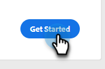

1. 「**Outlook を使用してメールを送信する**」を選択し、「**次へ**」をクリックします。

   

1. 使用している Outlook のバージョンを選択し、「**次へ**」をクリックします。この例では、Exchange オンプレミスを選択しています。

   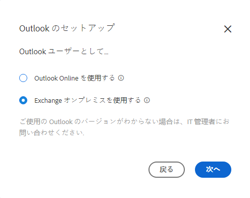

   <table>
    <tbody>
     <tr>
      <td><strong>Outlook オンライン</strong></td>
      <td>Exchange オンラインとも呼ばれます</td>
     </tr>
     <tr>
      <td><strong>Exchange オンプレミス</strong></td>
      <td>Exchange 2013 および 2016 を含む</td>
     </tr>
    </tbody>
   </table>

1. 資格情報を入力し、「**接続**」をクリックします。

   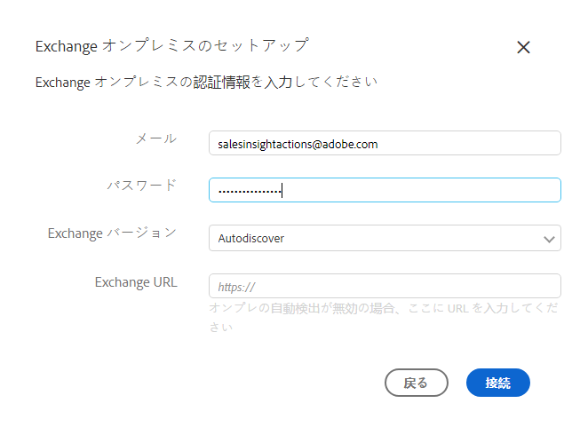

   >[!NOTE]
   >
   >Exchange バージョンドロップダウンで自動検出をオフにした場合は、Exchange の URL を IT 部門に問い合わせる必要があります。

   この接続を使用してメールをトラッキングし、配信チャネルとしてもトラッキングできます。

   >[!NOTE]
   >
   >Exchange オンプレミスを使用する場合、IT チームがメール送信制限を設定します。

## Outlook オンラインに接続するための権限の取得 {#getting-permission-to-connect-to-outlook-online}

IT チームと連携して、Marketo Sales に Outlook オンラインアカウント（Microsoft 365）への接続を許可する権限を取得する必要がある可能性があります。

>[!NOTE]
>
>Microsoft 365 アカウントを管理する IT チームに、アクセスが必要なアプリケーションが「Marketo Sales Connect」であることを伝えます。

IT チームの環境設定および現在の設定に応じて、アクセスの付与方法について問い合わせるのが最善です。以下に、話し合いのガイドとして役立つ記事の一部を示します。

* グローバル同意：[Microsoft 365 管理者向けの統合アプリと Azure AD](https://learn.microsoft.com/ja-jp/microsoft-365/enterprise/integrated-apps-and-azure-ads?view=o365-worldwide){target="_blank"}
* ユーザーの同意：[ アプリケーションに対するユーザーの同意方法を設定します ](https://learn.microsoft.com/ja-jp/azure/active-directory/manage-apps/configure-user-consent?tabs=azure-portal&pivots=portal){target="_blank"}
* 管理者の同意：[ 管理者の同意ワークフローを設定 ](https://learn.microsoft.com/ja-jp/microsoft-365/admin/misc/user-consent?source=recommendations&view=o365-worldwide){target="_blank"}
* ユーザー同意のオンまたはオフ：[Microsoft 365 でのアプリに対するユーザー同意の管理 ](https://learn.microsoft.com/ja-jp/microsoft-365/admin/misc/user-consent?source=recommendations&view=o365-worldwide){target="_blank"}
* Microsoft Defender を使用した管理：[OAuth アプリを管理 ](https://learn.microsoft.com/ja-jp/defender-cloud-apps/manage-app-permissions){target="_blank"}
