# 詳細検索の概要 {#advanced-search-overview}

詳細検索を利用して、メールを閲覧したりクリックしたり、メールに返信した見込み客をターゲットすることで、最もエンゲージメントの高い見込み客のターゲットリストを作成できます。

## 詳細検索へのアクセス方法 {#how-to-access-advanced-search}

1. Web アプリケーションで、「**[!UICONTROL コマンドセンター]**」をクリックします。

   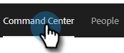

1. 「**[!UICONTROL メール]**」をクリックします。

   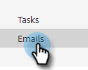

1. 該当するタブを選択します。

   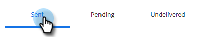

1. 「[!UICONTROL 詳細検索]」をクリックします。

   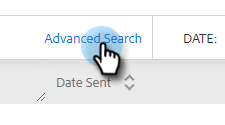

## フィルター {#filters}

**日付**

検索の日付範囲を選択します。 プリセット日は、選択したメールステータス（[!UICONTROL 送信済み]、[!UICONTROL 未配信]、[!UICONTROL 保留中]）に応じて更新されます。

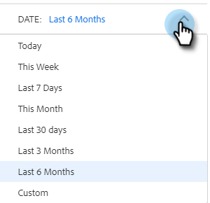

**対象者**

「[!UICONTROL 対象者]」セクションのメールの受信者／送信者でフィルタリングします。

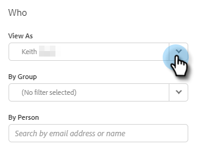

<table>
 <tr>
  <td><strong>ドロップダウン</strong></td>
  <td><strong>説明</strong></td>
 </tr>
 <tr>
  <td><strong>[!UICONTROL ビュー形式]</strong></td>
  <td>Sales Connect インスタンスの特定の送信者でフィルターします（このオプションは、管理者のみが利用できます）。</td>
 </tr>
 <tr>
  <td><strong>[!UICONTROL グループ別]</strong></td>
  <td>特定の受信者グループでメールをフィルターします。</td>
 </tr>
 <tr>
  <td><strong>[!UICONTROL 人物別]</strong></td>
  <td>特定の受信者でフィルターします。​</td>
 </tr>
</table>

**タイミング**

作成日、配信日、失敗した日付、スケジュールした日付別に選択します。 使用できるオプションは、選択したメールのステータス（[!UICONTROL 送信済み]、[!UICONTROL 配信不能]、[!UICONTROL 保留中]）に応じて異なります。

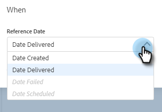

**キャンペーン**

キャンペーンへの参加状況でメールをフィルターします。

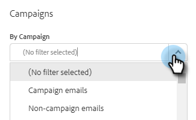

**ステータス**

選択できるメールステータスは 3 つあります。 選択したステータスに応じて、タイプ／アクティビティのオプションが変更されます。

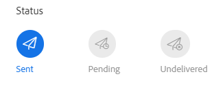

_&#x200B;**ステータス：送信済み**&#x200B;_

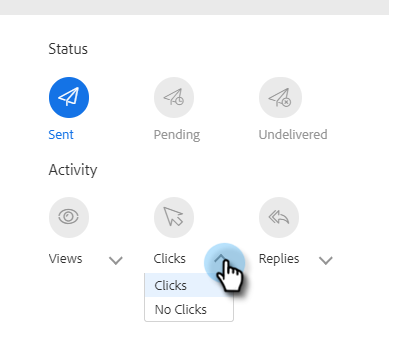

送信したメールアクティビティ別にフィルターします。 [!UICONTROL 表示回数]／[!UICONTROL 表示なし]、[!UICONTROL クリック数]／[!UICONTROL クリックなし]、[!UICONTROL 返信数]／[!UICONTROL 返信なし]を選択できます。

_&#x200B;**ステータス：保留中**&#x200B;_

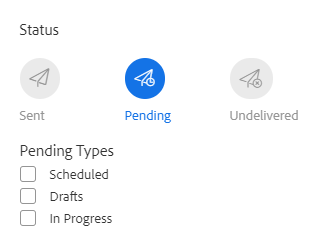

保留中のすべてのメールでフィルターします。

<table>
 <tr>
  <td><strong>ステータス</strong></td>
  <td><strong>説明</strong></td>
 </tr>
 <tr>
  <td><strong>[!UICONTROL スケジュール済み]</strong></td>
  <td>作成ウィンドウ（Salesforce または web アプリ）、メールプラグイン、またはキャンペーンからスケジュールされたメール。</td>
 </tr>
 <tr>
  <td><strong>[!UICONTROL ドラフト]</strong></td>
  <td>現在ドラフト状態のメール。 メールをドラフトとして保存するには、件名と受信者が必要です。</td>
 </tr>
 <tr>
  <td><strong>[!UICONTROL 進行中]</strong></td>
  <td>送信中のメール。 メールがこの状態に保たれるのは数秒間ほどです。</td>
 </tr>
</table>

_&#x200B;**ステータス：未配信**&#x200B;_

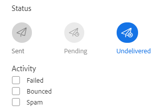

配信されなかったメールでフィルターします。

<table>
 <tr>
  <td><strong>ステータス</strong></td>
  <td><strong>説明</strong></td>
 </tr>
 <tr>
  <td><strong>[!UICONTROL 失敗]</strong></td>
  <td>セールスコネクトからのメール送信に失敗した場合（一般的な理由としては、購読解除済み／ブロック済みの取引先責任者にメールが送信された場合や、動的フィールドの入力に問題があった場合など）が該当します。</td>
 </tr>
 <tr>
  <td><strong>[!UICONTROL バウンス済み]</strong></td>
  <td>メールは、受信者のサーバーによって却下された場合、バウンス済みとしてマークされます。 Sales Connect サーバー経由で送信されたメールのみがここに表示されます。</td>
 </tr>
 <tr>
  <td><strong>[!UICONTROL スパム]</strong></td>
  <td>受信者によってメールがスパム（迷惑メールの一般用語）としてマークされた場合。 Sales Connect サーバー経由で送信されたメールのみがここに表示されます。</td>
 </tr>
</table>

## 保存した検索条件 {#saved-searches}

保存した検索条件を作成する方法を次に示します。

1. すべてのフィルターを設定したら、「**[!UICONTROL フィルターに名前を付けて保存]**」をクリックします。

   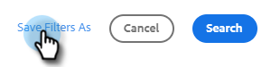

1. 検索に名前を付け、「**[!UICONTROL 保存]**」をクリックします。

   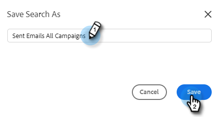

保存した検索条件は、左側のサイドバーに表示されます。

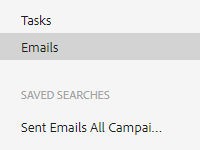
