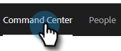
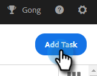
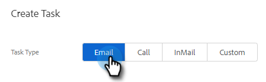
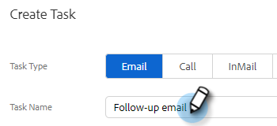
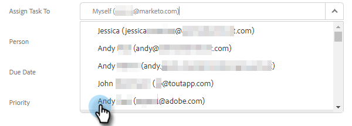
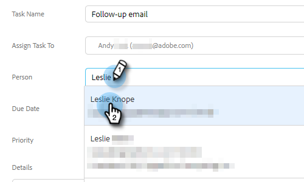
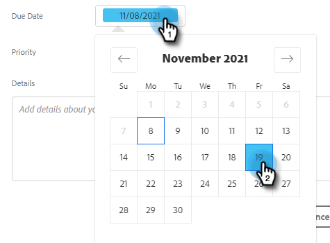
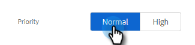
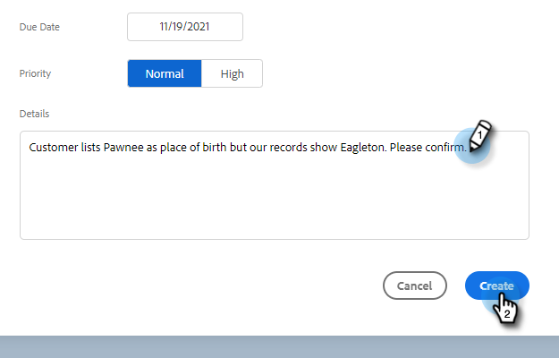

# チームメンバーへのタスクの割り当て&#x200B; {#assigning-tasks-to-team-members}

他のチームメンバーと共同作業を行う場合は、タスクを割り当てることで、見込み客の開拓作業を調整できます。

>[!NOTE]
>
>タスクを割り当てられるのは、共有されている取引先責任者に対してのみです。

1. Web アプリケーションで、「**[!UICONTROL コマンドセンター]**」をクリックします。

   

1. 「**[!UICONTROL タスクを追加]**」をクリックします。

   

1. タスクタイプを選択します。

   

1. タスクに名前を付けます。

   

1. 「タスクの割り当て」フィールドで、タスクを割り当てるチームの人物を選択します。

   

1. 「人物」フィールドに、連絡を取りたい相手を追加します。

   

1. 「期限」を選択します。

   

1. 「優先度」を設定します。

   

1. チームメイトに関連する重要な詳細を追加し（オプション）、「**[!UICONTROL 作成]**」をクリックします。

   
