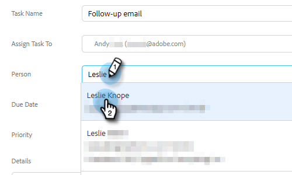

# チームメンバーへのタスクの割り当て {#assigning-tasks-to-team-members}

他のチームメンバーと共同作業を行う場合は、タスクを割り当てることで、潜在顧客を探し出す作業を調整できます。

>[!NOTE]
>
>タスクの割り当ては、共有取引先責任者に対してのみ可能です。

1. Web アプリケーションで、「**コマンドセンター**」をクリックします。

   

1. 「**タスクを追加**」をクリックします。

   

1. タスクタイプを選択します。

   

1. タスクに名前を付けます。

   

1. 「タスクの割り当て」フィールドで、タスクを割り当てるチームの人物を選択します。

   

1. 「人物」フィールドに、取引先責任者となる人物を追加します。

   

1. 「期限」を選択します。

   

1. 「優先度」を設定します。

   

1. チームメイトに関連する重要な詳細を追加し（オプション）、「**作成**」をクリックします。

   
