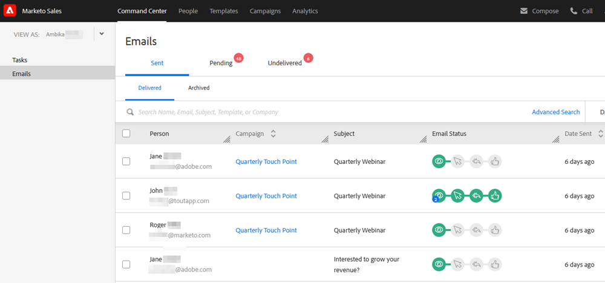
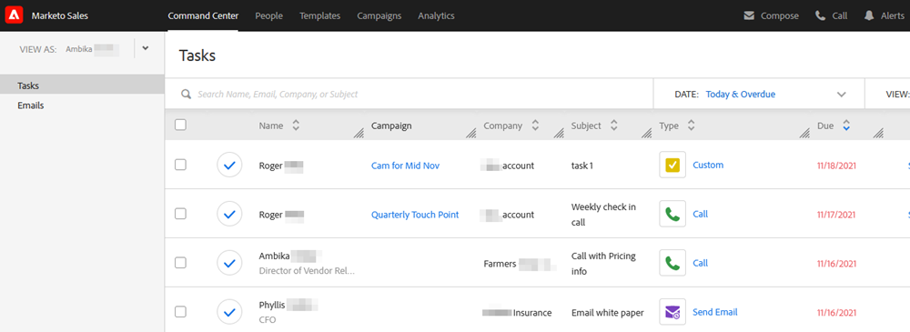

# コマンドセンターの概要 {#command-center-overview}

[!UICONTROL コマンドセンター]は単一の統合ビューで、何も抜け落ちがないように確認しながら、次のステップを考え出すのに役立ちます。

## メールの管理 {#manage-emails}

[!UICONTROL コマンドセンター]のメールセクションでは、すべてのメールアクティビティを管理できます。 [!DNL Sales Connect] から送信されたメールを確認するためのメール送信ボックスと考えてください。 スケジュールされたメールの管理、メールに関心を寄せている人の確認、メールの配信に問題があるかどうかの確認などを行います。

メールセクションでは、すべてのメールを俯瞰して、プライマリタブとサブタブを使用して組織を簡素化できます。プライマリタブとサブタブは、メールがステータスに基づいて自動的に保存されるフォルダーの役割を果たします。

<table>
 <tr>
  <th>プライマリ</th>
  <th>サブ</th>
  <th>説明</th>
 </tr>
 <tr>
  <th rowspan="2">[!UICONTROL 送信済み]</th>
  <td>[!UICONTROL 配信済み]</td>
  <td>受信者に配信されたメール。</td>
 </tr>
 <tr>
  <td>[!UICONTROL アーカイブ済み]</td>
  <td>メールのトラッキングを無効にするためにユーザーがアーカイブしたメール。</td>
 </tr>
 <tr>
  <th rowspan="3">[!UICONTROL 保留中]</th>
  <td>[!UICONTROL スケジュール済み]</td>
  <td>現在配信がスケジュールされているメール。 メールが送信されると、配信済みフォルダーに移動します。</td>
 </tr>
 <tr>
  <td>[!UICONTROL ドラフト]</td>
  <td>下書きとして保存されたメール。 
  <strong>注意</strong>：下書きとして保存できるのは1通のメールのみです。 一括メール（「メールを選択して送信」と「メールをグループ化」）は下書きとして保存されません。</td>
 </tr>
 <tr>
  <td>[!UICONTROL 進行中]</td>
  <td>これは、送信モーション中にメールが処理される中間の状態を示します。 メールが処理中であるのは、わずかの間です。</td>
 </tr>
 <tr>
  <th rowspan="3">[!UICONTROL 未配信]</th>
  <td>[!UICONTROL 失敗]</td>
  <td>配信に失敗したメール。
</td>
 </tr>
 <tr>
  <td>[!UICONTROL バウンス済み]</td>
  <td>受信者のメールサーバーから却下されたメール。 
  <strong> メモ </strong>：これは、レガシーのToutApp ユーザーであり、配信チャネルとしてMSC サーバーにアクセスできる場合にのみ検出されます。</td>
 </tr>
 <tr>
  <td>[!UICONTROL スパム]</td>
  <td>受信者によって手動でスパムとマークされたメール。 
  <strong> メモ </strong>：これは、レガシーのToutApp ユーザーであり、配信チャネルとしてMSC サーバーにアクセスできる場合にのみ検出されます。</td>
 </tr>
</table>

## タスクの管理 {#manage-tasks}

タスクセクションは、タスクの管理と完了を一括して行える場所です。 タスクをシームレスに管理し、生産性を高め、最も関連性の高い項目に集中できます。

## エンゲージした見込み客のフォローアップ {#follow-up-with-engaged-prospects}

作成ウィンドウまたはキャンペーンを使用して見込み客とのエンゲージメントを開始したら、詳細検索機能を使用して、最もエンゲージメントの高い見込み客を再度ターゲティングできます。

例えば、MSC のキャンペーンに 100 人を追加する場合、メールを閲覧してクリックしたが返信しなかった人を再度ターゲティングしたいと考えるでしょう。 そのためには、キャンペーンフィルターに加えて、表示ステータスおよびクリックステータスのアクティビティフィルターを利用して、再度ターゲティングする人のリストを特定します。

補足：詳細検索を保存すると、動的リストとして機能し、受信者がメールを表示またはクリックした時点で、エンゲージメント条件を満たすメールの受信者がリストに追加されます。

>[!MORELIKETHIS]
>
>* タスク
>* 詳細検索の概要
>* 「選択して送信」による一括メールの作成
