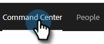
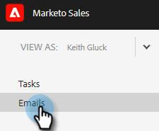
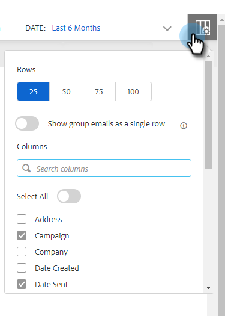

# メール列とメールページのレイアウト {#email-columns-and-email-page-layout}

[コマンドセンター](/help/marketo/product-docs/marketo-sales-insight/actions/email/command-center/command-center-overview.md)のメールセクションに表示される、利用可能な列を設定することができます。 設定は、それぞれのメールサブフォルダー（「配信済み」、「失敗」、「スケジュール済み」など）に対して保存されます。

## メール列 {#email-columns}

<table>
 <colgroup>
  <col>
  <col>
 </colgroup>
 <tbody>
  <tr>
   <th>列</th>
   <th>説明</th>
  </tr>
  <tr>
   <td><strong>[!UICONTROL ユーザー]</td>
   <td>[!UICONTROL セールスコネクト] の人物の名前とメールアドレス。 このフィールドをクリックすると、人物の詳細表示の「情報」タブが開きます。</td>
  </tr>
  <tr>
   <td><strong>[!UICONTROL 名前]</td>
   <td>[!UICONTROL Sales Connect] の人物の名前。</td>
  </tr>
  <tr>
   <td><strong>[!UICONTROL アドレス]</td>
   <td>[!UICONTROL Sales Connect] の人物のプライマリメールアドレス。</td>
  </tr>
  <tr>
   <td><strong>[!UICONTROL キャンペーン]</td>
   <td>メールがキャンペーンの一環として送信された場合は、キャンペーンの名前が表示されます。 このフィールドをクリックすると、そのキャンペーンの設定ページに移動します。</td>
  </tr>
  <tr>
   <td><strong>[!UICONTROL テンプレート]</td>
   <td>テンプレートの名前を表示します（メールがテンプレートと共に送信された場合）。</td>
  </tr>
  <tr>
   <td><strong>[!UICONTROL 件名]</td>
   <td>メールの件名行。</td>
  </tr>
  <tr>
   <td><strong>[!UICONTROL グループ]</td>
   <td>メール受信者が属するグループを表示します。</td>
  </tr>
  <tr>
   <td><strong>[!UICONTROL 役職]</td>
   <td>メール受信者の職位。</td>
  </tr>
  <tr>
   <td><strong>[!UICONTROL 会社]</td>
   <td>メール受信者の会社。</td>
  </tr>
  <tr>
   <td><strong>[!UICONTROL メールのステータス]</td>
   <td>メールのステータス。 ステータスには次のようなものがあります。ドラフト、スケジュール済み、処理中、スパム、バウンス、失敗、送信済み。 送信済みのメールには、そのメールで発生した表示数、クリック数および返信数を示すアクティビティストリームが表示されます。</td>
  </tr>
  <tr>
   <td><strong>[!UICONTROL 作成日]</td>
   <td>メールが作成された日付。</td>
  </tr>
  <tr>
   <td><strong>[!UICONTROL 最終更新日]</td>
   <td>メールが最後に更新された日付。</td>
  </tr>
  <tr>
   <td><strong>[!UICONTROL 配信チャネル]</td>
   <td>メールの送信に使用された配信チャネルの名前。</td>
  </tr>
  <tr>
   <td><strong>[!UICONTROL 最新アクティビティ]</td>
   <td>メール受信者による最後のエンゲージメント（表示、クリック、返信など）。</td>
  </tr>
  <tr>
   <td><strong>[!UICONTROL 送信日]</td>
   <td>メールが送信された日付。</td>
  </tr>
  <tr>
   <td><strong>[!UICONTROL フォローアップアクション]</td>
   <td>メール、電話、inMail、タスクによるフォローアップに使用できるクイックアクションボタン。</td>
  </tr>
  <tr>
   <td><strong>[!UICONTROL グループメール]</td>
   <td>メールがグループメールの一部として送信された場合は、チェックマークを表示します。</td>
  </tr>
  <tr>
   <td><strong>[!UICONTROL タスクの期限日付]</td>
   <td>メールに関連するタスクの期限日付を表示します。 タスクは、メールリストのクイックアクションボタンから作成することで、メールに関連付けることができます。</td>
  </tr>
  <tr>
   <td><strong>[!UICONTROL メールアクション]</td>
   <td>メールに対するアクションを実行するために使用できるクイックアクションボタン。 メールのステータスに応じて、次のアクションを使用できます。アーカイブ、成功、削除、再試行送信、アーカイブ解除。</td>
  </tr>
  <tr>
   <td><strong>[!UICONTROL タスクのタイプ]</td>
   <td>メールに関連するタスクのタイプを表示します。 タスクは、メールリストのクイックアクションボタンから作成することで、メールに関連付けることができます。</td>
  </tr>
  <tr>
   <td><strong>[!UICONTROL 失敗した日付]</td>
   <td>メールが配信されなかった場合にメール送信が失敗した日付を表示します。</td>
  </tr>
 </tbody>
</table>

## メールページのレイアウト設定 {#email-page-layout-settings}

次の手順に従って、レイアウトを設定できます。

1. Web アプリケーションで、「**[!UICONTROL コマンドセンター]**」をクリックします。

   

1. 「**[!UICONTROL メール]**」セクションを選択します。

   

1. 「設定」ボタンをクリックします。 オプションでは、行数の選択、表示するフィールドの選択、グループメールをグリッド内の 1 つの項目にまとめる（またはメールグリッドの一部であるすべてのメールを 1 つの項目として表示する）かを選択できます。

   

1. 完了したら、設定ボックスの外側をクリックして変更を保存します。
