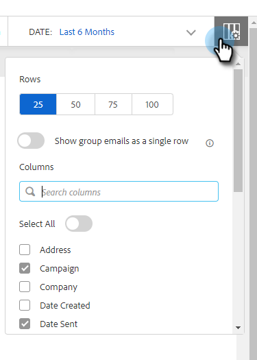

# メール列とメールページのレイアウト {#email-columns-and-email-page-layout}

[コマンドセンター](/help/marketo/product-docs/marketo-sales-insight/actions/email/command-center/command-center-overview.md)のメールセクションに表示される、利用可能な列を設定することができます。設定は、それぞれのメールサブフォルダー（「配信済み」、「失敗」、「スケジュール済み」など）に対して保存されます。

## メール列 {#email-columns}

<table> 
 <colgroup> 
  <col> 
  <col> 
 </colgroup> 
 <tbody> 
  <tr> 
   <th>列</th> 
   <th>説明</th> 
  </tr> 
  <tr> 
   <td><strong>人物</td> 
   <td>Sales Connect の人物の名前とメール。このフィールドをクリックすると、人物の詳細表示の「情報」タブが開きます。</td> 
  </tr> 
  <tr> 
   <td><strong>名前</td> 
   <td>Sales Connect の人物の名前。</td> 
  </tr> 
  <tr> 
   <td><strong>住所</td> 
   <td>Sales Connect の人物のプライマリメールアドレス。</td> 
  </tr> 
  <tr> 
   <td><strong>キャンペーン</td> 
   <td>メールがキャンペーンの一環として送信された場合は、キャンペーンの名前が表示されます。このフィールドをクリックすると、そのキャンペーンの設定ページに移動します。</td> 
  </tr> 
  <tr> 
   <td><strong>テンプレート</td> 
   <td>テンプレートの名前を表示します（メールがテンプレートと共に送信された場合）。</td> 
  </tr> 
  <tr> 
   <td><strong>件名</td> 
   <td>電子メールの件名行。</td> 
  </tr> 
  <tr> 
   <td><strong>グループ</td> 
   <td>メール受信者が属するグループを表示します。</td> 
  </tr> 
  <tr> 
   <td><strong>役職</td> 
   <td>メール受信者の職位。</td> 
  </tr> 
  <tr> 
   <td><strong>企業</td> 
   <td>メール受信者の会社。</td> 
  </tr> 
  <tr> 
   <td><strong>メールステータス</td> 
   <td>メールのステータス。ステータスには次のようなものがあります。ドラフト、スケジュール済み、処理中、スパム、バウンス、失敗、送信済み。送信済みのメールには、そのメールで発生した表示数、クリック数および返信数を示すアクティビティストリームが表示されます。</td> 
  </tr> 
  <tr> 
   <td><strong>作成日</td> 
   <td>メールが作成された日付。</td> 
  </tr> 
  <tr> 
   <td><strong>最終更新日</td> 
   <td>メールが最後に更新された日付。</td> 
  </tr> 
  <tr> 
   <td><strong>配信チャネル</td> 
   <td>メールの送信に使用された配信チャネルの名前。</td> 
  </tr> 
  <tr> 
   <td><strong>最新のアクティビティ</td> 
   <td>メール受信者による最後のエンゲージメント（表示、クリック、返信など）。</td> 
  </tr> 
  <tr> 
   <td><strong>送信日</td> 
   <td>メールが送信された日付。</td> 
  </tr> 
  <tr> 
   <td><strong>フォローアップアクション</td> 
   <td>メール、電話、inMail、タスクによるフォローアップに使用できるクイックアクションボタン。</td> 
  </tr> 
  <tr> 
   <td><strong>グループメール</td> 
   <td>メールがグループメールの一部として送信された場合は、チェックマークを表示します。</td> 
  </tr> 
  <tr> 
   <td><strong>タスク期日</td> 
   <td>メールに関連するタスクの期限を表示します。タスクは、メールリストのクイックアクションボタンから作成することで、メールに関連付けることができます。</td> 
  </tr> 
  <tr> 
   <td><strong>メールアクション</td> 
   <td>メールに対するアクションを実行するために使用できるクイックアクションボタン。メールのステータスに応じて、次のアクションを使用できます。アーカイブ、成功、削除、再試行送信、アーカイブ解除。</td> 
  </tr> 
  <tr> 
   <td><strong>タスクタイプ</td> 
   <td>メールに関連するタスクのタイプを表示します。タスクは、メールリストのクイックアクションボタンから作成することで、メールに関連付けることができます。</td> 
  </tr> 
  <tr> 
   <td><strong>失敗した日付</td> 
   <td>メールが配信されなかった場合にメール送信が失敗した日付を表示します。</td> 
  </tr> 
 </tbody> 
</table>

## メールページのレイアウト設定 {#email-page-layout-settings}

次の手順に従って、レイアウトを設定できます。

1. Web アプリケーションで、「**コマンドセンター**」をクリックします。

   

1. 「**メール**」セクションを選択します。

   

1. 「設定」ボタンをクリックします。オプションでは、行数の選択、表示するフィールドの選択、グループメールをグリッド内の 1 つの項目にまとめる（またはメールグリッドの一部であるすべてのメールを 1 つの項目として表示する）かを選択できます。

   

1. 完了したら、設定ボックスの外側をクリックして変更を保存します。
