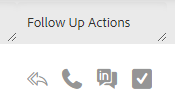

# [!UICONTROL コマンドセンター]のクイックアクション {#quick-actions-in-the-command-center}

メールグリッドには 2 種類のクイックアクション列があります。 メールに対してアクションを実行できるメールアクションと、数回のクリックでエンゲージメントアクションを実行できるフォローアップアクションがあります。

## クイックアクション {#quick-actions}

メールクイックアクションは、見ているメールのステータスに最も関連性の高いアクションに応じて動的に更新されます。 各メールステータスに対して表示できるメールクイックアクションは最大 2 つです。 以下で、各ステータスで使用できるメールのクイックアクションを確認できます。

**[!UICONTROL 配信済み]**

| ステータス | 説明 |
|---|---|
| [!UICONTROL アーカイブ] | アーカイブ済みフォルダーにメールを追加し、そのメールの表示とクリックの追跡をすべて無効にします。 |
| [!UICONTROL 成功] | テンプレート分析でメールがレポートに成功したことを示します。 |

**[!UICONTROL アーカイブ済み]**

<table>
 <colgroup>
  <col>
  <col>
 </colgroup>
 <tbody>
  <tr>
   <td>[!UICONTROL アーカイブ解除]</td>
   <td>メールを配信済みフォルダーに戻し、表示およびクリックの追跡を再開します。</td>
  </tr>
  <tr>
   <td>[!UICONTROL 削除]</td>
   <td>
メールを削除します。 <strong> メモ：</strong> キャンペーンの一部として送信されたメールは削除できません。
</td>
  </tr>
 </tbody>
</table>

**[!UICONTROL ドラフト]および[!UICONTROL スケジュール済み]**

<table>
 <colgroup>
  <col>
  <col>
 </colgroup>
 <tbody>
  <tr>
   <td>[!UICONTROL 編集]</td>
   <td>編集する作成ウィンドウでメールを開きます。</td>
  </tr>
  <tr>
   <td>[!UICONTROL 削除]</td>
   <td>
メールを削除します。 <strong> メモ：</strong> キャンペーンの一部として送信されたメールは削除できません。
</td>
  </tr>
 </tbody>
</table>

**[!UICONTROL 失敗]、[!UICONTROL バウンス]、[!UICONTROL スパム]**

<table>
 <colgroup>
  <col>
  <col>
 </colgroup>
 <tbody>
  <tr>
   <td>[!UICONTROL 再試行送信]</td>
   <td>即座にメールの再送信を試みます。</td>
  </tr>
  <tr>
   <td>[!UICONTROL 削除]</td>
   <td>
メールを削除します。 <strong> メモ：</strong> キャンペーンの一部として送信されたメールは削除できません。
</td>
  </tr>
 </tbody>
</table>

**[!UICONTROL フォローアップアクション]**

| 機能 | 説明 |
|---|---|
| フォローアップメールを送信 | 選択したインラインメール本文が追加され、受信者への送信準備が整った状態で、作成ウィンドウを開きます。 |
| 電話をかける | セールス電話を開いて、メール受信者に電話をかけます。 |
| inMail を送信 | [!DNL LinkedIn] にリダイレクトして、InMail メッセージをリードに送信します。 |
| タスクの作成 | リマインダータスクを作成するための作成タスクポップアップを開きます。 |
