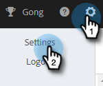
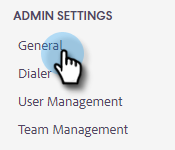
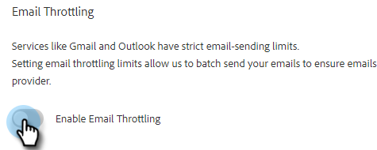
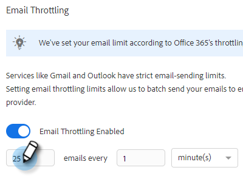
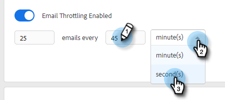
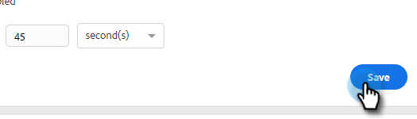

# メール接続のスロットリング {#email-connection-throttling}

[!DNL Sales Connect] アカウントを統合して[!DNL Exchange]またはGmail メールプロバイダーを通じて送信すると、合理的な設定が可能になり、1対1のセールスコミュニケーション用にメールの配信品質が最適化されます。 ただし、システムの健全性とアカウントの安全性を維持するのに、Gmail と [!DNL Exchange] ではメール送信の制限が実施されます。 これらの制限は、プロバイダーの裁量によって増減することができます。

## 概要 {#overview}

メール接続のスロットリングを使用すると、セールスコネクト管理者は、Gmail または Exchange を配信チャネルとして使用する場合に、配信チャネルプロバイダーに引き渡されるメールの送信レートが設定された制限を超えないように、メールの送信レートを設定できます。

制限を継続的に超えると、配信チャネルプロバイダーが疑わしい動作と見なし、メール送信が失敗したり、アカウントが無効になったりする場合があります。

## 注意事項 {#things-to-note}

* ユーザーがGmailまたは[!DNL Exchange]に接続すると、自動的に有効になります
* ニーズに合わせてレコメンデーションの設定を増減する場合は、カスタマイズできます。
* Gmail または [!DNL Exchange] を通じて送信されるメールのみスロットリングし、カスタム配信チャネルをスロットリングしません。
* メール接続のスロットリングでは、各ユーザーがメールプロバイダーと独自に接続しているため、各ユーザーのメールが個別にキューに入れられます。

## メール接続スロットル設定の設定 {#configuring}

1. 歯車アイコンをクリックし、「**[!UICONTROL 設定]**」を選択します。

   

1. 「[!UICONTROL 管理者設定]」で、「**[!UICONTROL 一般]**」をクリックします。

   

1. 右側の「メール接続のスロットリング」カードで、「**[!UICONTROL メールのスロットリングを有効にする]**」スライダーをクリックします。

   

1. 右側の「メール接続のスロットリング」カードで、メールチャネルプロバイダーに送信するメールのバッチサイズを入力します。

   

1. 各バッチが送信されるまでの待機時間を設定します。 この例では、45 秒ごとに 25 通のメールを選択します。

   

1. 「**[!UICONTROL 保存]**」をクリックします。

   

変更を保存すると、すべてのユーザは、接続された Gmail または [!DNL Exchange] アカウントに一括でメールを送信して配信できます。

## メールプロバイダーの制限 {#email-provider-limits}

### [!DNL Outlook 365] {#outlook}

ビジネス／エンタープライズ

* 1 日あたり 10,000 件
* 1 分あたり 30 件
* 1 件のメールあたり 500 人の受信者

詳しくは[こちら](https://docs.microsoft.com/ja-jp/office365/servicedescriptions/exchange-online-service-description/exchange-online-limits?redirectedfrom=MSDN#RecipientLimits)をご覧さい。

### Gmail {#gmail}

* 1 日あたり 2,000 件（体験版およびフラグ付きアカウントの場合は 500 件）
* 1 秒あたり 2 件のメール（API の上限）
* 1 メッセージあたり 2,000 人（外部受信者の場合は最大 500 人）

詳しくは[こちら](https://support.google.com/a/answer/166852?hl=jp)をご覧さい。

### [!DNL Microsoft Exchange Server (2010, 2013)] {#microsoft-exchange}

サーバーが組織でホストされるので、制限は組織の IT 部門によって設定されます。 必要に応じて、ネットワーク管理者またはシステム管理者に問い合わせてください。

>[!MORELIKETHIS]
>
>* [配信チャネルの概要](/help/marketo/product-docs/marketo-sales-connect/email/email-delivery/delivery-channel-overview.md)
>* [Gmail ユーザのメール接続](/help/marketo/product-docs/marketo-sales-connect/email-plugins/gmail/email-connection-for-gmail-users.md)
>* [Outlook ユーザのメール接続](/help/marketo/product-docs/marketo-sales-connect/email-plugins/msc-for-outlook/email-connection-for-outlook-users.md)
