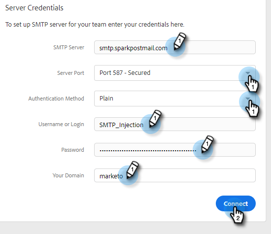

# チーム向けのカスタム配信チャネルの設定 {#set-up-a-custom-delivery-channel-for-your-team}

>[!NOTE]
>
>**管理者権限が必要**

>[!NOTE]
>
>* SMTP サーバーの設定に加えて、メールを送信する前に、[メール ID を認証する必要があります](/help/marketo/product-docs/marketo-sales-insight/actions/getting-started/email-settings/verify-your-email.md)。
>* お使いの SMTP サーバーに適したサーバー資格情報を取得するには、IT チームまたは SMTP サーバーのベンダーと協力することをお勧めします。
>* SMTP サーバーの資格情報を使用して Gmail サーバーと Exchange サーバーに接続することはできません。これらのプロバイダーとの統合には、アドビのメール接続サービスを使用してください。

1. 歯車アイコンをクリックし、「**設定**」を選択します。

   

1. 「管理設定」で、「**一般**」をクリックします。

   

1. 「**チーム配信チャネル**」タブをクリックします。

   

1. SMTP サーバーの資格情報を入力し、「**接続**」をクリックします。

   

   >[!NOTE]
   >
   >チーム SMTP サーバーは、すべてのチームメンバーに対するデフォルトのメール ID のデフォルトの配信チャネルになります。さらに、その他のすべてのメール ID の配信チャネルオプションとして使用できます。

   >[!MORELIKETHIS]
   >
   >* [Gmail ユーザのメール接続](/help/marketo/product-docs/marketo-sales-connect/email-plugins/gmail/email-connection-for-gmail-users.md)
   >* [Outlook ユーザのメール接続](/help/marketo/product-docs/marketo-sales-connect/email-plugins/msc-for-outlook/email-connection-for-outlook-users.md)

